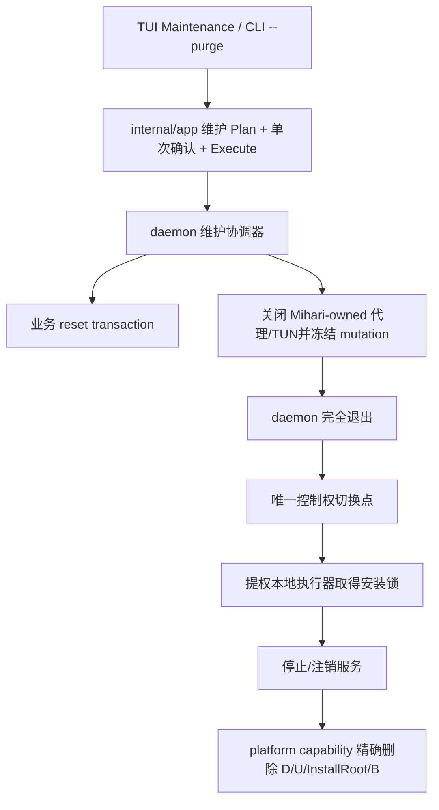

# Issue #194 全量卸载：设计阶段交接

> **用户最新范围约束（2026-09-10，覆盖本文旧方案）：** 不允许扩张 scope，不允许构建大型模块。功能仅为卸载 Mihari 服务和删除 Mihari 创建的文件。删除范围按源码确认的文件名/目录清单界定，遇到清单之外的项目停止并提示；文件名匹配不宣称是创建来源证明。不得继续旧身份/权限证明框架、卸载事务、持久化恢复、维护控制协议或多阶段接管系统。复用现有服务卸载、布局和 TUI 清理流程，仅增加直接完成此功能必需的最小代码。现有 System 入口位置、默认 Cancel 二次确认和全部英文提示要求继续有效。旧实现尚未清理，不代表新范围要求保留它。

## 实施状态补充（2026-09-10，优先于下方设计历史）

用户已批准设计和执行计划，并要求以 subagent-driven development 实施；开发模型为 `gpt-5.6-terra high`，审核模型为 `gpt-6-astra`。第 1 项结果模型已通过测试和 Astra 审核，第 2 项通用只读计划、Unix 与 Windows 原生观察器均已通过各自审核；完整受管资源清单仍待补齐。Windows 原生运行和现有安装记录兼容性未验证。没有提交、推送、PR 或真实服务操作授权。

代理运行期间每十分钟主动检查一次；完成或阻塞消息及时处理。执行详情保存在该计划的 `.superpowers/sdd/2026-09-10-issue-194-uninstall-implementation/progress.md`，后续进展以执行计划与该记录为准。

## 最新范围修订（2026-09-10，优先于下方历史快照）

**最新状态：** 用户已批准 [全量卸载设计](../specs/2026-09-10-issue-194-uninstall-design.md)，并要求构建执行计划；补充要求为应用内全部固定提示使用英文。新增持久化/安全边界及 Windows pending 语义已随设计获批，不重复请求同范围批准。当前继续以该 spec 和新的执行计划为准，不恢复旧双入口方案的逐节批准；尚未开始实现或提交。

**执行计划：** [2026-09-10-issue-194-uninstall-implementation.md](2026-09-10-issue-194-uninstall-implementation.md)，18 个依赖明确的 TDD 任务。全部任务尚未执行；下一步由用户决定开始实施的方式，不重新设计已批准范围。

用户范围指示：仅保留全量删除服务、程序与数据，取消仅删除数据的温重置功能。

- 当前唯一新增产品能力为全量卸载：停止并注销 OS 服务，删除受管程序和本实例数据，然后退出 TUI。
- 取消温重置，包括 reset TUI 入口、reset 控制协议、返回 Setup 的重置流程、多文件业务 reset 事务及其恢复记录。下方所有相关 scope、验收与待确认问题均为历史内容，不再执行。
- 上一轮提出的“Reset 独立事务记录 + Uninstall 独立进度记录”没有获得批准；不得把这次范围收敛当作对新增持久化格式的批准。卸载是否需要新增进度记录及其格式仍需单独论证。
- 继续沿用此前批准的卸载范围、提权要求、在线/受限离线分层编排、身份验证、失败即停与安全重试要求。数据删除失败时保留安装程序，不承诺恢复已经删除的数据。
- 既有 plain `service uninstall` 的公开语义保持兼容，`--purge --yes` 承接全量卸载。
- 用户已明确批准界面规格：控制仍在 System 页，在 Logging 下方新增独立 section，唯一选项的精确文案为 `Completely Uninstall Mihari`。System 页其他 section 不动，现有 Service 区域的 `Uninstall service` 保留。此前助手提出移除该行的建议已被覆盖。
- 触发 `Completely Uninstall Mihari` 后弹出二次确认，弹窗初始焦点必须在 `Cancel`；不能通过打开弹窗的 Enter 直接确认卸载。取消不产生服务停止或删除效果。
- section 标题沿用此前的 `Maintenance` 设计；按钮选项文案和 Logging 下方位置以上一条用户指示为准。确认正文继续明确服务、受管程序和本实例数据的删除范围及不可恢复性。
- 下一轮设计评审围绕唯一卸载流程展开：只读预览与一次确认、在线停机与离线证明、禁止重新启动、卸载服务、数据删除、程序删除、安装控制记录与锁的最终收尾、Windows helper 和可观察结果。
- 本次只更新交接文档，没有修改生产代码或测试，也没有 commit、push、PR 或真实服务操作。

当前工作分支仍为 `codex/issue-194-reset-uninstall`，HEAD 为 `89075fb`；已只读核实远端 dev 为 `f619cf4`，新增 #224 仅改发布工作流及其测试。交接文档仍为未跟踪文件。

以下第 1–14 节保留原交接历史；与本节冲突时以本节及用户后续指示为准。仍处于架构设计阶段，继续使用 `superpowers:brainstorming`，不进入实现。

---

> **历史交接说明（已由上方范围修订覆盖）：** 本任务仍处于 `superpowers:brainstorming` 的架构设计阶段。原先要求从第 8 节继续双入口设计；现在仅评审全量卸载。完整设计获批后才能写 spec，再经用户审阅后使用 `superpowers:writing-plans`。不得直接实现、提交、推送或创建 PR。仓库规定 commit 必须由用户明确授权。

**Issue:** [#194 System 页增加清除数据与全量卸载（服务 + 软件）](https://github.com/mihari-proxy/mihari/issues/194)

**历史结论（双入口 scope 已取消）:** 用户曾确认产品 scope，选择并批准“分层维护编排器”的组件边界。两条端到端数据流已经展示，但用户尚未批准；尤其是新增内部 maintenance recovery record 尚未获得持久化格式变更所需的明确确认。

## 1. 文档性质与停止线

本文是当前会话的完整交接快照，不是最终设计、实施计划或实现授权。

- 没有修改生产代码或测试。
- 没有创建 commit、push、PR，也没有操作真实 daemon、订阅、系统代理、TUN 或 OS 服务。
- 接手者不得从用户此前对 scope/框架的确认推导出实现、提交或外部操作授权。
- 下一步应继续设计评审，而不是开始 TDD 或编码。
- Issue 横跨 TUI、稳定控制协议、daemon 状态事务、提权本地卸载与 Windows 自删除，已按 **Architectural** 路径分类，不能降级为 bounded change。

## 2. Worktree、分支与基线

- 主仓库：`/home/kinema/dev/mihari`
- 本任务 worktree：`/home/kinema/dev/mihari/.worktrees/issue-194`
- 工作分支：`codex/issue-194-reset-uninstall`
- 基线与 `origin/dev`：`89075fbcf97ea0eb2c502bf38078bf15764ff07e`
- 基线提交：`fix: 完善操作关联日志与错误链诊断 (#223)`
- 创建本文前分支与 `origin/dev` 完全一致，Git 状态干净。
- 该 worktree 原先已存在且无独有提交；本会话执行 `fetch origin dev` 后以 `--ff-only` 快进到当前基线，没有 reset/rebase 或覆盖用户修改。
- worktree 原为 `root:root`，导致普通用户无法创建测试 fixture；本会话只对精确路径 `/home/kinema/dev/mihari/.worktrees/issue-194` 执行了 `chown -R kinema:kinema`，未改变其他 worktree。
- `.superpowers` 已被 `.gitignore` 忽略。会话中的浏览器草图位于本 worktree 的 `.superpowers/brainstorm/1811571-1789019851/`，只用于讨论，不是设计源文件或待提交内容。

仓库根 `AGENTS.md` 要求涉及架构边界时阅读 `docs/superpowers/specs/2026-08-03-mihari-architecture-design.md`，但该文件在当前 `origin/dev` 中不存在。接手者应以当前 `AGENTS.md`、`.github/CONTRIBUTING.md`、`README.md`、`docs/architecture.md`、`docs/unix-layout.md` 与实际代码为准，并在最终 spec 中如实记录该缺失，不能臆造文件内容。

## 3. Issue 的产品目标

System 页必须提供两个独立的破坏性操作，不能合并：

1. **清除用户数据 / Reset user data**：保留软件与服务，让用户重新进入首次 Setup。
2. **全量卸载 / Uninstall Mihari**：停止并注销服务、删除 Mihari 安装和数据，然后退出 TUI。

现有 `service uninstall` 只注销 OS 服务并保留数据和安装目录；现有 `Run Setup` 只打开向导，不清理已有状态。手动删除数据根会绕过 daemon 单写入者、系统代理/TUN cleanup、控制凭据与安装事务保护，因此不能作为产品实现。

## 4. 用户已明确批准的 scope

### 4.1 清除用户数据采用“温重置”

用户批准以下范围：

**清除：**

- settings；恢复默认设置，而不是保留旧业务配置；
- onboarding；成功后 `Complete=false`，TUI 进入 Setup；
- 订阅 catalog、订阅缓存及相关 staging；
- 生成的 runtime config；
- TUI preferences；
- Web 面板 credential 与激活状态；
- 日志与 staging。

**保留：**

- OS 服务注册与运行方式；
- Mihari 二进制及安装目录；
- 本地控制令牌，保证执行 reset 的 TUI 可以继续连接；
- mihomo core 二进制；
- GeoIP 资产；
- 已安装的面板构建。

已确认的语义是“保留可重新利用的下载资产与控制令牌”。Web/controller 业务 secret 不等于本地控制令牌：settings 和 Web credential 会重置，本地 IPC control credential 保留。

**仍需在详细设计中明确但不能擅自决定：**

- “清日志”是否也删除 reset 前已经导出的 `logs-export`。用户只对全量卸载明确批准删除当前 U 中的导出；温重置尚未单独裁决此子项。
- settings 清空后 core channel 如何与保留的本地 core 资产收敛；应用 release channel sidecar 属于安装 metadata，应与业务 settings 区分。
- 当前 TUI 日志位于 Unix 当前用户 U；daemon 不能越权写 U。若 reset 要清该日志，必须使用既有 TUI logging 窄例外并先关闭日志 runtime，不能扩大成 TUI 删除业务文件。

### 4.2 清除用户数据的事务语义

用户批准：

- settings、onboarding、订阅、runtime config、TUI preferences、Web credential/activation 是一个逻辑业务事务；任一步提交失败必须恢复旧状态。
- reset 前关闭 Mihari-owned 系统代理和 TUN；后续失败时尝试恢复 reset 前的 Mihari-owned 状态。
- 日志截断和无效 staging cleanup 属于提交后清理；失败返回 warning，不能把已成功的业务 reset 伪报成失败。
- 补偿失败时沿用 daemon 既有 `degraded` 语义：发布已提交事实，拒绝后续 mutation，要求重启收敛。

“逻辑业务事务”已批准，但具体如何在进程崩溃后恢复尚未批准；第 7 节提出的 recovery record 仍是草案。

### 4.3 降级控制面中的 reset

用户批准 reset 作为恢复入口：

- 控制 socket/named pipe 与认证仍可用、但完整 runtime 初始化失败时，最小 daemon 维护组件仍应提供 reset。
- 删除前必须建立可信数据根、代理 ownership 与排他 maintenance gate；条件不足就拒绝。
- 控制通道完全不可用时不提供“离线 reset”，以免绕过 daemon 单写入者。
- daemon 完全不可用时只允许第 4.6 节定义的严格离线**全量卸载**兜底。

### 4.4 全量卸载的删除范围

用户批准：

- 删除 OS 服务注册；服务已安装时先停再注销。
- 删除当前解析出的业务数据 D、机器 base/control 数据 B、`InstallRoot` 中受管 Mihari 软件。
- 删除发起卸载用户的整个当前用户诊断根 U，包括 TUI 日志与 `logs-export`。
- 不扫描或删除其他用户的 U。
- 不自动清理历史 `%AppData%\mihari`、`%ProgramData%\mihari` 或其他无法由当前安装记录证明属于本实例的旧树。
- 便携/下载目录中的启动副本若不位于受管 `InstallRoot`，不属于必删范围。
- 尊重当前已解析、已验证的 `MIHARI_DATA` 与 `MIHARI_INSTALL_ROOT`；环境字符串本身不是删除 authority。

当前 Windows 安装控制目录与“历史 ProgramData 旧树”的区分必须由安装记录和实际代码证明；不能按大小写或目录名粗暴扫描。

### 4.5 CLI 与 TUI 入口

用户批准：

- `mihari service uninstall` 保持现有“只注销服务”语义，避免破坏公开 CLI 行为。
- 新增 `mihari service uninstall --purge --yes`，与 TUI 全量卸载使用同一 app 用例和语义。
- 本 Issue 不新增 reset 的公开 CLI 命令；reset 产品入口为 TUI，底层使用内部版本化本地控制协议。
- System 页新增独立 `Maintenance` 区域，始终显示：
  - `Reset user data`：daemon 能力可用时执行，不可用时显示原因；
  - `Uninstall Mihari`：始终可见，未提权时显示 `Requires administrator/root`，Enter 只提示用户从提权 shell 重启，不自动弹 UAC/sudo。
- 现有 `Uninstall service` 继续位于 Service 区域，与全量卸载明确区分。
- 两档操作各自使用强确认，文案必须列明不可恢复、删除内容与保留内容。

### 4.6 daemon 不可用时的全量卸载兜底

用户批准严格、受限的离线全量卸载：

- daemon 可用时优先经控制协议关闭 Mihari-owned 系统代理/TUN并进入受控停机。
- daemon 不可用包括：服务启动失败/崩溃循环、二进制损坏或不兼容降级、control token/socket/权限损坏、安装事务门禁阻止启动，或 daemon 已停但安装残留。
- 离线路径必须提权，并在删除前证明服务与受管进程已停止、安装记录有效、目标路径与文件身份可信。
- 无法证明系统代理属于 Mihari 时不得修改它，只保留并返回明确 warning；不得关闭其他产品代理。
- TUN 随受管 mihomo 进程停止；不得杀占用端口的外部进程。
- 不能验证安装记录、路径身份、停机状态或删除 authority 时 fail closed，不删除数据或软件。

### 4.7 全量卸载的失败语义

用户批准“安全顺序、失败即停”，不采用 best-effort 继续删除：

1. 先验证全部目标、身份、安装记录和权限。
2. 在线时由 daemon 关闭 Mihari-owned 系统代理/TUN并冻结 mutation。
3. 停止并注销服务；失败则不删除数据或软件。
4. 删除数据；失败则保留安装目录，方便重试。
5. 最后删除受管安装目录并退出。

不承诺跨这些不可逆步骤回滚，但结果必须报告最后完成阶段，并允许对残留状态安全重试。详细设计还需把 B、D、U、InstallRoot 与 install-control record 的精确先后及锁释放点展开；不能在持有位于待删树内部的 lock/handle 时声称整树已删除。

### 4.8 服务状态不阻塞全量卸载入口

用户批准：

- 服务已安装：停止并注销后继续。
- 服务未安装：视为该步骤已完成，继续清理可信安装目录和数据。
- 因此全量卸载位于独立 Maintenance 区，不随 `Uninstall service` 行的显示条件隐藏。

## 5. 已比较的框架方案

会话比较了三种框架：

### A. 分层维护编排器（用户已选择）

- TUI/CLI 只发起、展示 plan 和确认。
- daemon 在存活期间独占业务 reset、代理/TUN cleanup 与 mutation freeze。
- daemon 完全退出后，本地提权 app 执行器接管服务、数据和安装资源删除。
- 在线与离线卸载共用同一 plan、身份重检、进度结果和平台 capability。

优势是所有权切换明确、可逐阶段重试、各层可独立测试；代价是需要新的 maintenance plan/result 模型和跨平台执行器。

### B. TUI 启动 CLI 子进程统筹（已放弃）

接线表面较少，但 TUI 会依赖子进程/stdout，取消、诊断、资源关闭与 typed outcome 难以统一，并容易复制 daemon 与本地卸载逻辑。

### C. daemon 全权完成卸载（已放弃）

无法覆盖 daemon 不可用场景；daemon 同时删除自身服务、运行二进制和数据会破坏所有权边界，Windows 自删除与 SCM 时序尤其脆弱。

## 6. 用户已批准的组件边界

用户在浏览器架构图中明确选择并批准以下边界：



边界说明：

- 不新增职责模糊的通用 `utils` 或 generic maintenance package。
- reset 的业务 mutation 仍属于 daemon-owned runtime/协调器。
- `internal/app` 负责与表现层无关的 plan、确认绑定和卸载用例编排，可复用现有 installation manager 的模式。
- `internal/platform` 只提供小型、平台隔离、可验证 identity 的删除/自删除 capability。
- daemon 返回准备结果并完全退出之前，本地 TUI/CLI 不得直接写或删除业务文件。
- daemon 退出后，本地提权执行器取得安装锁，才进入已批准的 installer 窄例外。
- Windows 当前运行副本位于 InstallRoot 时，最终自删除由退出后的受控临时 helper 完成；Unix 可在关闭资源后 unlink。helper 的具体协议与安全模型仍待详细设计。

## 7. 已展示但尚未获得用户批准的数据流草案

用户在看到第二节数据流图后要求转为交接，因此本节**不能视为批准设计**。接手者应从这里恢复逐节评审。

### 7.1 Reset 草案

1. TUI 强确认后，带 operation ID 与当前 revision 调用稳定 v1 reset endpoint。
2. daemon 取得全局 maintenance gate；完整 runtime 与降级控制面从同一入口进入，阻止并发 mutation。
3. 快照旧业务状态与系统代理/TUN ownership，生成并校验全新默认状态及 runtime config。
4. 关闭 Mihari-owned OS 状态，再原子提交 settings、onboarding、订阅、preferences 与 Web 状态；失败恢复旧状态。
5. 发布新 revision，重启受管 core，TUI 进入 Setup；日志与 staging cleanup 在提交后执行，失败只产生 warning。

### 7.2 全量卸载草案

1. 本地只读 Plan 绑定服务状态、daemon 可达性、安装记录、B/D/当前 U/InstallRoot identity，并生成 digest。
2. TUI 或 CLI 强确认；Execute 只接受刚生成的单次 plan。
3. 重新观察目标并取得安装锁；任一变化都在产生删除效果前拒绝。
4. 在线路径要求 daemon 关代理/TUN、冻结 mutation 并退出；离线路径要求证明服务及受管进程已停止。
5. 草案顺序为：注销服务 → 删除 D → 删除当前 U → 删除 InstallRoot → 最后清 B 与安装控制记录。
6. Unix 直接结束；Windows 通过退出后的受控 helper 完成无法由当前进程完成的最终删除。

### 7.3 尚未批准的持久化变更

草案提出新增严格版本化、大小受限的 `maintenance recovery record`：

- 用于 reset 进程崩溃后的事务恢复，以及卸载阶段/安全重试记录；
- 不改变 settings、订阅或公开配置格式；
- 正常完成后删除；
- 位置、schema、owner、mode/DACL、commit point、旧版本行为和 B/P/Windows install-control 差异尚未设计完成。

这是新的持久化格式。根据仓库 `AGENTS.md`，接手者必须先说明影响并取得用户明确确认，才能把它写进最终设计或实现。若不用 recovery record，必须提出能满足已批准“逻辑业务事务”和崩溃一致性的替代方案，不能静默降低保证。

## 8. 接手者应继续完成的设计评审

按 `superpowers:brainstorming` 逐节继续，除架构图确有帮助外直接在对话中说明；用户已明确要求普通问题和文字内容不要再使用网页。

推荐顺序：

1. **恢复第 7 节的数据流评审。** 先明确 recovery record 的影响并请用户批准或选择替代方案。
2. **协议与组件合同。** 明确 endpoint/DTO、capability discovery、revision/idempotency、warning/progress/result、daemon shutdown acknowledgement，以及 degraded control plane 的装配方式。
3. **事务与错误处理。** 明确 reset 每个 commit point、rollback、crash recovery、degraded 收敛；明确 full uninstall 的 plan claim、身份重检、安装锁、partial completion 和 retry。
4. **平台细节。** 分别给出 Windows、Linux、macOS 的 B/D/U/I、service、foreground process、open handle、self-delete helper、ACL/mode/no-follow 规则。
5. **测试设计。** 单元、integration、race、故障注入、跨平台 CGO0 build；真实服务/真实订阅/testenv 不在默认测试中，也未获授权。
6. 每节得到用户确认后，将完整设计写入 `docs/superpowers/specs/2026-09-10-issue-194-reset-uninstall-design.md`，做 placeholder/一致性/scope/歧义自审，再请用户审阅。
7. 只有用户批准 written spec 后，才使用 `superpowers:writing-plans` 创建实施计划。是否 commit 仍须按仓库规则取得用户明确授权。

仍需明确的问题至少包括：

- reset 是否删除 `logs-export`；TUI 当前日志如何关闭、删除并在 Setup 中重新建立；
- reset 后 core channel/settings 与保留 core 资产如何收敛；
- maintenance gate 是否复用现有 runtime mutation serialization，降级控制面如何共享同一 writer；
- recovery record 的位置与清理时机，尤其 Unix system B、private P、Windows fixed install-control 的差异；
- full uninstall 如何在 install lock 位于待删 B/P 内时安全完成最后删除；
- daemon 如何在 response 已可靠送达后冻结并退出，客户端如何等待 endpoint/process 消失；
- daemon 不可达时，系统代理 ownership 可以从哪些受信任证据证明；不能证明时 warning 的稳定契约；
- 前台 daemon/mihomo 与 OS service 实例如何区分并证明全部停止，不能按端口杀外部进程；
- Windows helper 的来源、完整性、参数绑定、父进程等待、ACL、重启/崩溃行为与清理；
- `service uninstall --purge --yes --json` 的成功、warning、partial failure 与退出码；
- reset endpoint 的具体路径及 DTO 是否只做向后兼容 v1 扩展；不得改变既有 envelope/error/exit code 语义。

## 9. 当前代码事实与可复用基础

接手者应重新阅读相关文件；以下仅是定位索引，不代替代码验证。

### 9.1 布局与写入边界

- `internal/platform/layout.go`：
  - Unix system：B 为系统 base，D=`B/data`，control endpoint/token/channel 在 B，U 为当前 UID 日志根；
  - Windows：Base/Data/ClientLogs 当前为同一用户根，control 使用 named pipe；
  - 显式 `MIHARI_DATA=P`：private 单根 P，不得与默认 B/D 重叠；
  - `InstallRoot` 独立解析并尊重 `MIHARI_INSTALL_ROOT`。
- `internal/platform/paths.go`：settings、onboarding、subscriptions、runtime、preferences、GeoIP、Web、logs、staging 的精确相对路径。
- TUI 只可通过 `internal/logging` 写其固定日志；这不是任意业务文件删除权限。

### 9.2 安装事务与身份绑定

- `internal/app/installation_plan.go`、`installation_manager.go` 已有 read-only plan、digest、单次授权、执行前 re-prepare/revalidate 与 operation lock 模式，应优先复用思想和小接口。
- `internal/app/installation_reset.go` 的 `fresh` 安装清理列表会删除 `bin`、`geoip`、`web` 等；它与本 Issue 已批准的温重置保留策略不同，不能直接拿来当 reset 实现。
- Unix `install.lock`、install-control state、journal/recovery、startup gate 与 retained data identity 已存在于 `internal/app` / `internal/platform`。
- Windows 有 fixed installation-control、operation/startup locks 与 identity/ACL 检查；必须确认其当前路径和与历史 ProgramData 树的关系。

### 9.3 服务、TUI 生命周期与平台替换

- `internal/service/service.go` 当前 `Uninstall` 会先 stop，再注销，并将未安装/已停止视为可接受状态；现有 `service uninstall` 仍须保持只卸服务。
- `internal/cli/service.go` 有可注入的 `ServiceAction` 与本地 diagnostics，可扩展 flag 路由但不能把业务实现放进 CLI。
- `internal/tui/pages/system/model.go` 已有 service action、强确认 intent、elevation 展示和 typed page result 模式。
- `internal/tui/run.go` 已有 worker shutdown、session/export/logging/PrivateFS 关闭顺序，以及在 TUI 退出后执行 installation/self-update completion 的结构。全量卸载应复用该 lifecycle，而不是在 page goroutine 里直接删当前日志根或二进制。
- `internal/update` / `internal/platform/replacement_target*` 已有 candidate/target identity 与跨平台替换基础，但没有已经证明安全的“全量卸载 Windows 自删除 helper”；不能把 binary replacement 等同于 directory self-delete。

### 9.4 控制面与降级模式

- `/v1` DTO、error envelope、error code 与 CLI exit code 是稳定契约；新增 endpoint/字段只能作为兼容扩展，破坏性语义需要新版本。
- daemon 装配失败时可保留降级控制面，但现有 runtime 方法未必存在。reset 必须作为独立注入的 daemon-owned maintenance capability，或提出等价且边界清晰的装配方式。
- IPC 必须继续使用 Windows named pipe / Unix socket，绝不能增加 TCP 维护端口。

## 10. 历史 PR #196：只能作为反例和测试素材

[PR #196](https://github.com/mihari-proxy/mihari/pull/196) 已于 2026-09-09 关闭，未合并。其 commit `b8b2fc62587fdb6f6a31c6938a7b77e5aadca67d` 同时混合 Issue #193 与早期 Issue #194 reset，只实现了 reset，没有后来补充的全量卸载。

旧实现新增 `POST /v1/data/reset`，在 `internal/runtime/data.go` 中顺序修改多个 store/目录并重启 core。评审至少指出以下有效风险，接手者应转成回归要求，不能直接 cherry-pick：

1. onboarding 更新会把旧 settings 中的 system proxy/TUN desired 状态再次写盘，产生冗余写入与崩溃窗口；
2. 删除 TUI preferences 的错误被忽略，却报告 reset 成功；
3. 替换 preferences service pointer 与并发 reader 存在 race；
4. destructive reset 完成后，后台 revision 变化仍可能让最终 coordinator commit 返回 `revision_conflict`，形成“磁盘已清但 API 报失败”；
5. 旧实现是多次直接文件/目录 mutation，没有解决完整 crash recovery；
6. PR 混入大量与 #193 downgrade 相关改动，不符合当前单 Issue scope。

旧 PR 选择保留 control token、core、GeoIP 与 panel builds，和本次已批准温重置范围一致；只有这一产品结论可作为参考，代码结构不视为批准方案。

## 11. 基线验证现状

Go 位于 `/usr/local/go/bin/go`，默认 `PATH` 中没有 `go`。

执行过：

```console
PATH=/usr/local/go/bin:$PATH go mod download
PATH=/usr/local/go/bin:$PATH go test ./...
```

root 运行会触发项目刻意的安全拒绝，例如 `private fs: refuse to create data root as root`，不是有效普通开发基线。

恢复 worktree 所有权后，又执行：

```console
runuser -u kinema -- env PATH=/usr/local/go/bin:/usr/bin:/bin go test ./...
```

结果：绝大多数包通过；`internal/app` 与 `internal/integration` 的一组 Unix trusted-root / migration 测试失败，统一原因为：

```text
writable directory ancestor: permission denied
```

原因是仓库祖先 `/home/kinema/dev/mihari` 与 `.worktrees` 当前 mode 为 `0775`，安全 fixture 拒绝 group-writable ancestor。没有为跑绿测试而修改父仓库权限。当前不能声称全仓基线通过；接手者可在可信、非 group-writable 的隔离路径重跑，或先确认项目约定的本地安全测试环境。不得把这些既有环境失败归咎于 Issue #194，也不得隐藏它们。

第二次普通用户运行中，`cmd/mihari`、`internal/runtime`、`internal/control/*`、`internal/tui/*`、`internal/platform`、`internal/service`、`internal/subscription`、`internal/update` 等其余输出包通过。

## 12. 预计受影响区域（尚非实施计划）

最终设计很可能涉及：

- `internal/control/protocol/`：兼容新增 reset/prepare/result DTO；
- `internal/control/server/`、`internal/control/client/`：typed maintenance routes；
- `internal/runtime/`：reset transaction、revision、compensation、degraded；
- `internal/app/`：maintenance/uninstall plan、single-use claim、在线/离线编排与阶段结果；
- `internal/platform/`：可信删除 capability、进程/服务停机证明、Windows self-delete helper、Unix identity/no-follow；
- `internal/service/`：复用 stop-before-uninstall，不改变 plain uninstall 语义；
- `internal/cli/`：`--purge --yes`、JSON、退出码；
- `internal/tui/pages/system/`、`internal/tui/run.go`：Maintenance UI、强确认、退出后执行与本地 U/logging cleanup；
- `cmd/mihari/`：依赖装配与进程退出边界；
- `internal/integration/`：跨包 reset、online/offline uninstall、crash/retry；
- `README.md`、`docs/commands.md`、`docs/architecture.md`、必要的平台说明。

这只是设计定位，不授权一次性修改所有文件，也不允许顺手重构无关 diagnostics、安装或 logging 代码。功能 PR 指向 `dev`，不得修改 `CHANGELOG.md`。

## 13. 最低验收方向（待最终设计细化）

- 两档操作在 UI、行为和确认文案上不可混淆。
- reset 保留 control connection、service、Mihari/core/GeoIP/panel builds，并可靠回到 Setup。
- reset 的业务状态提交、rollback、crash recovery、revision 和 degraded 行为均有故障注入测试。
- 全量卸载在线与离线使用同一可信 plan；plan 被修改、重放、路径替换、symlink/reparse/junction、身份变化时均 fail closed。
- 服务注销失败不删数据；数据删除失败不删 InstallRoot；partial result 可安全重试。
- 不关闭 foreign proxy/TUN，不杀端口占用外部进程。
- TUI 在删除当前 U 前关闭 export/session/logging/PrivateFS 和 workers；无悬挂 goroutine/handle。
- Windows 当前进程位于 InstallRoot 时能在退出后安全删除，helper 不接受未绑定路径或被替换的目标。
- 普通 `service uninstall` 契约不变；`--purge --yes --json` 有稳定 envelope/exit code。
- 当前平台 unit/integration/race/vet/gofmt 通过；Windows/Linux/macOS amd64/arm64 均做 `CGO_ENABLED=0` build。
- 不执行真实订阅、真实 mihomo、系统服务安装/卸载或用户真实目录删除，除非用户另行明确授权 testenv。

## 14. 交接完成标准

接手 agent 应能做到：

1. 从本 worktree 继续工作，不重新创建或切换到 main/dev；
2. 清楚区分第 4、6 节的已批准内容与第 7、8 节的未批准设计；
3. 先就 recovery record 与第二节数据流取得用户确认；
4. 完成协议、错误、平台和测试设计的逐节批准；
5. 写入并自审最终 spec，请用户审阅；
6. 只有在用户批准 spec 后才写 implementation plan；
7. 只有在用户明确授权后才 commit/push/PR；
8. 实施时严格 Red–Green–Refactor，并保留所有架构不变量与用户既有修改。
