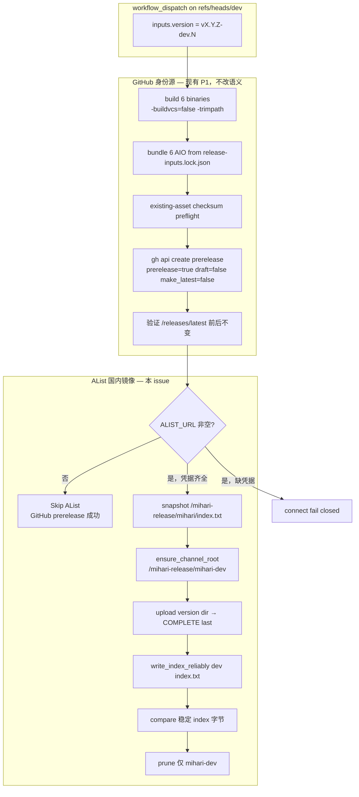

# P2：为 prerelease 通道增加独立 AList index

| 字段 | 值 |
|------|----|
| **Status** | Approved |
| **Author** | TBD |
| **Date** | 2026-08-24 |
| **Issue** | [#126](https://github.com/mihari-proxy/mihari/issues/126) `[feat] 为 prerelease 通道增加独立 AList index` |
| **Branch / worktree** | `feat/126-prerelease-alist-index` @ `C:\Users\Kinema\Documents\modular_dev\mihari\.worktrees\issue-126-prerelease-alist-index`（跟踪 `origin/dev` @ `cd180e3`） |
| **相关** | #115（dev 发版 P1，已落地）、#125（安装脚本 / 应用内通道消费，本 issue 不实现）、#96（稳定国内加速渠道，不得混写） |

## Overview

Mihari 的稳定通道已经通过 `release.yml` 把 AIO 包写入 AList `/mihari-release/mihari`，并由 `index.txt` 的 `latest vX.Y.Z` 驱动国内安装器。预发布通道（`release-dev.yml`，版本 `vX.Y.Z-dev.N`）目前只创建 GitHub prerelease（`prerelease=true`、`make_latest=false`），**完全不写 AList**。已发布的 `v0.9.0-dev.2` / `v0.9.0-dev.3` 因此只有 GitHub 资产，墙内部署没有可解析的 prerelease `latest`。

本设计把现成的策略层接到 `release-dev.yml`：在 GitHub prerelease **成功之后**，条件化调用已存在的 `scripts/release-alist.py --channel dev --base-path /mihari-release/mihari-dev`，写出独立的 `/mihari-release/mihari-dev/index.txt`。同时新增 `retract-dev.yml`，只撤回 dev AList 目录 / dev index 与 GitHub prerelease 资产，保留 canonical dev tag。稳定 `index.txt`、稳定版本目录和 `/releases/latest` 在任何路径下都不得被改写。

策略、writer、跨通道拒绝在脚本层已经就绪；本 issue 的核心是 **workflow 接线、首次根目录创建、通道级并发锁、稳定面隔离验收、dev retract，以及文档/测试从「P2 不可用」翻转到「P2 可用」**。

## Background & Motivation

### 当前两条发布线

| 通道 | 来源 | 版本 | GitHub | AList |
|------|------|------|--------|-------|
| Stable | 受保护 `main`，`release.yml` | `vX.Y.Z` | 正式 Release，参与 `/releases/latest` | `/mihari-release/mihari`，`index.txt` 的 `latest` 为 `vX.Y.Z` |
| Dev | 受保护 `dev`，`release-dev.yml` | `vX.Y.Z-dev.N` | prerelease；`make_latest=false`；精确 14 个 assets | **无。** `release-dev.yml` 不含任何 `ALIST_*` 步骤 |

稳定国内入口（不可改默认）：

```
https://cloud.xn--30q18ry71c.com/p/public/mihari-release/mihari/index.txt
```

`scripts/install/install-aio-remote.sh` / `.ps1` 把该 URL 硬编码为默认 `INDEX_URL`，并已支持环境变量 `MIHARI_INDEX_URL` 覆盖。

### 策略层已预留、workflow 未接线

`scripts/release_policy.py` 已经固定：

```python
_BASE_PATHS = {
    "stable": "/mihari-release/mihari",
    "dev": "/mihari-release/mihari-dev",
}
```

`parse_version(value, channel)` 拒绝跨通道版本；`validate_base_path` 拒绝任何非精确匹配路径（含 `..` 与把 stable 路径传给 `dev`）。

`scripts/release-alist.py`、`retract-alist.py`、`alist_index.py` 已接受 `--channel dev`：

- writer `alist_index.write_index_reliably` 要求 `latest` 能被 `parse_version(..., channel)` 接受；空 index 仅允许 retract。
- `publish()` 仅在 `args.channel == "stable"` 时调用 `upload_root_scripts()`。`test_publish_dev_never_uploads_root_installers` 已锁定该行为。
- 单元测试大量使用 `/mihari-release/mihari-dev`（`scripts/test_release_alist.py`、`test_retract_alist.py`、`test_alist_index.py`）。

缺口在 Actions：

- `.github/workflows/release-dev.yml`：GitHub-only。workflow 级并发 `dev-release-${{ inputs.version }}`。**没有** job 级 AList 锁，**没有** `release-alist.py`。
- `.github/workflows/release.yml` / `retract.yml`：`--channel stable --base-path /mihari-release/mihari`，job 级并发 `mihari-stable-alist`。
- 文档与 `scripts/test_release_workflow.py` 明确断言「不写 AList」「`ALIST_` not in workflow」「`retract-dev.yml` not in document」。

远端 AList **尚未** 存在 `mihari-dev` 目录或 index。不得把测试夹具或策略常量误当成远端已就绪。

### 痛点

后续 #125 的墙内 prerelease 安装需要一份与稳定通道同格式、但身份完全隔离的 `index.txt`。若把 `-dev.N` 写入稳定 index，国内默认安装会装到预发布；若继续只走 GitHub，墙内没有稳定入口。这正是 #115 拆出的 P2。

## Goals & Non-Goals

### Goals

1. 在 `/mihari-release/mihari-dev/index.txt` 维护独立路由表，`latest` 只能是 `vX.Y.Z-dev.N`。
2. 钉死公开直链契约，供后续脚本硬编码或用 `MIHARI_INDEX_URL` 指向：
   `https://cloud.xn--30q18ry71c.com/p/public/mihari-release/mihari-dev/index.txt`
3. 在 `release-dev.yml` 于 GitHub prerelease **最终验收成功之后** 条件化调用现有 `release-alist.py --channel dev`。
4. `ALIST_URL` 缺失 → skip AList，GitHub prerelease 仍成功；URL 存在但 `ALIST_USERNAME` / `ALIST_PASSWORD` 任一缺失 → `connect()` fail closed，workflow 失败。
5. 任何 dev 写入都不得改动稳定 index、稳定版本目录或 `/releases/latest`；workflow 必须在 AList mutation 前后用字节级比对证明稳定 index 未变。
6. 提供 **dev retract**：只操作 `/mihari-release/mihari-dev/<version>/` 与 **dev** index，删除 GitHub prerelease 及其 assets，**保留** canonical `vX.Y.Z-dev.N` tag（与 `retract.yml` 对齐）。
7. 文档从「P2 不可用」改为「P2 可用」，并写明稳定安装入口不会指向 dev index。
8. 为后续 #125 留下最小消费钩子：文档化 `MIHARI_INDEX_URL`；**不**改默认安装命令。

### Non-Goals

- 修改 README / README.zh-CN 快速开始，或稳定 `install-aio-remote.{sh,ps1}` 的默认 URL。
- 把 prerelease 混入稳定 `index.txt`。
- 让 GitHub `/releases/latest` 指向 prerelease。
- 实现 #125（`MIHARI_CHANNEL`、`self update`、TUI 切通道、应用内通道切换）。
- 改 `/v1`、daemon、TUI、CLI 默认行为。
- 在每次 `dev` push 上自动发 AList；保持手动 `workflow_dispatch`。
- 为历史 GitHub-only 版本 `v0.9.0-dev.2` / `v0.9.0-dev.3` 做回溯发布（见 Open Questions；默认不回溯）。
- 把稳定硬编码的 `install-aio-remote.*` 上传到 dev AList 根目录。
- 改变可复现构建：继续 `-buildvcs=false -trimpath` 与 `scripts/release-inputs.lock.json`。
- 新增网络监听、CGO、或把 secrets 打进日志。

## Key Decisions

1. **独立 index，路径由策略钉死。** `latest` 只存在于 `/mihari-release/mihari-dev/index.txt`，格式与稳定通道相同。理由：`release_policy._BASE_PATHS` 与 `validate_base_path` 已经拒绝混写；公开 URL 必须稳定，才能给 #125 硬编码。

2. **GitHub prerelease 成功之后再写 AList，失败不回滚 GitHub。** 与 `release.yml` 一致：GitHub 是规范身份源；AList 是国内镜像。AList 失败时 GitHub prerelease 保留，重跑同一 `vX.Y.Z-dev.N` 走现有 checksum preflight + AList identity fail-closed。AList 绝不能在 GitHub 验收前启动，以免半成品目录配上未完成的 GitHub 身份。

3. **`ALIST_URL` 是唯一启用开关；凭据缺失 fail closed。** 复制 `release.yml` 的 `ALIST_CONFIGURED: ${{ secrets.ALIST_URL != '' }}`。`connect()` 在三个变量任一为空时 `fail("ALIST_URL / ALIST_USERNAME / ALIST_PASSWORD are required")`。不得把 username/password 放进 skip 判定。

4. **dev AList 使用独立并发组 `mihari-dev-alist`，禁止复用 `mihari-stable-alist`。** 稳定 release/retract 已经靠该组互斥。共享会导致稳定发版被 dev 发布堵住，或更糟：两个 writer 在不同路径上交错时仍竞争同一把锁的语义含糊。dev 只锁 dev。workflow 级 `dev-release-${{ inputs.version }}` 保留，用于同版本 GitHub 重试互斥。副作用：稳定发版若在 dev mutation 的 snapshot→compare 窗口改写稳定 `index.txt`，dev run 会 fail closed（`foreign channel index changed during this mutation`），无法与真实隔离破坏区分。接受该误报并重跑；不把两通道合成一把锁。

5. **不上传 `install-aio-remote.sh/.ps1` 到 `/mihari-release/mihari-dev/`。** `publish()` 已对 `channel == "dev"` 跳过 `upload_root_scripts`，且有回归测试。若上传当前脚本，dev 根目录的「安装器」仍会指向**稳定** index，形成静默装稳定的陷阱。#125 之前的消费钩子是 `MIHARI_INDEX_URL` + 稳定根目录上已经公开的下载器。

6. **独立 `retract-dev.yml`，不给 `retract.yml` 加 `channel` 输入。** 稳定 retract 强制 `refs/heads/main` + 纯 semver + `mihari-stable-alist`。dev 需要 `refs/heads/dev` + `vX.Y.Z-dev.N` + `mihari-dev-alist` + `--commit-sha`。混在一个文件里会把闸门、checkout、并发组缠在一起，误 dispatch 的爆炸半径更大。GitHub 侧对齐稳定：删 Release/assets，**保留 tag**（`refs/tags/v*` ruleset 禁止删 tag）。

7. **首次发布只对 `channel == "dev"` 自动 `mkdir` 逻辑路径 `/mihari-release/mihari-dev`（fs `/mihari-dev`）。** 远端今天没有该目录。探测时 **`list_dir("/")`**（`_fs_path("/")` 保持 `"/"`，即存储根）。**在解读 `mihari-dev` 之前必须先确认恰好一条名为 `mihari` 且 `is_dir is True` 的条目**——这是「当前 listing 就是含稳定通道的存储根」的活证据。缺少该兄弟项 → `fail("unable to inspect release root")`，不得 mkdir，也不得当作 retract no-op。**禁止** `list_dir("/mihari-release")` 或 `exists("/mihari-release/mihari-dev")`——后者会 list 父路径 `/mihari-release`，而 `_fs_path("/mihari-release")` 原样返回，AList 会再拼一次存储根，落到加倍路径（v0.3.0 同类 bug）。`ensure_channel_root` **不得**在 `channel == "stable"` 上运行。

8. **不在本 issue 为 `release-dev.yml` 增加 `commit_sha` 输入。** 源身份仍是受保护 `dev` 的 dispatch HEAD（现有 P1）。历史 `v0.9.0-dev.2/3` 保持 GitHub-only、不回溯到 AList；AList 从本变更落地后的下一个 `vX.Y.Z-dev.N` 开始。它们仍可用 `retract-dev.yml` 撤回 GitHub prerelease（见决策 12）。

9. **隔离验收发生在同一个 AList mutation step 内**（snapshot 稳定 index → 调用 `release-alist.py` / `retract-alist.py` → 再读稳定 index 并逐字节比较），这样 `ALIST_*` secrets 仍然只注入那一步，延续 `test_stable_alist_secrets_are_scoped_only_to_the_mutation_step` 的模型。compare 失败时除 dev writer backup 外，必须另传 **stable isolation snapshot** artifact，作为恢复稳定 index 的唯一允许来源。

10. **可复现构建保持不变。** 不改 `go build -buildvcs=false -trimpath`、不改 lock 消费、不改 14-asset 契约。AList 版本目录仍然只放 6 个 AIO 包 + `SHA256SUMS.txt` + `BUILDINFO` + `COMPLETE`。

11. **发布 GitHub→AList；撤回 AList→GitHub；两条路径都不删 tag。** 与 `release.yml` / `retract.yml` 对齐。发布先冻结 GitHub 身份再镜像；撤回先把国内 `latest` 切离坏版本，GitHub 删除失败时用户至少不会再从 AList 装到它。AList 撤回失败时 **不得** 已经删掉 GitHub prerelease（否则无法对照 BUILDINFO / 重跑 identity）。`gh release delete` 不传 `--cleanup-tag`；canonical `v*` tag 留给 ruleset。

12. **dev retract 把「已确认的存储根上没有 `mihari-dev` 子项」当作 AList no-op，然后仍删除 GitHub prerelease。** 与决策 7 共用同一探测：`list_dir("/")` 必须先看到稳定兄弟 `mihari`（目录），然后才允许把缺失的 `mihari-dev` 当 no-op。若 `"/"` 的 listing 没有 `mihari`，视为探测失败而非「通道不存在」，**不得** skip AList 后仍 `gh release delete`（否则会在错误根上留下 dev `latest` 却删掉 GitHub，颠倒决策 11）。`v0.9.0-dev.2/.3` 在真正的存储根（有 `mihari`、无 `mihari-dev`）上仍可撤回。通道根若存在但不是目录：fail closed。tag peel 的 `--expected-sha` 必须是 peel 得到的 commit，**禁止** job `SHA`（当前 `dev` HEAD）。

## Proposed Design

### 目标目录与公开契约

发布成功后，远端 AList（此前不存在 `mihari-dev`）应呈现：

```
/mihari-release/mihari-dev/                 base_path（fs/API；策略固定，不可配置）
├── index.txt                               latest 只能是 vX.Y.Z-dev.N
└── vX.Y.Z-dev.N/                           不可变版本目录
    ├── mihari-all-in-one-{linux,darwin,windows}-{amd64,arm64}.tar.gz / .zip
    ├── SHA256SUMS.txt
    ├── BUILDINFO                           version=...\ncommit=<40-hex>\n
    └── COMPLETE                            "<version>\n"
```

**没有** `install-aio-remote.sh` / `.ps1`。

公开直链（`alist_client.AList.public_url` 规则：`{ALIST_URL}/p/public{path}`（逻辑路径，含 `mihari-release` 挂载段），无 `?sign=`）：

| 对象 | URL |
|------|-----|
| Dev index | `https://cloud.xn--30q18ry71c.com/p/public/mihari-release/mihari-dev/index.txt` |
| Dev 某版本包 | `https://cloud.xn--30q18ry71c.com/p/public/mihari-release/mihari-dev/<version>/mihari-all-in-one-<goos>-<goarch>.tar.gz` |

`index.txt` 格式与稳定通道字节级同构，仅 `latest` 身份不同：

```
latest v0.9.0-dev.4
linux-amd64   <公开直链>  <sha256>
linux-arm64   <公开直链>  <sha256>
darwin-amd64  <公开直链>  <sha256>
darwin-arm64  <公开直链>  <sha256>
windows-amd64 <公开直链>  <sha256>
windows-arm64 <公开直链>  <sha256>
```

`alist_index._validate("dev", body, allow_empty=False)` 会拒绝 `latest v0.9.0`（稳定形状）写入该文件。

### 架构与数据流



### AList 提交顺序（不得改）

沿用 `scripts/release-alist.py` 的 `publish()`：

1. **仅当 `args.channel == "dev"`** 调用 `ensure_channel_root`（新增，见下）。`channel == "stable"` 必须直接进入步骤 2，与今天的 `release.yml` 字节级兼容。
2. `ensure_monotonic_version`：候选版本不得低于通道内「当前合法 latest ∪ 所有可逐字节验证的完整目录」的最高值
3. `upload_version_dir`：缺目录则 mkdir；先传 6 包与 metadata，逐字节回读，**最后** 写 `COMPLETE`（内容为 `"<version>\n"`）
4. 再次 `ensure_monotonic_version`
5. 读现有 `index.txt` 作为 `expected_previous`
6. `build_index` 生成新 body
7. `write_index_reliably`：单次 PUT + 权威 readback；stale / 第三方值 / 不确定回读一律 fail closed，不自动 rollback
8. **不**调用 `upload_root_scripts`（dev）；stable 保持现有上传
9. `prune_versions`：只扫描 `parse_version(name, channel)` 接受的目录，默认 `MIHARI_KEEP_VERSIONS`（GitHub variable，缺省 5）

已有 `COMPLETE` 的同版本目录：`verified_directory(..., expected_commit, expected_sums)` 全量一致才复用；冲突 fail closed，绝不覆盖。这与 GitHub 侧 existing-asset preflight 是同一身份哲学。

### 首次通道根目录

AList 拓扑（`scripts/alist_client.py` `_fs_path`，`test_fs_path_strips_mount_segment`）：

| 逻辑路径 | `_fs_path` 结果 | 说明 |
|----------|-----------------|------|
| `/mihari-release/mihari` | `/mihari` | 稳定通道根；当前 writer 只 list 这条 |
| `/mihari-release/mihari-dev` | `/mihari-dev` | **必须钉死**；与 `mihari` 同为存储根子目录 |
| `/` | `/` | 存储根本身；`sep <= 0` 原样返回 |
| `/mihari-release` | `/mihari-release` | **禁止 list/exists/mkdir**。fs API 会再拼存储根，读到 `/mihari-release/mihari-release` |

`AList.exists(path)` 内部 `list_dir(parent)`。因此 `exists("/mihari-release/mihari-dev")` 会 list `/mihari-release`，与上表最后一行相同，**不能**用来探测通道根。

新增 `ensure_channel_root`。`publish()` 仅在 `args.channel == "dev"` 且任何 `list_dir(base_path)` / `ensure_monotonic_version` 之前调用。函数自身再 guard `channel != "dev": return`。

发布与 retract 共用同一探测函数，放在 `alist_client.py`（或两份 hyphenated 脚本都能 import 的小模块）里，禁止两处各写一份、漏掉 `mihari` 检查：

```python
def storage_root_entries(alist):
    """List the AList storage root. Fail unless it contains stable sibling mihari."""
    try:
        entries = alist.list_dir("/")  # fs JSON path 必须是 "/"
    except Exception:
        fail("unable to inspect release root")
    if not isinstance(entries, list):
        fail("unable to inspect release root")
    mihari = [e for e in entries if isinstance(e, dict) and e.get("name") == "mihari"]
    if len(mihari) != 1 or mihari[0].get("is_dir") is not True:
        fail("unable to inspect release root")
    return entries


def ensure_channel_root(alist, base_path, channel):
    if channel != "dev":
        return
    # validate_base_path 已保证 base_path == "/mihari-release/mihari-dev"
    entries = storage_root_entries(alist)
    matches = [e for e in entries if isinstance(e, dict) and e.get("name") == "mihari-dev"]
    if not matches:
        alist.mkdir(base_path)  # fs path /mihari-dev；相对存储根非递归
        return
    if len(matches) != 1 or matches[0].get("is_dir") is not True:
        fail("channel base path is not a directory")
```

约束：

- 探测只通过 `list_dir("/")`。**没有恰好一条 `mihari` 目录 → 与传输失败相同，fail closed**；不得 mkdir，retract 也不得 no-op。
- 只在上述检查通过后，才把缺失的 `mihari-dev` 当作「需要 mkdir」（publish）或「AList no-op」（retract）。
- 只 `mkdir` 逻辑路径 `expected_base_path("dev")`（fs `/mihari-dev`，其 **fs 父目录是存储根 `/`**，不是逻辑 `/mihari-release`）。不 mkdir `/mihari-release/mihari`，不 mkdir `/mihari-release`，不 mkdir `"/"`。
- 若 `mihari-dev` 已是目录：no-op。
- 若同名非目录存在：fail closed。
- retract **不** mkdir。

实现时必须给 `test_fs_path_strips_mount_segment` 增加：

```python
assert alist._fs_path("/mihari-release/mihari-dev") == "/mihari-dev"
assert alist._fs_path("/") == "/"
```

并增加客户端测试：对 `list_dir("/")` 捕获发往 `/api/fs/list` 的 JSON `path` 等于 `"/"`（可用 httptest/fake session，不打公网）。

### 稳定面隔离守卫

新增小脚本 `scripts/alist_channel_guard.py`（独立文件，不把 writer 变成 CLI）。职责：snapshot / compare **稳定** index；不写 AList。snapshot 必须落盘为可上传 artifact 的目录，而不能只写 runner `/tmp` 里一个无名 bin。

```python
# 行为规格，不是最终排版
ISOLATION_DIR = Path(os.environ["RUNNER_TEMP"]) / "mihari-index-backup" / "stable-isolation"

def snapshot(alist, path: str, output_dir: Path) -> None:
    # path 必须是 /mihari-release/mihari/index.txt
    output_dir.mkdir(parents=True, exist_ok=True)
    body = alist.content(path)  # None → 对象不存在
    raw = b"" if body is None else body.encode("utf-8")
    (output_dir / "index.txt").write_bytes(raw)
    (output_dir / "metadata.json").write_text(
        json.dumps({
            "channel": "stable",
            "existed": body is not None,
            "path": path,
            "sha256": hashlib.sha256(raw).hexdigest(),
        }, sort_keys=True)
        + "\n",
        encoding="utf-8",
    )

def compare(alist, path: str, expected_dir: Path) -> None:
    expected = (expected_dir / "index.txt").read_bytes()
    live = alist.content(path)
    live_bytes = b"" if live is None else live.encode("utf-8")
    if live_bytes != expected:
        fail("foreign channel index changed during this mutation")
```

失败信息不得包含 index 正文、URL token 或凭据。

CLI：

```text
python scripts/alist_channel_guard.py snapshot \
  --path /mihari-release/mihari/index.txt \
  --output-dir "${RUNNER_TEMP}/mihari-index-backup/stable-isolation"
python scripts/alist_channel_guard.py compare \
  --path /mihari-release/mihari/index.txt \
  --expected-dir "${RUNNER_TEMP}/mihari-index-backup/stable-isolation"
```

`release-alist.py` 本身已经不能对 `--channel dev` 使用稳定 `base_path`；守卫是 workflow 层的 fail-closed 验收。

**恢复契约：** 隔离失败后，**唯一**允许用来恢复稳定 index 的字节来源是 artifact `stable-index-isolation-<run_id>-<attempt>`。禁止用 `dev-index-backup-*`（`channel=dev` / `path=/mihari-release/mihari-dev/index.txt`）去写稳定路径。不自动 PUT 回稳定 index。人工恢复须校验 metadata 的 `channel=stable`、`path=/mihari-release/mihari/index.txt` 与 `sha256`，规则与现有 stable writer backup 相同（`existed=false` → 确认无合法并发后删除该 index；空/非空则逐字节恢复）。

### `release-dev.yml` 接线

保留现有 `resolve` / `build` / `bundle` / GitHub `publish` 步骤语义。只在 `publish` job 上追加 AList，并加上通道锁。

#### 并发

```yaml
# 文件级：保持不变，同版本 GitHub 重试互斥
concurrency:
  group: dev-release-${{ inputs.version }}
  cancel-in-progress: false

# jobs.publish 新增：跨版本、与 retract-dev 互斥的 AList writer 锁
jobs:
  publish:
    concurrency:
      group: mihari-dev-alist
      cancel-in-progress: false
```

禁止 `group: mihari-stable-alist`。`cancel-in-progress` 必须为 `false`，避免取消正在 PUT index 的 run。

GitHub 允许 workflow 级 + job 级同时存在：同版本 run 先被 workflow 组挡住；不同版本的 publish/retract 再被 `mihari-dev-alist` 串行。

#### job env

在现有 `SHA` / `GH_TOKEN` / `DEV_RELEASE_NAME` / `DEV_RELEASE_BODY` 上增加：

```yaml
ALIST_CONFIGURED: ${{ secrets.ALIST_URL != '' }}
MIHARI_KEEP_VERSIONS: ${{ vars.MIHARI_KEEP_VERSIONS }}
```

不要把 `ALIST_USERNAME` / `ALIST_PASSWORD` 放进 job env。

#### 步骤（插在现有 “Final verify prerelease and stable latest” **之后**）

```yaml
      - uses: actions/setup-python@v7
        if: env.ALIST_CONFIGURED == 'true'
        with:
          python-version: '3.12'

      - name: Publish to AList drive
        id: alist_mutation
        if: env.ALIST_CONFIGURED == 'true'
        env:
          ALIST_URL: ${{ secrets.ALIST_URL }}
          ALIST_USERNAME: ${{ secrets.ALIST_USERNAME }}
          ALIST_PASSWORD: ${{ secrets.ALIST_PASSWORD }}
        run: |
          python -m pip install --disable-pip-version-check -r scripts/requirements-release.txt
          python scripts/alist_channel_guard.py snapshot \
            --path /mihari-release/mihari/index.txt \
            --output-dir "${RUNNER_TEMP}/mihari-index-backup/stable-isolation"
          set +e
          python scripts/release-alist.py \
            --version "${VERSION}" \
            --dist-dir dist \
            --repo-root . \
            --channel dev \
            --commit-sha "${SHA}" \
            --base-path /mihari-release/mihari-dev \
            --keep-versions "${MIHARI_KEEP_VERSIONS:-5}"
          publish_status=$?
          python scripts/alist_channel_guard.py compare \
            --path /mihari-release/mihari/index.txt \
            --expected-dir "${RUNNER_TEMP}/mihari-index-backup/stable-isolation"
          compare_status=$?
          set -e
          if [ "${compare_status}" -ne 0 ]; then exit "${compare_status}"; fi
          exit "${publish_status}"

      - name: Upload dev index recovery backup
        if: "env.ALIST_CONFIGURED == 'true' && ((failure() && steps.alist_mutation.outcome == 'failure') || (cancelled() && steps.alist_mutation.outcome == 'cancelled'))"
        uses: actions/upload-artifact@v7
        with:
          name: dev-index-backup-${{ github.run_id }}-${{ github.run_attempt }}
          path: ${{ runner.temp }}/mihari-index-backup/dev/**
          if-no-files-found: ignore
          retention-days: 3

      - name: Upload stable index isolation snapshot
        if: "env.ALIST_CONFIGURED == 'true' && ((failure() && steps.alist_mutation.outcome == 'failure') || (cancelled() && steps.alist_mutation.outcome == 'cancelled'))"
        uses: actions/upload-artifact@v7
        with:
          name: stable-index-isolation-${{ github.run_id }}-${{ github.run_attempt }}
          path: ${{ runner.temp }}/mihari-index-backup/stable-isolation/**
          if-no-files-found: ignore
          retention-days: 3

      - name: Re-verify stable latest after AList mutation
        if: env.ALIST_CONFIGURED == 'true'
        run: |
          gh api "repos/${GITHUB_REPOSITORY}/releases/latest" > /tmp/latest-after-alist.json 2> /tmp/latest-after-alist.err \
            || { echo "::error::unable to read stable latest release after AList mutation"; exit 1; }
          python scripts/github_release_policy.py latest \
            --before /tmp/latest-before.json --after /tmp/latest-after-alist.json --dev-version "${VERSION}"

      - name: Append prerelease AList install hook to release notes
        if: env.ALIST_CONFIGURED == 'true'
        run: |
          NOTES="$(gh release view "${VERSION}" --json body -q .body)"
          MARKER='<!-- aio-install-dev -->'
          if printf '%s' "$NOTES" | grep -qF "$MARKER"; then
            echo "dev aio-install section already present — skipping"
            exit 0
          fi
          cat > /tmp/aio_append_dev.md <<'TEMPLATE'

          <!-- aio-install-dev -->
          ## 国内 prerelease 安装（AList，免 GitHub；覆盖 index，不改默认稳定入口）

          Linux / macOS：

          ```bash
          curl -fsSL https://cloud.xn--30q18ry71c.com/p/public/mihari-release/mihari/install-aio-remote.sh | MIHARI_INDEX_URL=https://cloud.xn--30q18ry71c.com/p/public/mihari-release/mihari-dev/index.txt bash
          ```

          Windows (PowerShell)：

          ```powershell
          $env:MIHARI_INDEX_URL='https://cloud.xn--30q18ry71c.com/p/public/mihari-release/mihari-dev/index.txt'
          & ([scriptblock]::Create((irm https://cloud.xn--30q18ry71c.com/p/public/mihari-release/mihari/install-aio-remote.ps1)))
          ```
          TEMPLATE
          gh release edit "${VERSION}" --notes "$(printf '%s\n%s\n' "$NOTES" "$(cat /tmp/aio_append_dev.md)")"
```

要点：

- Python 依赖仍然从 `scripts/requirements-release.txt` 安装（当前仅 `requests==2.32.5`），禁止 `pip install requests`。
- mutation step **只允许**上面这一种退出结构（compare-first）：`set +e` 包住 `release-alist.py` **和** `compare`，记录 `publish_status` / `compare_status`，`set -e` 之后若 `compare_status != 0` 则 `exit` 该值，否则 `exit "${publish_status}"`。禁止先 `set -e` 再 `compare` 然后无条件 `exit "${publish_status}"`——那会在有人插入命令或拿掉 `set -e` 时吞掉隔离失败。workflow 测试必须断言该守卫字符串存在。
- `compare` 失败时 `alist_mutation.outcome == 'failure'`，两条 backup 步骤都会跑：`dev-index-backup-*`（writer 的 dev 旧 index）和 `stable-index-isolation-*`（守卫 snapshot）。后者才是恢复稳定 index 的来源。路径不得写成 `.../mihari-index-backup/stable/**`，以免与稳定 workflow 的 writer backup 语义混淆。
- 追加 release notes 发生在 GitHub 最终验收**之后**，因此不会破坏 `github_release_policy.py release --mode final` 对 `<!-- github-release-dev -->` 的检查。marker 用 `<!-- aio-install-dev -->`，避免与稳定 `<!-- aio-install -->` 混淆。
- 追加步骤失败不得回滚 AList 或 GitHub assets；它只是文档。`if: env.ALIST_CONFIGURED == 'true'` 且默认 `if` 在 job 未失败时运行——若 mutation 失败，后续非 `if: failure()` 步骤会被跳过，notes 不会在失败的 AList 发布上宣传 index。这是期望行为。

#### 明确不要做的事

- 不要在 GitHub mutation 之前调用 AList。
- 不要 `softprops/action-gh-release` 的 `make_latest`；继续 `gh api ... -f make_latest=false`。
- 不要改 build/bundle。
- 不要把 `MIHARI_INDEX_URL` 写进稳定脚本默认值。

### Dev retract：`.github/workflows/retract-dev.yml`

新文件，结构镜像 `retract.yml`，闸门换成 dev。

```yaml
name: retract dev

on:
  workflow_dispatch:
    inputs:
      version:
        description: 'Canonical dev version to retract, e.g. v0.3.0-dev.1 (leading zeroes are rejected)'
        required: true
        type: string
      confirm:
        description: 'Confirm to permanently remove the GitHub prerelease/assets and AList dev distribution; the canonical dev tag is retained.'
        required: true
        type: boolean

permissions:
  contents: read

env:
  VERSION: ${{ inputs.version }}
  CONFIRM: ${{ inputs.confirm }}

jobs:
  resolve:
    name: resolve trusted dev source
    runs-on: ubuntu-latest
    permissions:
      contents: read
    outputs:
      sha: ${{ steps.source.outputs.sha }}
    steps:
      - name: Guard dev ref and version
        run: |
          [ "${GITHUB_REF}" = "refs/heads/dev" ] \
            || { echo "::error::dev retraction must be dispatched from refs/heads/dev"; exit 1; }
          if [[ ! "${VERSION}" =~ ^v(0|[1-9][0-9]*)\.(0|[1-9][0-9]*)\.(0|[1-9][0-9]*)-dev\.(0|[1-9][0-9]*)$ ]]; then
            echo "::error::version must match the dev prerelease format"
            exit 1
          fi
      - uses: actions/checkout@v7
        with:
          ref: ${{ github.sha }}
          fetch-depth: 0
      - id: source
        name: Resolve trusted dev commit
        run: |
          SHA="$(git rev-parse HEAD)"
          [ "${SHA}" = "${GITHUB_SHA}" ] \
            || { echo "::error::checked-out commit does not equal event commit"; exit 1; }
          echo "sha=${SHA}" >> "${GITHUB_OUTPUT}"

  retract:
    name: retract dev release
    needs: resolve
    if: github.ref == 'refs/heads/dev' && needs.resolve.outputs.sha != ''
    runs-on: ubuntu-latest
    concurrency:
      group: mihari-dev-alist
      cancel-in-progress: false
    permissions:
      contents: write
    env:
      ALIST_CONFIGURED: ${{ secrets.ALIST_URL != '' }}
      SHA: ${{ needs.resolve.outputs.sha }}
      GH_TOKEN: ${{ secrets.GITHUB_TOKEN }}
    steps:
      - uses: actions/checkout@v7
        with:
          ref: ${{ needs.resolve.outputs.sha }}
          fetch-depth: 0

      - name: Verify trusted source commit
        run: |
          [ "$(git rev-parse HEAD)" = "${SHA}" ] \
            || { echo "::error::checkout did not resolve the trusted dev commit"; exit 1; }

      - name: Gate (dev semver + confirm)
        run: |
          if [[ ! "${VERSION}" =~ ^v(0|[1-9][0-9]*)\.(0|[1-9][0-9]*)\.(0|[1-9][0-9]*)-dev\.(0|[1-9][0-9]*)$ ]]; then
            echo "::error::version must match the dev prerelease format"
            exit 1
          fi
          [ "${CONFIRM}" = "true" ] \
            || { echo "::error::confirm must be true to permanently remove prerelease/assets and AList dev distribution; canonical dev tag retained"; exit 1; }

      - name: Peel canonical tag for identity SHA
        run: |
          # 7 层 peel 循环可从 release-dev.yml 抄结构，但 tag-chain 的
          # --expected-sha 禁止抄 "${SHA}"：job SHA 是当前 dev HEAD，
          # 撤回历史 v0.9.0-dev.2/.3 时必然不等于 tag commit。
          gh api "repos/${GITHUB_REPOSITORY}/git/ref/tags/${VERSION}" > /tmp/tag-ref.json 2> /tmp/tag-ref.err \
            || { echo "::error::unable to read release tag"; exit 1; }
          jq -e '(.object.type | type == "string") and (.object.sha | type == "string")' /tmp/tag-ref.json >/dev/null \
            || { echo "::error::release tag response is invalid"; exit 1; }
          jq -c '{type: .object.type, sha: .object.sha}' /tmp/tag-ref.json > /tmp/tag-chain.jsonl
          tag_type="$(jq -r '.object.type' /tmp/tag-ref.json)"
          tag_sha="$(jq -r '.object.sha' /tmp/tag-ref.json)"
          for depth in $(seq 1 7); do
            [ "${tag_type}" = tag ] || break
            gh api "repos/${GITHUB_REPOSITORY}/git/tags/${tag_sha}" > /tmp/tag-object.json 2> /tmp/tag-object.err \
              || { echo "::error::unable to peel release tag"; exit 1; }
            jq -e '(.object.type | type == "string") and (.object.sha | type == "string")' /tmp/tag-object.json >/dev/null \
              || { echo "::error::annotated tag response is invalid"; exit 1; }
            jq -c '{type: .object.type, sha: .object.sha}' /tmp/tag-object.json >> /tmp/tag-chain.jsonl
            tag_type="$(jq -r '.object.type' /tmp/tag-object.json)"
            tag_sha="$(jq -r '.object.sha' /tmp/tag-object.json)"
          done
          [ "${tag_type}" != tag ] || { echo "::error::release tag peel exceeds the allowed depth"; exit 1; }
          [ "${tag_type}" = commit ] || { echo "::error::release tag did not peel to a commit"; exit 1; }
          jq -s . /tmp/tag-chain.jsonl > /tmp/tag-chain.json
          RELEASE_SHA="${tag_sha}"
          echo "RELEASE_SHA=${RELEASE_SHA}" >> "${GITHUB_ENV}"
          python scripts/github_release_policy.py tag-chain \
            --chain /tmp/tag-chain.json --expected-sha "${RELEASE_SHA}"

      - name: Snapshot stable latest before mutation
        run: |
          gh api "repos/${GITHUB_REPOSITORY}/releases/latest" > /tmp/latest-before.json 2> /tmp/latest-before.err \
            || { echo "::error::unable to read stable latest release"; exit 1; }
          python scripts/github_release_policy.py latest \
            --before /tmp/latest-before.json --after /tmp/latest-before.json --dev-version "${VERSION}"

      - uses: actions/setup-python@v7
        if: env.ALIST_CONFIGURED == 'true'
        with:
          python-version: '3.12'

      - name: Retract from AList drive
        id: alist_mutation
        if: env.ALIST_CONFIGURED == 'true'
        env:
          ALIST_URL: ${{ secrets.ALIST_URL }}
          ALIST_USERNAME: ${{ secrets.ALIST_USERNAME }}
          ALIST_PASSWORD: ${{ secrets.ALIST_PASSWORD }}
        run: |
          python -m pip install --disable-pip-version-check -r scripts/requirements-release.txt
          python scripts/alist_channel_guard.py snapshot \
            --path /mihari-release/mihari/index.txt \
            --output-dir "${RUNNER_TEMP}/mihari-index-backup/stable-isolation"
          set +e
          python scripts/retract-alist.py \
            --version "${VERSION}" \
            --channel dev \
            --base-path /mihari-release/mihari-dev \
            --commit-sha "${RELEASE_SHA}"
          retract_status=$?
          python scripts/alist_channel_guard.py compare \
            --path /mihari-release/mihari/index.txt \
            --expected-dir "${RUNNER_TEMP}/mihari-index-backup/stable-isolation"
          compare_status=$?
          set -e
          if [ "${compare_status}" -ne 0 ]; then exit "${compare_status}"; fi
          exit "${retract_status}"

      - name: Upload dev index recovery backup
        if: "env.ALIST_CONFIGURED == 'true' && ((failure() && steps.alist_mutation.outcome == 'failure') || (cancelled() && steps.alist_mutation.outcome == 'cancelled'))"
        uses: actions/upload-artifact@v7
        with:
          name: dev-index-backup-${{ github.run_id }}-${{ github.run_attempt }}
          path: ${{ runner.temp }}/mihari-index-backup/dev/**
          if-no-files-found: ignore
          retention-days: 3

      - name: Upload stable index isolation snapshot
        if: "env.ALIST_CONFIGURED == 'true' && ((failure() && steps.alist_mutation.outcome == 'failure') || (cancelled() && steps.alist_mutation.outcome == 'cancelled'))"
        uses: actions/upload-artifact@v7
        with:
          name: stable-index-isolation-${{ github.run_id }}-${{ github.run_attempt }}
          path: ${{ runner.temp }}/mihari-index-backup/stable-isolation/**
          if-no-files-found: ignore
          retention-days: 3

      - name: Delete GitHub prerelease
        env:
          GH_TOKEN: ${{ secrets.GITHUB_TOKEN }}
        run: |
          # 复制 retract.yml：lookup 成功则 gh release delete --yes；HTTP 404 视为已撤回。
          # 禁止 --cleanup-tag。日志：canonical dev tag retained.

      - name: Re-verify stable latest after GitHub delete
        run: |
          gh api "repos/${GITHUB_REPOSITORY}/releases/latest" > /tmp/latest-after.json 2> /tmp/latest-after.err \
            || { echo "::error::unable to read stable latest release after retraction"; exit 1; }
          python scripts/github_release_policy.py latest \
            --before /tmp/latest-before.json --after /tmp/latest-after.json --dev-version "${VERSION}"
```

workflow 测试必须钉死 `resolve["outputs"]["sha"] == "${{ steps.source.outputs.sha }}"`、`retract.if`、checkout `needs.resolve.outputs.sha`，对齐 `test_stable_retract_runs_secrets_only_from_a_verified_main_checkout`。`--commit-sha` 只能是 peel 写入的 `RELEASE_SHA`，不能是 job env `SHA`。**Peel 步骤内** `github_release_policy.py tag-chain` 的 `--expected-sha` 必须是 `"${RELEASE_SHA}"` 或 `"${tag_sha}"`；该步骤字符串不得出现 `--expected-sha "${SHA}"`（那是 `release-dev.yml` 发布路径的正确写法，撤回路径照抄会挡住历史 tag）。Gate 错误路径不得 echo `${VERSION}`。

顺序是 **AList mutation →（失败则 backup）→ GitHub delete → latest 再校验**。不得先删 GitHub。

### `retract-alist.py`：保留现有语义，仅增加 dev 通道根探测

现有行为保持：

- latest 撤回：先 `write_index_reliably` 切到次高完整 dev 版本（或空），再 `remove` 目标目录。
- 非 latest：index 字节不变，只删目录。
- 目录不存在且 index 不再引用：幂等返回。
- 目录不存在但 index 仍指向该 version：fail closed。
- BUILDINFO commit 与 `--commit-sha` 不一致：fail closed。
- 稳定路径 + `channel=dev`：`validate_base_path` 拒绝。

**新增（仅 `channel == "dev"`），插在 `validate_inputs` 之后、`directory_exists` 之前：**

调用与 publish 相同的 `storage_root_entries(alist)`（禁止 list `/mihari-release`，禁止单独再写一份不检查 `mihari` 的 listing）：

- `storage_root_entries` 失败（传输错误、listing 不是 list、**没有恰好一条 `mihari` 目录**）→ fail closed（`unable to inspect release root`）。**这不是 no-op**：不得 skip AList 后继续 `gh release delete`。
- listing 已证明是存储根，且没有 `mihari-dev` → **AList no-op 成功返回**（不 mkdir、不读 index、不 remove）。workflow 继续 `gh release delete`。
- `mihari-dev` 存在且 `is_dir is True` → 进入现有 `retract()` 逻辑。
- `mihari-dev` 存在但不是目录 → fail closed。

这样 `retract-dev.yml` 在 `ALIST_URL` 已配置、存储根上已有稳定 `mihari`、但还从未 bootstrap 过 `mihari-dev` 时，仍能撤回 GitHub-only 的 `v0.9.0-dev.2` / `v0.9.0-dev.3`。若 `fs/list` 的 `"/"` 其实是虚拟根（子项是 `mihari-release` 而不是 `mihari`），会 fail closed 而不是误删 GitHub。

### 保留策略与 prune 隔离

`MIHARI_KEEP_VERSIONS` 两条通道共用，默认 5。`prune_versions(..., channel="dev")` 只列举 `parse_version(name, "dev")` 成功的目录名；`test_dev_retention_never_removes_stable_directories` 已覆盖「稳定目录不被 dev prune 碰到」。不引入第二个 GitHub variable。

### 消费钩子（给 #125，本 issue 只文档化）

| 钩子 | 本 issue 的承诺 |
|------|------------------|
| 公开 index URL | 永久契约，见上表 |
| `MIHARI_INDEX_URL` | 稳定下载器已支持；文档给出覆盖示例 |
| GitHub prerelease notes 中的 `<!-- aio-install-dev -->` | AList 成功后追加一次 |
| `MIHARI_CHANNEL` / `self update` / TUI | **不做** |
| README 默认命令 | **不改** |

墙内用户在 #125 落地前若要装 prerelease，必须显式覆盖 index；漏设则仍走稳定 `latest`。这是安全默认，不是缺陷。

### 历史版本

`v0.9.0-dev.2` / `v0.9.0-dev.3` **不回溯发布到 AList**。`release-dev.yml` 的 ref 闸门是 `GITHUB_REF == refs/heads/dev`，不能从 tag dispatch；当前 `dev` HEAD 也已经不等于那些 tag SHA。本 issue 不增加 `commit_sha` 输入。下一个新的 `vX.Y.Z-dev.N` 才是第一条带 AList 的 dev 发布。

它们 **可以** 用 `retract-dev.yml` 撤回 GitHub prerelease：缺失 `mihari-dev` 根时 AList no-op，随后 `gh release delete`。不要为了撤回它们而先手工 mkdir 通道根。

### `regenerate-index.py`

现仅允许 `validate_base_path("stable", ...)`。扩展 `--channel {stable,dev}`，**默认 `stable`**（省略 flag 不 fail；打断现有运维习惯不值得）。对 dev 调用 `highest_complete(..., channel="dev")` 与 `write_index_reliably(..., channel="dev")`。

默认通道是脚枪：有人以为在修 dev，实际会写 `/mihari-release/mihari/index.txt`。必须：

1. argparse help 明确写出默认通道和路径，例如 `--channel` help：`Index channel to rebuild (default: stable, writes /mihari-release/mihari/index.txt)`。
2. 在任何 PUT 之前 `info` 一行已解析的 `channel` 与 `{base_path}/index.txt`（无 secret）。
3. `test_regenerate_index.py` 断言 `--help` 含 `stable` 与 `/mihari-release/mihari`。
4. `docs/distribution.md`（P2 文档 PR）同样写明默认是稳定通道/路径，修 dev 必须 `--channel dev`。

人工运行前必须确认对应通道的 release/retract workflow 都未在跑。这不是发版主路径，但是拓扑修复工具。

## API / Interface Changes

无 `/v1`、CLI、daemon、TUI 变化。

### Python CLI（已存在，workflow 首次真正传入 `dev`）

```text
python scripts/release-alist.py \
  --version vX.Y.Z-dev.N \
  --dist-dir dist \
  --repo-root . \
  --channel dev \
  --commit-sha <40-hex> \
  --base-path /mihari-release/mihari-dev \
  --keep-versions 5

python scripts/retract-alist.py \
  --version vX.Y.Z-dev.N \
  --channel dev \
  --base-path /mihari-release/mihari-dev \
  --commit-sha <40-hex-from-tag-peel>
```

`--base-path` 与 `--channel` 必须同时出现且匹配；只靠 default `DEFAULT_BASE_PATH`（稳定）对 `channel=dev` 会在 `validate_inputs` 失败。workflow 测试必须断言两个 flag 的字面值。

`retract-alist.py` 对 `channel=dev` 增加存储根探测：`storage_root_entries` 证明 `"/"` 含稳定 `mihari` 目录之后，没有 `mihari-dev` 子项时成功 no-op（CLI 仍退出 0）；缺少 `mihari` 兄弟项则 fail closed。这是本 issue 唯一对 retract 脚本的生产行为增量。

### 新增 CLI

```text
python scripts/alist_channel_guard.py snapshot \
  --path /mihari-release/mihari/index.txt \
  --output-dir "${RUNNER_TEMP}/mihari-index-backup/stable-isolation"
python scripts/alist_channel_guard.py compare \
  --path /mihari-release/mihari/index.txt \
  --expected-dir "${RUNNER_TEMP}/mihari-index-backup/stable-isolation"
```

### 新增 workflow

| 文件 | 触发 | 写入范围 |
|------|------|----------|
| `.github/workflows/retract-dev.yml` | 从 `dev` 手动 dispatch（`version` + `confirm`） | 删 `/mihari-release/mihari-dev/<version>/`，重建 **dev** `index.txt`；删 GitHub prerelease/assets；保留 dev tag |

### 公开 URL 契约（稳定，后续脚本可硬编码）

```
https://cloud.xn--30q18ry71c.com/p/public/mihari-release/mihari-dev/index.txt
```

## Data Model Changes

无应用持久化 / settings / protocol schema 变化。

AList 对象模型按通道复制稳定布局：

| 字段 | Stable | Dev |
|------|--------|-----|
| base path | `/mihari-release/mihari` | `/mihari-release/mihari-dev` |
| index `latest` | `vX.Y.Z` | `vX.Y.Z-dev.N` |
| BUILDINFO | 新目录必须有；历史稳定目录可缺 | **必须有**；retract 校验 commit |
| COMPLETE | `"<version>\n"` | 同左 |
| 根目录安装脚本 | 上传稳定硬编码 URL 的脚本 | **不上传** |
| 保留数 | `MIHARI_KEEP_VERSIONS` 默认 5 | 同左，作用域仅 dev 目录 |

无迁移：远端没有旧的 `mihari-dev` 对象需要转换。第一次成功的 `release-alist.py --channel dev` 就是 bootstrap。

Index backup metadata 分两类，不得混用：

```json
{"channel": "dev", "existed": false, "path": "/mihari-release/mihari-dev/index.txt", "sha256": "<hex>"}
```

```json
{"channel": "stable", "existed": true, "path": "/mihari-release/mihari/index.txt", "sha256": "<hex>"}
```

- `dev-index-backup-<run_id>-<attempt>`：writer 在 mutation **dev** index 前的备份。恢复时校验 `channel=dev` 且 path 精确等于 `/mihari-release/mihari-dev/index.txt`。
- `stable-index-isolation-<run_id>-<attempt>`：守卫在 dev mutation 前对**稳定** index 的 snapshot。隔离 compare 失败后，**只允许**用这份 artifact 恢复稳定 index。

**禁止**用 dev backup 去写稳定路径，也禁止用 isolation snapshot 去写 `mihari-dev`。

## Alternatives Considered

### 1. 只在 AList 列出版本目录、不写 `index.txt`

脚本无法区分完整目录与半成品（`COMPLETE` 之前）。否决。issue 正文已否决。

### 2. 把 `-dev.N` 写入稳定 `index.txt`

国内默认安装会装到预发布，且破坏 `parse_version(..., "stable")`。否决。

### 3. 继续只走 GitHub prerelease

墙内 #125 没有入口。本 issue 正是为补这一环。否决「什么都不做」。

### 4. 给 `retract.yml` 增加 `channel` 输入，而不是新 workflow

减少文件数，但要把 `main`/`dev` 闸门、两种版本正则、两把并发锁、是否传 `--commit-sha` 编进同一份 YAML。现有测试把 `retract.yml` 钉死为 stable-only（`--channel stable`、`github.ref == refs/heads/main`、`mihari-stable-alist`）。独立 `retract-dev.yml` 的误操作面更小。否决混用。

### 5. 上传 `install-aio-remote.*` 到 dev 根，或在仓库新增 `*-dev.sh` 副本

上传现有文件会让「dev 安装器」安装稳定版。新增硬编码 dev URL 的副本接近 #125 的消费实现，且造成双份脚本。已有 `MIHARI_INDEX_URL` 足够作为保留钩子。否决本 issue 上传/复制安装器。

### 6. AList 与 GitHub 并行，或 AList 先于 GitHub

并行无法保证 GitHub 身份已 freeze 再写镜像，失败窗口变大。AList 先行会在 GitHub 失败时留下无 tag 的国内 `latest`。否决。保持「GitHub 成功 → AList」。

### 7. 共享 `mihari-stable-alist` 锁「以免两个 writer 同时打 AList」

两条通道写的是不同 fs 路径，共享锁只会让稳定发版被 dev 发布排队（或反向），不能提供比路径隔离更强的正确性。真正危险的是 **同通道** 的 release 与 retract 并发，这由 `mihari-dev-alist` 覆盖。否决共享。

### 8. 为回溯 `v0.9.0-dev.3` 增加 `commit_sha` 输入

有用，但改变 P1 的「dispatch HEAD == 源 SHA」不变量，需要 ancestry 检查与新测试。不在 #126 做。

### 9. `list_dir("/mihari-release")` 或 `exists(通道根)` 来 bootstrap

`_fs_path` 对单段 `/mihari-release` 原样返回，AList 会拼出加倍路径。否决。只 list `"/"`。

### 10. 发布接线与 retract 拆成两个合入 `dev` 的 PR

文档测试同时锁「不写 AList」和「不得出现 retract-dev.yml」；中间态要么 CI 红，要么 `dev` 上有 writer 无撤回。否决。脚本层（PR 1）与 Actions/文档（PR 2）仍可拆。

## Security & Privacy Considerations

| 威胁 | 严重度 | 缓解 |
|------|--------|------|
| 把 prerelease 写进稳定 `latest`，默认安装被劫持 | 高 | 路径策略 + writer 通道校验 + mutation 步骤内稳定 index 字节比对；compare 在 publish/retract 失败后仍运行；compare 失败上传 `stable-index-isolation-*` 供人工恢复，禁止用 dev backup 覆盖稳定 index |
| 凭据进入 skip 判定或 job 日志 | 高 | 仅 `ALIST_URL != ''` 决定是否进入 mutation；username/password 只出现在 `alist_mutation` 的 `env`；`fail()` / `info()` 已有的 sanitized 消息不得扩展为打印 URL/index 正文 |
| 跨通道 `remove` / prune | 高 | `parse_version` 过滤目录名；`validate_base_path`；已有 `test_dev_retention_never_removes_stable_directories` |
| 上传稳定安装器到 dev 根 | 高 | 保持 `upload_root_scripts` 仅 stable；workflow 测试断言 `release-alist.py` 的 `--channel dev` 且文档/测试继续断言 dev 根无安装器 |
| 并发覆盖 index | 中 | job 级 `mihari-dev-alist` + writer 的 expected_previous + 单次 PUT/readback；不声称 CAS |
| 伪造 BUILDINFO 撤回别人的目录 | 中 | retract 要求 tag peel SHA 与 BUILDINFO commit 一致；tag 受 `refs/tags/v*` ruleset 保护 |
| 公开直链被缓存读到半成品 | 中 | 先 COMPLETE 再写 index；用户只通过 index 发现新版本 |
| 扩大网络暴露面 | 低 | 无新监听；AList 仍是既有出站 HTTPS |
| 日志泄漏订阅 URL / controller secret | 低 | 本变更不触及应用运行时；发布脚本已避免打印 token |

`connect()` 在凭据缺失时的退出码必须是失败，不能被 workflow `if` 吃掉。`ALIST_CONFIGURED` 为 true 时 mutation step 无条件运行。

## Observability

- 成功：`release-alist.py` 已有 `::notice::published {version} to {base_path}; index at {index_url}`。dev 的 `index_url` 应为 `https://<ALIST_URL host>/p/public/mihari-release/mihari-dev/index.txt`。
- 失败：`::error::` 使用现有 sanitized 字符串（`stale index observed before mutation`、`completed version dir conflicts or cannot be verified`、`foreign channel index changed during this mutation` 等）。禁止把远端 body、token、完整 index 打到日志。
- 恢复：mutation 失败或 mutation 期间取消 → 上传两份保留 3 天的 artifact：
  - `dev-index-backup-<run_id>-<attempt>`：`$RUNNER_TEMP/mihari-index-backup/dev/**`（writer 的 dev 旧 index）
  - `stable-index-isolation-<run_id>-<attempt>`：`$RUNNER_TEMP/mihari-index-backup/stable-isolation/**`（稳定 index 字节 + `channel=stable` metadata）
  成功后下游失败不上传（远端 index 已提交）。隔离 compare 失败时两份都会上传，因为 `alist_mutation` 为 failure。
- 指标：无新 metrics 系统。验收靠 workflow 绿/红与人工下载 index。
- 告警：维护者看 Actions；稳定 index compare 失败视为事故，停止自动 rollback，只用 `stable-index-isolation-*` 按 metadata 人工恢复稳定面。

## Rollout Plan

1. **实现与 CI**：按下方 PR Plan 合入 `dev`。PR 1 必须同时改 `RELEASE_SAFETY_TESTS` 与 `.github/workflows/ci.yml` 的 pytest 命令，否则新测试文件不会在 CI 运行。PR 2 同时合入 publish 与 retract，**禁止**在没有 `retract-dev.yml` 的情况下让 AList 写入进 `dev`。
2. **不改 GitHub Secrets**。复用 `ALIST_URL` / `ALIST_USERNAME` / `ALIST_PASSWORD` 与 `vars.MIHARI_KEEP_VERSIONS`。不新增 secret。
3. **不在 AList 控制台手工预建 `mihari-dev`**（`ensure_channel_root` 负责）。若运维已经误建了同名文件，首次发布应 fail closed，再人工处理。
4. **首次真实发布**：从受保护 `dev` dispatch `release-dev`，version 使用**新的** `vX.Y.Z-dev.N`（不要复用 `-dev.2/.3`）。验收清单见下。`ALIST_URL` 若在该仓库未配置，则只验证 GitHub-only skip。
5. **首次真实撤回**：仅在有致命错误时从 `dev` dispatch `retract-dev`。不要用首次 rollout 当撤回演练，除非准备好下一个更高 dev 版本。GitHub-only 历史 tag 的撤回不需要先有 `mihari-dev` 目录。
6. **回滚**：
   - 代码回滚：revert 合入 `dev` 的 PR；不会自动删除已经写上 AList 的 `mihari-dev`。
   - 对象回滚：对已发布的坏版本跑 `retract-dev`；稳定面应保持不变。
   - 不要用 `regenerate-index.py` 默认通道去「修」dev；必须显式 `--channel dev`。
7. **Feature flag**：无应用内 flag。行为开关就是 `ALIST_URL` 是否存在。

### 验收清单（对应 issue「建议验证」）

- [ ] 发布后 `GET` 公开 dev index，`latest` 等于本次 `vX.Y.Z-dev.N`，六条平台行可下载且 sha256 匹配本地 `AIO_SHA256SUMS.txt`
- [ ] 同一 run 前后，稳定 `/mihari-release/mihari/index.txt` 字节不变（workflow compare + 人工再下一次）
- [ ] `/releases/latest` 仍为非 draft、非 prerelease 的稳定版本
- [ ] `parse_version` / `validate_base_path` 单测继续拒绝跨通道
- [ ] 临时去掉 `ALIST_URL` 的语义在单元/workflow 测试中体现为 skip（无法在 CI 里真删 secret）；代码路径与稳定一致
- [ ] 重跑同版本且字节一致：GitHub preflight + AList `verified_directory` 幂等；字节冲突 fail closed
- [ ] 默认 `install-aio-remote` URL 仍指向稳定 index；dev 根不存在这两个文件名
- [ ] `release-dev.yml` / `retract-dev.yml` 不含 `mihari-stable-alist`
- [ ] 远端在首次成功发布前没有 `mihari-dev` 不是失败条件

## Testing Plan（TDD）

行为变更先写失败测试。现有 CI pytest 命令（`ci.yml` unit job 与 `RELEASE_SAFETY_TESTS`）**不含**新文件。PR 1 必须把两者改成同一条字面量：

```
python -m pytest scripts/test_release_policy.py scripts/test_github_release_policy.py scripts/test_release_workflow.py scripts/test_alist_client.py scripts/test_alist_index.py scripts/test_release_alist.py scripts/test_retract_alist.py scripts/test_regenerate_index.py scripts/test_alist_channel_guard.py -q
```

`test_ci_runs_release_safety_suite_from_pinned_requirements_on_all_integration_branches` 断言 `safety["run"] == f"python -m pytest {RELEASE_SAFETY_TESTS}"`，因此只改测试文件、不改 constant/`ci.yml` 会使新测试永远不跑。

### Topology-aware Fake（PR 1 前置）

现有 `test_release_alist.py` `FakeAList.list_dir` 对缺失目录返回 `[]` 且不走 `_fs_path`；`ensure_monotonic_version` 只在 `Exception` 时 fail closed。因此「空 Fake 上 publish 成功」**在没有 `ensure_channel_root` 时也会绿**，不能当 TDD。

引入 topology-aware fake（可被 `test_release_alist.py` / `test_retract_alist.py` 共用；允许小测试 helper）：

- `list_dir` 对不存在的 **fs** 目录 raise `AListError`（与真实 `fs/list` 一致）。
- `mkdir` **在 fs 空间不递归**：对逻辑路径 `p` 计算 `fs = AList._fs_path(p)`；`fs == "/"` 禁止；fs 父目录必须已是存储根 `"/"` 或先前 mkdir 出的 fs 目录。`mkdir("/mihari-release/mihari-dev")` 的 fs 是 `/mihari-dev`，父目录是 `"/"`（测试开始时已存在），**不得**要求逻辑父路径 `/mihari-release` 存在——那条路径禁止 list/mkdir。
- 每次 `list_dir` / `mkdir` / `exists` 记录 `(op, logical_path, fs_path)`，其中 `fs_path` 必须调用真实 `AList._fs_path`。
- 起始状态：只预置存储根子项 `mihari`（`is_dir True`）。**不要**预置逻辑目录 `/mihari-release`。没有 `mihari-dev`。
- `list_dir("/mihari-release")` 若被调用，记录的 fs path 是 `/mihari-release`，测试应断言该 op **从未发生**。

针对该 Fake 的 first-publish 测试必须：**当前 `publish()` 失败**；实现 `ensure_channel_root` 后才通过。断言 mkdir 参数是逻辑 `/mihari-release/mihari-dev`、fs `/mihari-dev`，且没有任何 mkdir `/mihari-release/mihari` 或 list `/mihari-release`。

`channel == "stable"` 的 `publish()` 在同一 Fake 上不得调用 `list_dir("/")` 做 bootstrap，也不得 mkdir `mihari-dev`。用记录的 call args 断言，不只靠 Fake dict 里有没有某个 key。

### PR 1 测试（脚本 + CI 列表；不翻转「P2 不可用」文档）

- `test_alist_client.py`：`_fs_path("/mihari-release/mihari-dev") == "/mihari-dev"`；`_fs_path("/") == "/"`；`list_dir("/")` 请求 JSON `path` 为 `"/"`。
- `test_release_alist.py`：上文 first-publish / 已有 `mihari-dev` no-op / 同名文件 fail / stable 不跑 helper；`list_dir("/")` **没有 `mihari` 兄弟项**时 `ensure_channel_root` / `publish(channel=dev)` fail closed 且不 mkdir。现有 `test_publish_dev_never_uploads_root_installers` 保持。
- `test_retract_alist.py`：`list_dir("/")` 有 `mihari`、无 `mihari-dev` 时 `retract(..., "dev")` 成功且无 upload/remove；`mihari-dev` 根存在后仍走原逻辑；`list_dir("/")` 传输失败 fail closed；**listing 无 `mihari` 不是 no-op**（fail closed，无 GitHub 侧含义、无 remove）。
- `test_alist_channel_guard.py`（新）：snapshot None→`existed=false` 空 `index.txt` + metadata `channel=stable` / `path=/mihari-release/mihari/index.txt`；compare 相等通过；compare 不相等 SystemExit 且 stderr 无正文/secret。
- `test_regenerate_index.py`：`--channel dev` 重建 dev index；默认仍 stable；dev+稳定路径被拒绝；`--help` 含 `stable` 与 `/mihari-release/mihari`；写入前有 notice 含已解析路径。
- `test_release_workflow.py`：仅扩展 `RELEASE_SAFETY_TESTS` 字符串（加 `scripts/test_alist_channel_guard.py`）。
- `.github/workflows/ci.yml`：pytest 命令与 constant 逐字相同。

### PR 2 测试（发布 + 撤回 + 文档一次翻转）

必须改写：

| 测试 | 现状 | 目标 |
|------|------|------|
| `test_release_workflow_is_github_only_and_limits_tag_peeling` | `ALIST_` / `mihari-dev` 不得出现在 `release-dev.yml` | 拆成：仍限制 tag peel 深度；**新增** AList 接线断言 |
| `test_release_documents_record_verified_dev_github_release_and_unavailable_dev_alist` | 文档必须包含「dev AList 发布与 dev retract workflow」且 **不得** 出现 `retract-dev.yml` | **本 PR 一次改完**：P2 发布与撤回均可用；文档 **必须** 出现 `retract-dev.yml`；删除「不写 AList」「当前不创建或操作该目录」 |
| `test_alist_runtime_dependencies_are_pinned_after_checkout_in_both_stable_workflows` | 只覆盖 stable release/retract | 扩展到 `release-dev.yml` 与 `retract-dev.yml` |

新增 workflow 断言（全部属于 PR 2，因为 `retract-dev.yml` 与发布接线同 PR）：

- `publish` job 与 `retract-dev.yml` 的 retract job：`concurrency.group == mihari-dev-alist` 且 `cancel-in-progress is False`
- 两文件都不含 `mihari-stable-alist`
- `release-alist.py`：`--channel dev`、`--base-path /mihari-release/mihari-dev`、`--commit-sha "${SHA}"`
- `retract-alist.py`：`--channel dev`、`--base-path /mihari-release/mihari-dev`、`--commit-sha "${RELEASE_SHA}"`（禁止 `--commit-sha "${SHA}"`）
- **Peel 步骤**（`name: Peel canonical tag for identity SHA`）含 `github_release_policy.py tag-chain` 与 `--expected-sha "${RELEASE_SHA}"` 或 `"${tag_sha}"`；该步骤文本不得含 `--expected-sha "${SHA}"`（`release-dev.yml` 发布路径仍使用 `"${SHA}"`，不要误伤）
- `resolve["outputs"]["sha"] == "${{ steps.source.outputs.sha }}"`；retract checkout `needs.resolve.outputs.sha`；`retract.if` 含 `refs/heads/dev`
- `ALIST_CONFIGURED == '${{ secrets.ALIST_URL != '' }}'`；mutation `if` 为 `env.ALIST_CONFIGURED == 'true'`；secrets 只出现在 `id: alist_mutation`
- 两条 backup：`dev-index-backup-` → `.../mihari-index-backup/dev/**`；`stable-index-isolation-` → `.../mihari-index-backup/stable-isolation/**`；`if` 与稳定 mutation-failure 结构相同
- mutation 在 “Final verify prerelease and stable latest” **之后**
- mutation run：`snapshot` 在 `release-alist.py` / `retract-alist.py` 之前，`compare` 在其后；`if [ "${compare_status}" -ne 0 ]` 出现在 `exit "${publish_status}"` / `exit "${retract_status}"` 之前
- setup-python `@v7` + `3.12` + `requirements-release.txt`
- `retract-dev.yml`：confirm 布尔、不 echo 非法 version、`gh release delete` 无 `--cleanup-tag`、AList 步骤字面量出现在 Delete GitHub 步骤之前
- notes marker `<!-- aio-install-dev -->`，URL 含 `mihari-dev/index.txt` 且仍引用稳定根 `install-aio-remote.sh`
- build 步仍为 `-buildvcs=false -trimpath`

### 不做的测试

- 不打公网、不连真实 AList、不在 CI 里创建 `mihari-dev`。
- 不把真实用户目录或真实订阅写进测试。

## Risks

| 风险 | 严重度 | 缓解 |
|------|--------|------|
| 首次 list `/mihari-release` 落到加倍 fs 路径 | 高 | 只 `list_dir("/")`；钉死 `_fs_path("/mihari-release/mihari-dev") == "/mihari-dev"`；topology fake 对缺失 fs 目录 raise |
| `list_dir("/")` 不是存储根（无 `mihari` 兄弟）时 retract no-op 仍删 GitHub | 高 | `storage_root_entries` 要求恰好一条 `mihari` 目录，否则 fail closed，不进入 no-op |
| 撤回 peel 抄 `--expected-sha "${SHA}"` 挡住历史 tag | 高 | peel 用 peel 出的 commit 作 `--expected-sha`；workflow 测试钉死 peel 步骤不含 `"${SHA}"` |
| compare 漏跑导致稳定 index 被改而不自知 | 高 | snapshot/compare 包在同一 step，publish/retract 失败也 compare；隔离 snapshot 单独上传 |
| 文档/测试仍声称 P2 不可用，导致 CI 红或 runbook 错误 | 中 | 发布与撤回同一 PR 翻转文档与 `test_release_workflow.py` |
| 有 AList writer、无 retract | 高 | 不把 `release-dev.yml` AList 步骤单独合入 `dev` |
| 运维从 tag ref dispatch 想回溯旧版本 | 中 | 闸门拒绝非 `refs/heads/dev`；文档写明历史版本不回溯 |
| AList 公共 CDN 缓存旧 index | 低 | 权威 readback 走 `content()`（public_url GET）；缓存过期后用户看到新 latest。不在本 issue 做 cache purge |
| `set +e` 编写错误吞掉 compare 失败 | 中 | workflow 测试用源字符串顺序/退出结构约束；code review 对照本设计的 compare-first exit |
| 追加 release notes 的 `gh release edit` 与并发 edit 竞态 | 低 | 同版本已被 `dev-release-${{ inputs.version }}` 串行 |

## Open Questions

无未决项。2026-08-24 审核结论：

1. **不回溯** `v0.9.0-dev.2` / `v0.9.0-dev.3` 到 AList。AList 从下一个新的 `vX.Y.Z-dev.N` 开始。历史 GitHub prerelease 可用 `retract-dev.yml` 删除（AList no-op）。
2. **追加** GitHub prerelease notes 中的 `MIHARI_INDEX_URL` 示例（`<!-- aio-install-dev -->`）。
3. **共用** `MIHARI_KEEP_VERSIONS`（默认 5），不为 dev 另开 variable。
4. **`regenerate-index.py --channel` 打进 PR 1**；默认仍是 stable，help/notice/文档锁住默认路径。
5. **自动 mkdir** `mihari-dev`（`list_dir("/")` + 稳定兄弟 `mihari` 检查）；不要求运维在 AList UI 预创建。

## References

- Issue: https://github.com/mihari-proxy/mihari/issues/126
- `#115` P1 GitHub-only prerelease：`.github/workflows/release-dev.yml`
- 稳定 AList：`.github/workflows/release.yml`（`Publish to AList drive`）、`.github/workflows/retract.yml`
- 策略与 writer：`scripts/release_policy.py`、`scripts/release-alist.py`、`scripts/retract-alist.py`、`scripts/alist_index.py`、`scripts/alist_client.py`
- 守卫测试：`scripts/test_release_workflow.py`（含 `RELEASE_SAFETY_TESTS`）、`scripts/test_release_alist.py`、`scripts/test_retract_alist.py`、`scripts/test_alist_index.py`、`scripts/test_alist_client.py`（`_fs_path`）
- 文档：`docs/RELEASE.md`、`docs/distribution.md`
- 下载器钩子：`scripts/install/install-aio-remote.sh`、`scripts/install/install-aio-remote.ps1`（`MIHARI_INDEX_URL`）
- 架构约束：`AGENTS.md`（daemon 单写入者、不改 `/v1`、`CGO_ENABLED=0`）
- 可复现构建：`docs/superpowers/specs/2026-08-24-reproducible-release-inputs-design.md`

## 文档更新要点（与发布/撤回接线同一 PR，否则现有测试会红）

`docs/RELEASE.md`：

- 触发表：`release-dev.yml` 改为「GitHub prerelease + `ALIST_URL` 存在时写入 `/mihari-release/mihari-dev`」
- 增加 `retract-dev.yml` 行：从 `dev` dispatch，删 dev AList 与 GitHub prerelease，保留 canonical dev tag
- 「Stable 与 Dev 发布通道」表：Dev 的 AList 根目录改为 `/mihari-release/mihari-dev`，稳定入口影响仍为「不写稳定 index / `/releases/latest`」
- 「Dev 手动发布」：删除「不写 AList」；补充 AList 步骤、skip/fail-closed、`mihari-dev-alist`
- 「回滚发布」：增加 Dev 撤回小节；稳定小节保持「从 `main`」
- 保留 `v0.9.0-dev.2` 已验收的陈述，并注明当时 GitHub-only、AList 从本变更后的新版本开始

`docs/distribution.md`：

- 删除「尚未实现的 dev AList」「当前不创建或操作该目录」
- 增加 dev 目录树（无安装器文件）
- 公开 index URL
- `MIHARI_INDEX_URL` 覆盖示例（明确默认 README 命令仍是稳定）
- 并发：stable 用 `mihari-stable-alist`，dev 用 `mihari-dev-alist`；人工 `regenerate-index --channel ...` 前两条锁都要空闲
- backup 恢复：dev writer backup 的 `channel=dev` 与 path `/mihari-release/mihari-dev/index.txt`；隔离失败另有 `stable-index-isolation-*`（`channel=stable` / `/mihari-release/mihari/index.txt`），不得交叉恢复
- `regenerate-index.py` 默认 `--channel stable`，写入 `/mihari-release/mihari/index.txt`；修 dev 必须显式 `--channel dev`

`CHANGELOG.md` `[Unreleased] Added`：dev 通道独立 AList index 与 retract-dev（#126）。不要把这件事写进用户默认安装说明。

不要改 `README.md` / `README.zh-CN.md` 快速开始。

## PR Plan

每个 PR 独立可审、可合入 `dev`（经 feature 分支 PR，禁止直接提交 `dev`/`main`）。**发布接线与 retract 必须同一 PR**：`test_release_documents_record_verified_dev_github_release_and_unavailable_dev_alist` 同时锁着「不写 AList」和「不得出现 `retract-dev.yml`」，拆开会要么 CI 红、要么让 `dev` 上出现没有撤回路径的 AList writer。

### PR 1 — `test: 为 dev AList 补齐通道根探测、隔离守卫与 CI 测试列表`

- **Files/components：** `scripts/alist_client.py`（或共享小模块：`storage_root_entries`）、`scripts/release-alist.py`（`ensure_channel_root`，**仅** `channel == "dev"` 在 `publish()` 开头调用）、`scripts/retract-alist.py`（同一探测：有 `mihari`、无 `mihari-dev` → AList no-op；无 `mihari` → fail closed）、`scripts/alist_channel_guard.py`（新）、`scripts/regenerate-index.py`（`--channel` + help/notice）、`scripts/test_release_alist.py`、`scripts/test_retract_alist.py`、`scripts/test_alist_client.py`、`scripts/test_alist_channel_guard.py`（新）、`scripts/test_regenerate_index.py`、`scripts/test_release_workflow.py`（只改 `RELEASE_SAFETY_TESTS`）、`.github/workflows/ci.yml`（pytest 命令与 constant 同步）
- **Dependencies：** 无
- **Description：** 纯脚本 + 让新测试真正进入 CI。first-publish 必须在 topology-aware Fake 上对**当前** `publish()` 先红后绿。不改 `release-dev.yml` / 不建 `retract-dev.yml`，不翻转「P2 不可用」文档句。`test_publish_dev_never_uploads_root_installers` 继续通过。

### PR 2 — `feat: 为 prerelease 通道接入独立 AList index 与 retract-dev`

- **Files/components：** `.github/workflows/release-dev.yml`、`.github/workflows/retract-dev.yml`（新）、`scripts/test_release_workflow.py`（除 `RELEASE_SAFETY_TESTS` 以外的 YAML/文档断言）、`docs/RELEASE.md`、`docs/distribution.md`、`CHANGELOG.md`
- **Dependencies：** PR 1
- **Description：** GitHub 最终验收之后接 `release-alist.py --channel dev`；job 级 `mihari-dev-alist`；skip/fail-closed；mutation 内 snapshot/compare；`dev-index-backup-*` 与 `stable-index-isolation-*`；`<!-- aio-install-dev -->` notes。同一 PR 增加完整 `retract-dev.yml`（`outputs.sha`、AList-then-GitHub、保留 tag、缺失根 no-op 已在 PR 1 脚本中）。一次翻转文档与 `test_release_documents_*`：P2 发布与撤回均可用，文档必须出现 `retract-dev.yml`。不改 `release.yml` / `retract.yml`。合入前不得在生产 dispatch 启用 AList 的 `release-dev`——本 PR 合入后才允许首次真实发布。

### 不在这些 PR 中出现

- `scripts/install/install-aio-remote.*` 默认 URL
- README 快速开始
- `internal/update`、`internal/cli`、`internal/tui`、`internal/control/protocol`
- `release.yml` 的 `mihari-stable-alist` 组
- 自动 `push` 触发的 dev AList 发布
- 为 `v0.9.0-dev.2/.3` 回溯写 AList
