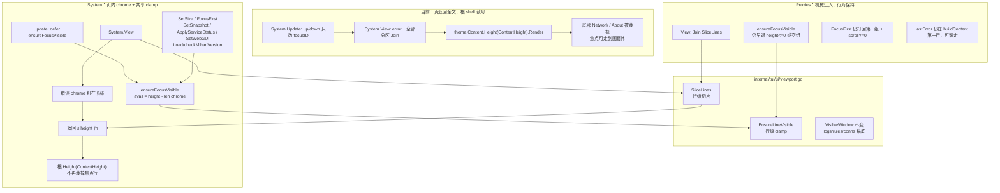
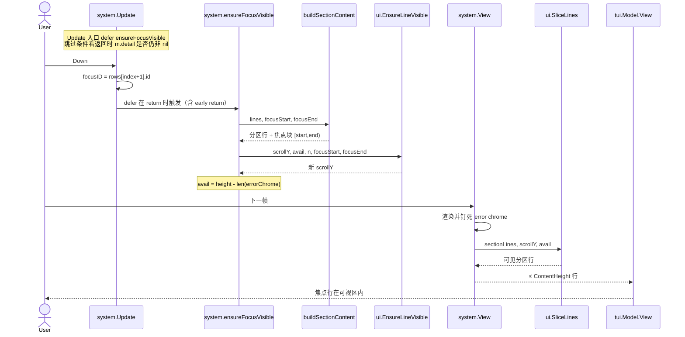

# TUI System 页焦点滚动设计

日期：2026-08-31
状态：设计定稿，待审批
关联 issue：https://github.com/mihari-proxy/mihari/issues/158
目标分支：`feat/158-system-page-scroll`（从 `origin/dev` @ `470e516`）
工作目录：`.worktrees/feat-158-system-page-scroll`
PR 目标：`dev`

## 1. 背景

System 页在普通高度终端里已经放不下。v0.7.5 增加 About（#97），v0.8.0 增加 Ports Config（#101），#106 又把宽屏双列改成始终单列，纵向高度继续增加。现场（v0.8.1，Windows Terminal）内容区被 Ports Config、Daemon、mihomo core、System service 铺满后，Network 只剩标题线，About 完全在折线以下。

焦点其实能走到这些被裁掉的行：`Update` 的 `up`/`down`（`internal/tui/pages/system/model.go:849-856`）只在 `m.rows()` 上改 `focusID`。`View()`（`model.go:1014-1026`）却把错误条和全部分区 `Join` 后整页返回，`SetSize`（`model.go:453`）只记录宽高。根 shell 再用

```go
body := model.theme.Content.Width(layout.ContentWidth).MaxWidth(layout.ContentWidth).Height(layout.ContentHeight).Render(page.View())
```

（`internal/tui/model.go:1104`）按内容区高度裁切。结果是：键盘焦点已经在 About，画面仍停在 Ports Config。

同一 TUI 里 Proxies 页已经有可用模式：`scrollY` + `buildContent()` + `ensureFocusVisible()`（`internal/tui/pages/proxies/model.go:56,106-117,213-340`），回归测试 `TestNavigation_ScrollKeepsFocusVisible`（`internal/tui/pages/proxies/navigation_test.go:64`）与 `TestNavigation_ScrollKeepsExpandedNodeVisible`（同文件 `:122`）。System 没有对应实现。

这是对先前明确延期的收口：

- About 设计 Non-Goal（`docs/superpowers/specs/2026-08-17-system-about-section-design.md` §3）：「不为 About 单独做 System 页滚动；现有页面在矮窗口下本来就会裁切底部。」
- Ports Config 设计 Non-Goal（`docs/superpowers/specs/2026-08-17-system-ports-config-design.md` §3）：「不为 System 单独做滚动容器（矮窗口仍裁切底部，与现状相同）。」

#158 把这两条非目标翻转为目标。

上一版同文件草稿把 Proxies 的 clamp **复制**进 System，并写死「不抽共享 helper」。用户审阅后拍板：行级窗口 **算法** 必须抽成一对纯函数，Proxies 与 System **同时**调用。本文件按该决定原地修订。System 特化（钉顶错误 chrome、`FocusFirst` 不回顶、调用点、五条必写测试）全部保留，不重开。

本设计修 System 页内容区滚动，并把 Proxies 已有 clamp/切片机械迁到同一对函数上。不改协议、不改 mutation、不恢复双列。

## 2. 目标

- System 页内容高度超过内容区时进入 **行级 viewport 滚动**，当前焦点行始终落在可视区内。
- 行级窗口算法以 `ui.EnsureLineVisible` + `ui.SliceLines` 为 **唯一共享面**（放在现有 `VisibleWindow` 旁，`internal/tui/ui/viewport.go`）。Proxies 同 PR 迁入，行为保持。
- 被裁掉的分区（Network 正文、About 标题与焦点行，以及 System service 里被裁掉的动作行）能用 `↑`/`↓` 滚进画面。About 底边框在焦点落在卡内非首行时按 §6 / 7.6 会被裁掉，不要求整卡入画。
- 失败原因继续钉在内容顶部，保留现有 `visibleErrorDetail()`（`model.go:1538-1543`）语义；错误条本身不随分区一起滚走。
- 端口行内编辑（`editID` / `updatePortEdit`，`model.go:1896-1931`）期间，正在编辑的行保持可见。
- 详情 overlay（`m.detail != nil`）保持现有全页替换，不引入滚动。
- 内容能放下时 `scrollY == 0`，`View()` 仍包含全部分区，现有按「标题出现在 View 字符串里」的测试继续绿。
- 纯 TUI 修复。不改 `/v1` DTO、错误码、JSON envelope、CLI 退出码、持久化或安全边界。

## 3. 非目标

- 不恢复宽屏双列。`TestSystemView_StacksSectionsInSingleColumnWhenWide`（`model_test.go:2555`，`SetSize(84, 40)`）已钉死「同一行不得出现两个 `╭`」。双列是另一项产品决策，且 Compact 窗口（内容宽度约 58）本来就不会走双列，修不了 #158。
- 不新增 PgUp / PgDn / 鼠标滚轮。
- 不抽 `LineViewport` 结构体（Chrome / Width 字段），不抽可滚动页壳，不上 bubbles `Viewport` / `list`。
- 不把行级窗口合并进 `ui.VisibleWindow`（item-index、锚底；logs/rules/conns 继续用现语义）。不改 `VisibleWindow` 的参数或行为。
- 不把 `buildContent` / `buildSectionContent`、焦点块映射、错误 chrome、`FocusFirst` 策略、各页何时调用 ensure 抽到 `ui`。这些留在页内。
- 不改 Proxies 的 `lastError` 放置（仍是 `buildContent` 里可滚动内容的第一行，可以滚走）和 `FocusFirst`（仍打回第一组且 `scrollY=0`）。
- 不改 rail、status bar、footer、帮助层。
- 不改任何 mutation / 确认 / 提权 / 端口写入路径。
- 不修 #89（确认后 Done 丢焦点光标）或 #90（详情卡换行）。
- 不改根 shell 的 `Height(layout.ContentHeight)` 裁切（其它页仍依赖它作安全网）。
- 功能 PR 不修改 `CHANGELOG.md`。
- 不改 System `FocusFirst` 的焦点选择语义：当前只在 `rowIndex(focusID) < 0` 时落到 `rowDaemon`（`model.go:462-466`）；`New` 默认 `focusID = rowMixed`（`model.go:392`）。重新进入内容区时若焦点仍有效则保持，由滚动去跟上，不强制跳回顶部行。

## 4. 当前行为（已核对）

### 4.1 根 shell 裁切

`calculateLayout`（`internal/tui/layout.go:35-56`）：

- 最小可用终端 `72×22`（Compact），`ContentHeight = max(1, height-StatusHeight-FooterHeight)` → 普通 Compact 内容区 **20 行**。
- 官方 Full `100×28`（`layout_test.go:48`）内容区 **26 行**。
- `resizePages`（`internal/tui/model.go:1130-1134`）把 `(ContentWidth, ContentHeight)` 传给每个 page 的 `SetSize`。

System 六个圆角分区在提权 + 服务 running + 双面板的现场大约 **34–36 行**（Ports 5 + Daemon 6~8 + Core 6 + Service 7 + Network 6 + About 4）。26 行的 Full 窗口也放不下，这就是 issue 截图里「普通高度已经裁切」的原因。

### 4.2 System `View` 没有窗口

```go
func (m *Model) View() string {
    if m.detail != nil {
        return m.theme.Content.Width(m.width).Height(m.height).Render(
            m.theme.Title.Render(strings.TrimSpace(m.detail.label)+" details") + "\n\n" + m.detail.detail + "\n\n" + ui.EscCloseHint,
        )
    }
    var parts []string
    // Pin failure reason at the top so it is not clipped away.
    if detail := m.visibleErrorDetail(); detail != "" {
        parts = append(parts, m.theme.Danger.Render(detail))
    }
    parts = append(parts, m.renderSections()...)
    return strings.Join(parts, "\n")
}
```

`renderSections`（`model.go:1029-1084`）按 `item.section` 分组，每组 `ui.RenderBorderedSection`。没有 `JoinHorizontal`、没有 `HalfSectionInner`，始终单列。行值经 `RenderBorderedSection` 的 `MaxWidth` 截断而不是折行（`internal/tui/ui/section_card.go:121-131`），因此每个 `row` 当前对应 **1 条 body 行** + 分区上下边框。

`visibleErrorDetail`：失败 outcome 优先用 `outcomeDetail`，否则 `strings.TrimSpace(lastError)`。注释写明「钉在顶部以免被裁掉」，但整页字符串仍从 Ports Config 起算，根 shell 一裁，错误条反而最安全、About 最倒霉。Issue 要求滚动之后 **错误条仍然钉顶**——这是相对 Proxies 的 System 特化。

### 4.3 Proxies 已有的行级窗口

| 点 | Proxies | System 现状 |
| --- | --- | --- |
| `scrollY` | 可视内容第一行（`model.go:56`），留在页 Model | 无 |
| `SetSize` | 记宽高后 `ensureFocusVisible()` | 只记宽高 |
| `FocusFirst` | 焦点归第一组、`scrollY=0`、再 `ensureFocusVisible()` | 仅在非法 `focusID` 时落到 `rowDaemon` |
| `View` | `buildContent()` 后若 `height>0 && len(lines)>height` 则切片 | 返回全部分区 |
| 错误行 | `lastError` 是可滚动内容的第一行，**可以滚走** | `visibleErrorDetail` 意图钉顶，但无窗口 |
| 焦点块 | 组焦点含顶边框+标题行；节点焦点为节点行区间 | 无 |
| 超高焦点块 | 钉住块顶 | 无 |
| 测试 | `TestNavigation_ScrollKeepsFocusVisible`（height=5，20 组）；`TestNavigation_ScrollKeepsExpandedNodeVisible` | 现有测试都不覆盖「矮窗口焦点仍可见」 |

`ensureFocusVisible` 本体在 `proxies/model.go:313-340`。本 PR 把它收成 `ui.EnsureLineVisible`，页内只保留 `buildContent` + 调用。现有导航测试 **不得改断言**。

`ui.VisibleWindow`（`internal/tui/ui/viewport.go:13-23`）是 **item-index、锚底** 的 logs/rules/conns 表格窗口，不是带圆角分区的行级切片。该文件目前 **只有** `VisibleWindow`，没有 `viewport_test.go`。日志页设计（`docs/superpowers/specs/2026-08-13-log-rule-conns-linecount-design.md`）也明确坚持手写渲染循环、不用 bubbles viewport。

### 4.4 现有测试与 `SetSize` 高度

| 测试 | `SetSize` | 对滚动的含义 |
| --- | --- | --- |
| `TestView_SectionGroups` | `(100, 40)` | 40 ≥ 全页，切片是 no-op |
| `TestSystemCoreChannelRowRendersSnapshotChannelAndVersion` | `(100, 40)` | 同上 |
| `TestSystemView_StacksSectionsInSingleColumnWhenWide` | `(84, 40)` | 同上；并断言无双列 |
| `TestView_FocusedRowHighlightOnlyWhenContentFocused` | `(80, 24)` | 24 可能裁掉 About，但只断言 Daemon 的 `FocusMarker` / RowFocus |
| `TestSystemAboutRendersDescriptionAndGitHub` 等 | **不调用 `SetSize`** | `height==0`，必须继续返回全文 |

新测试必须用 **短高度（约 8–12）** 才能证明滚动。`height<=0` 返回全文这条规则不能破，否则 About 系列测试会红。`SliceLines` 的 `height<=0 → 原文` 正是为这条规则服务。

## 5. 方案比较

### 5.1 采用：两个纯函数 + 两页调用

在 `internal/tui/ui/viewport.go` 于 `VisibleWindow` 旁新增 `EnsureLineVisible` 与 `SliceLines`。语义对齐当前 Proxies `ensureFocusVisible` / `View` 切片。`scrollY` 仍留在各页 Model。System 继续自己算 chrome 与焦点块，再把 `(scrollY, avail, n, focusStart, focusEnd)` 交给 helper。

理由：clamp 只有一份，两页不会各自漂移；helper 没有 Chrome/Width/页壳，YAGNI 边界清楚。

### 5.2 不采用：只在 System 页复制 Proxies clamp（上一版 Decision 1）

上一版认为 System 多出来的钉死错误条和扁平 row 会迫使共享函数加开关。用户否决：两页已经在用同一套行级窗口，复制等于制造第二份会分叉的公式。chrome 与焦点映射本来就不该进 helper。

### 5.3 不采用：bubbles Viewport / 可滚动页壳

与 logs/rules/conns 既有约束一致：TUI 页保持手写渲染循环。Viewport 模型要接管键盘和样式，和现有 `row` + `RenderBorderedSection` + 端口 `textinput` 叠在一起，改动面大于 bugfix。

### 5.4 不采用：把行级窗口合并进 `ui.VisibleWindow`

`VisibleWindow` 按 **item 下标** 锚底滚动，输入是 `count/height/chrome/following/focused`。System / Proxies 的可视单元是 lipgloss 渲染后的 **终端行**（含 `╭/╰` 边框），一个分区 3–8 行不等，焦点块有时还要带上顶边框。硬套会把整张卡滚进滚出，Network 标题线仍可能单独露出来——正是现在的现场。两者是不同原语，并列共存。

### 5.5 不采用：抽出带 Chrome/Width 的 `LineViewport` 结构体

结构体会开始长字段（chrome 行、宽度截断、焦点映射、页壳）。System 的错误条与 Proxies 的 `lastError` 语义相反，硬塞进去就是抽象腐烂。本 PR 只要两个纯函数。

### 5.6 不采用：抽出 helper 但 Proxies 继续用私有副本

单一调用方等于没共享。用户要求两页都走同一对函数，同 PR 完成 Proxies 调用点替换。

### 5.7 不采用：恢复双列当「修复」

#106 已经因为宽屏双列截断端口 URL 与 Network 状态而改回单列（`CHANGELOG.md` 对应条目；`TestSystemView_StacksSectionsInSingleColumnWhenWide`）。即便恢复，Compact `72×22` 内容区仍约 20 行，六个分区照样溢出。双列不是 #158 的解。

### 5.8 不采用：改根 shell，让 System 自行无限高、由父级滚动

根 `View` 对所有 page 一视同仁加 `Height(ContentHeight)`。父级滚动没有焦点信息，无法实现「焦点行始终可见」。滚动状态必须留在页内，根裁切只作溢出安全网。

## 6. 用户界面

交互与现在相同：内容区 `↑`/`↓` 按 `rows()` 顺序走焦点，`Enter` / `Esc` / 端口编辑快捷键不变。唯一可见变化：焦点走出当前窗口时画面跟着走。Proxies 对外行为不变。

矮窗口、无错误条、焦点在 GitHub 时（About fixture，全文 27 行，`height=12`）。GitHub 是非首行，焦点块只有那 1 条 body 行；`ensureFocusVisible` 把该行钉在窗口最后一行，**不**把 About 底边框算进焦点块（与 7.6 / Proxies 节点焦点一致）。因此 `╰` 被裁掉，窗口上方是 Core / Service / Network 的残留行，而不是「错误条 + 完整 Network 卡 + 完整 About 卡」：

```text
│   Install core     Unavailable              │  ← 可见窗口 [14:26)，GitHub 在 25
│   Restart core     Unavailable              │
╰─────────────────────────────────────────────╯
╭───System service────────────────────────────╮
│   Status           Unavailable              │
╰─────────────────────────────────────────────╯
╭───Network───────────────────────────────────╮
│   TUN              Unavailable              │
╰─────────────────────────────────────────────╯
╭───About─────────────────────────────────────╮
│   Mihari          A local manager for mihomo│
│ > GitHub          github.com/mihari-proxy/… │  ← 第 12 行 / 钉底；无 ╰
```

加 1 行错误 chrome 后 `avail=11`，GitHub 仍钉在分区窗口底，About 底边框仍被裁；Ports Config 标题不在窗口内。不要为了让 mock 好看而把底边框并进焦点块——多出来的高度只会多露出**上方**卡片，不会补全 About 底边。

- 错误条在：固定占用 View 顶部 **恰好 1 行**（7.7），分区在 `height-1` 里滚动。
- 错误条不在：分区使用全部 `height`，与 Proxies 相同。
- 内容 ≤ 可用高度：`scrollY = 0`，六张卡都在，和今天高窗口行为一致。
- 焦点块（含「分区首行带顶边框」）比剩余高度还高：钉住块顶，与 Proxies `ensureFocusVisible` 注释一致。
- 详情 overlay：仍是 `Width(m.width).Height(m.height)` 的全页替换，滚动无意义。

不增加滚动指示器、不改 `FooterSystem` / `FooterPortsEdit`。

## 7. 提议架构

### 7.1 当前裁切 vs 共享行级窗口



### 7.2 按键到切片的时序



Proxies 路径更短：`move` / `SetSize` / `FocusFirst` / `SetGroups` 调页内 `ensureFocusVisible` → `ui.EnsureLineVisible`；`View` 直接 `ui.SliceLines`。不走 System 的 chrome / `Update` defer。

### 7.3 唯一共享面：`EnsureLineVisible` / `SliceLines`

放在 `internal/tui/ui/viewport.go`，与现有 `VisibleWindow` 并列。标识符固定如下（仓库内无碰撞）。**不要**把它们收进 `VisibleWindow`，也 **不要**再包一层结构体。

注释必须写明：这是 **行级** 窗口（终端行 / 半开焦点块），与 `VisibleWindow` 的 item-index 锚底表格窗口不是同一原语。

```go
// EnsureLineVisible keeps [focusStart, focusEnd) inside a window of viewH lines.
// Returns the new scrollY. n is len(lines).
// Semantics (match current Proxies ensureFocusVisible at
// internal/tui/pages/proxies/model.go:313-340):
//   - viewH <= 0: return scrollY unchanged (callers that no-op when height<=0)
//   - n == 0: return 0
//   - focusStart < 0 || focusEnd <= focusStart: clamp scrollY into [0, max(0,n-viewH)]
//   - focusEnd-focusStart >= viewH: pin scrollY = focusStart, then clamp
//   - else: if focusStart < scrollY → scrollY = focusStart;
//           if focusEnd > scrollY+viewH → scrollY = focusEnd-viewH;
//           then clamp to [0, max(0,n-viewH)]
func EnsureLineVisible(scrollY, viewH, n, focusStart, focusEnd int) int

// SliceLines returns the visible window of lines.
//   - height <= 0: return lines unchanged (full page; protects tests that never SetSize)
//   - otherwise: start = min(max(0, scrollY), max(0, len(lines)-height));
//     return lines[start:start+min(height, len(lines)-start)]  // never panic
func SliceLines(lines []string, scrollY, height int) []string
```

参考实现（实现期以测试为准，语义必须与上表一致）：

```go
func EnsureLineVisible(scrollY, viewH, n, focusStart, focusEnd int) int {
    if viewH <= 0 {
        return scrollY
    }
    if n == 0 {
        return 0
    }
    maxScroll := max(0, n-viewH)
    clamp := func(y int) int { return min(max(0, y), maxScroll) }
    if focusStart < 0 || focusEnd <= focusStart {
        return clamp(scrollY)
    }
    if focusEnd-focusStart >= viewH {
        scrollY = focusStart
    } else {
        if focusStart < scrollY {
            scrollY = focusStart
        }
        if focusEnd > scrollY+viewH {
            scrollY = focusEnd - viewH
        }
    }
    return clamp(scrollY)
}

func SliceLines(lines []string, scrollY, height int) []string {
    if height <= 0 {
        return lines
    }
    n := len(lines)
    start := min(max(0, scrollY), max(0, n-height))
    return lines[start : start+min(height, n-start)]
}
```

精确边界（测试必盖）：

- `focusEnd == scrollY+viewH`：已经可见（半开区间），`scrollY` 不变。
- `n` 缩小到小于 `scrollY`：clamp 到 `max(0, n-viewH)`。
- `SliceLines` 在 `height<=0` 时允许返回同一 backing slice。
- `SliceLines` 不得 panic：空 `lines`、负 `scrollY`、`scrollY` 越过末尾都走 clamp。

**调用陷阱：** `SliceLines` 的 `height<=0` 表示「未 `SetSize`，返回全文」，**不是**「零高度窗口返回空」。System 在 `height>0` 且错误 chrome 占满窗口（`avail==0`，仅 `height==1` 的极端）时，**不得**把 `0` 传给 `SliceLines`，否则会把全部分区拼在错误条后面，撑破 `height`。见 7.8。

### 7.4 Proxies 迁入（同 PR、行为保持）

`scrollY` 仍在 `proxies.Model`（`model.go:56`），不搬进 `ui`。

`ensureFocusVisible` 变成：

```go
func (m *Model) ensureFocusVisible() {
    if m.height <= 0 || len(m.groups) == 0 {
        return
    }
    lines, focusStart, focusEnd := m.buildContent()
    m.scrollY = ui.EnsureLineVisible(m.scrollY, m.height, len(lines), focusStart, focusEnd)
}
```

**保留** `height<=0 || len(m.groups)==0` 早退，让空组路径与今天逐比特一致：当前实现在空组时不调用 `buildContent`、不改 `scrollY`。helper 的 `n==0 → 0` 若套到空组上，会把残留 `scrollY` 清零——`View` 对空组走另一条「无组卡片」分支、不读 `scrollY`，但为锁行为选择早退，不把空组交给 helper。`height<=0` 对 helper 也是 no-op，留在同一个 `if` 里最省事。

`View` 切片变成：

```go
func (m *Model) View() string {
    if len(m.groups) == 0 {
        // 现有空组卡片，不动
        ...
    }
    lines, _, _ := m.buildContent()
    return strings.Join(ui.SliceLines(lines, m.scrollY, m.height), "\n")
}
```

今天的 `if m.height > 0 && len(lines) > m.height { 切片 }` 与 `SliceLines` 等价：`height<=0` 返回全文；`n<=height` 时 `start=0` 返回全部。不要保留第二套手写切片。

保持不变：

- `lastError` 仍由 `buildContent` 插在 `lines[0]`（`model.go:233-235`），可以滚走。
- `FocusFirst` 仍打回第一组且 `scrollY=0`（`model.go:111-117`）。
- `move` / `SetSize` / `SetGroups` / expand 的 ensure 调用点不动。
- `TestNavigation_ScrollKeepsFocusVisible` / `TestNavigation_ScrollKeepsExpandedNodeVisible` **不改断言**。若有测试窥视精确 clamp 公式，也必须继续绿。

这是机械调用点替换，不是 Proxies 行为变更。

### 7.5 System 数据模型

`system.Model`（`model.go:295-352`）增加一个字段：

```go
scrollY int // 可滚动分区内容的顶行（不含错误 chrome）
```

零值 `0` 即「从 Ports Config 顶边框开始」，现有未 `SetSize` 的测试不受影响。`scrollY` 留在 `system.Model`，不搬进 `ui`。

不新增持久化、不写 daemon 管理的文件、不改 `internal/control/protocol`。

### 7.6 System `buildSectionContent`

把当前 `renderSections` 的分组循环收成一个函数，返回：

```go
func (m *Model) buildSectionContent() (lines []string, focusStart, focusEnd int)
```

- `lines`：六张（或实际存在的）`RenderBorderedSection` 卡按现有顺序拆成终端行。顺序不变：Ports Config → Daemon → mihomo core → System service → Network → About（`rows()` 在 `model.go:1087-1109`）。
- `focusStart, focusEnd`：相对 **分区行** 的半开区间 `[start, end)`，不含错误 chrome。
- 焦点映射（对齐 Proxies `buildContent` 对组标题的处理，`proxies/model.go:296-307`）：
  - 焦点行是该分区 **第一行**：焦点块 = 顶边框（标题）+ 该 body 行，避免滚到分区首行时标题被切掉。
  - 否则：焦点块 = 该 row 实际占用的 body 行。当前 `labelPart+value` 不含 `\n`，每个 row 对应 1 条 body 行；若未来 value 带换行，按 split 后的行数计。
  - 不把底边框算进焦点块（Proxies 节点焦点也不含底边框）。`height=12` 钉 GitHub 时 About 的 `╰` 被裁掉是算法结果，不是缺陷；§6 mock 按此绘制。从分区首行 `↓` 到第二行时，标题通常仍在上一帧窗口里。
- 允许删除独立的 `renderSections`，改为 `buildSectionContent` 的唯一渲染路径，避免两套分组循环漂移。不要抽到 `internal/tui/ui`。

错误条 **不** 放进 `buildSectionContent`。这是与 Proxies 的故意差异：Proxies 把 `lastError` 插在 `lines[0]`，可以滚走（`proxies/model.go:233-235`）。共享函数不表达这一点。

### 7.7 错误 chrome（System 特化）

策略：**恰好 1 行** chrome（或 0 行）。允许末尾省略号，禁止折成第二行去偷 `avail`。根 shell `theme.Content` 是 `Padding(0, 1)`（`internal/tui/ui/theme.go:78`），内宽 `ContentWidth-2`。分区卡外宽已是 `pageWidth-2`（`FullSectionInner` = `pageWidth-4`，外框 +2，`section_card.go:14-16,109`）。错误条必须截到同一外宽 `max(1, m.width-2)`，**不得** `MaxWidth(m.width)`——那会比内盒宽 2 列，被根 `Width(ContentWidth)` 折成第二 *视觉* 行，页内 `strings.Count("\n")+1` 仍 ≤ height，根 `Height(ContentHeight)` 却裁掉最后一行（往往是刚钉住的 GitHub）。

现有来源并非都是短常量：`ui.ServiceElevationRequired`（`strings.go:245`）76 字符，由 `confirmServiceAction`（`model.go:1424`）直接写入 `lastError`；Compact 内容宽 58、内宽 56，今天就会折行。`actionErrorDetail`（`model.go:1656-1663`）原样转发 `protocol.APIError.Message`，可能含 `\n`。

禁止 `lipgloss.NewStyle().Width(n)`（`Style.Width()`）折行，那会让 chrome 变成 2+ 视觉行去偷 `avail`。截断只用 `MaxWidth`。`lipgloss.Width(str)` 是量宽 API，**只**在测试里用来断言视觉宽度（Testing B.5），生产路径不要用它决定折行。`theme.Danger` 仅前景色（`theme.go:90`），本身不插入换行；ANSI CSI 也不含 `\n`。

```go
func (m *Model) errorChromeLines() []string {
    detail := strings.TrimSpace(m.visibleErrorDetail())
    if detail == "" {
        return nil
    }
    detail = strings.ReplaceAll(detail, "\n", " ")
    rendered := m.theme.Danger.Render(detail)
    if m.width > 0 {
        rendered = lipgloss.NewStyle().MaxWidth(max(1, m.width-2)).Render(rendered)
    }
    if i := strings.Index(rendered, "\n"); i >= 0 {
        rendered = rendered[:i]
    }
    return []string{rendered}
}
```

顺序固定：trim → 把 `\n` 换成空格 → `Danger.Render` → `MaxWidth(max(1, m.width-2))`（`width<=0` 时跳过截断，保护未 `SetSize` 的测试）→ 若仍出现 `\n` 只留第一视觉行。`width<=0` 时仍把内部换行压成一行，保证 chrome 行数是 0 或 1。

可用高度：

```text
avail = height - len(errorChromeLines)   // 0 或 1
若 height > 0 且 avail < 1：错误条占满窗口，分区不画（仅 height==1 的极端）
```

`ensureFocusVisible` 必须把扣掉 chrome 之后的 `avail` 传给 `EnsureLineVisible`。chrome 出现/消失时（含 `openGitHub` 同步写 `lastError`、`confirmPortEdit` 写 `InvalidPortEndpoint`、`checkMihariVersion`/`markRowOutcome`）由 7.10 的调用点重新 clamp，禁止底部留白。

### 7.8 System `View`

```go
func (m *Model) View() string {
    if m.detail != nil {
        // 保持现有 overlay，不动
        return m.theme.Content.Width(m.width).Height(m.height).Render(...)
    }
    errorLines := m.errorChromeLines()
    sectionLines, _, _ := m.buildSectionContent()
    if m.height <= 0 {
        return strings.Join(append(append([]string{}, errorLines...), sectionLines...), "\n")
    }
    if len(errorLines) >= m.height {
        // chrome 占满已设定尺寸的窗口。不得 SliceLines(..., 0)：
        // helper 的 height<=0 表示「未 SetSize，返回全文」。
        return strings.Join(errorLines[:m.height], "\n")
    }
    avail := m.height - len(errorLines)
    return strings.Join(append(errorLines, ui.SliceLines(sectionLines, m.scrollY, avail)...), "\n")
}
```

不变量：

1. `height <= 0` → 全文（保护未 `SetSize` 的测试）。走 `Join`，不调用 `SliceLines(..., 0)`——虽然结果碰巧相同（`SliceLines` 此时返回原文），但语义上「未设定尺寸」由页级 `if` 表达，避免与「avail==0」混淆。
2. `height > 0` → 输出行数 ≤ `height`（`strings.Count(view,"\n")+1` 与 Proxies 测试同一口径）。错误 chrome 为 0 或 1 行，且每行显示宽度 ≤ `max(1, width-2)`，避免根 `Padding(0,1)` 再折行。
3. 内容能放下 → `scrollY` 被 clamp 为 0，View 含全部分区标题。
4. `View` **不得** 调用 `ensureFocusVisible`（保持渲染侧无副作用；Proxies 也是如此）。

### 7.9 System `ensureFocusVisible`

```go
func (m *Model) ensureFocusVisible() {
    lines, focusStart, focusEnd := m.buildSectionContent()
    avail := m.height - len(m.errorChromeLines())
    m.scrollY = ui.EnsureLineVisible(m.scrollY, avail, len(lines), focusStart, focusEnd)
}
```

不在 helper 里扣 chrome。`height<=0` 时 `avail<=0`，helper 原样返回 `scrollY`（与「未 SetSize 是 no-op」一致，现有测试不受影响）。`height==1` 且 chrome==1 时 `avail==0`，helper 同样 no-op；`View` 按 7.8 只画 chrome，残留 `scrollY` 无观察效果。不必再手写一份 clamp。

可选：`height<=0` 时提前 return 以跳过 `buildSectionContent`。语义等价，不强制。

### 7.10 System 调用点

`system.Update`（`model.go:615-924`）是大 `switch` + 多处 `return m, cmd`，外加 `detail` / `updatePortEdit` / 非 key 三条提前退出。`up`/`down` 会落到函数末尾 `return m, nil`（924），但生产路径里真正改 chrome 或行列表的几乎全是 **early return**。在函数底部写一次 `ensureFocusVisible()` 对那些路径是死代码。Proxies 把调用放在 `move()`（`navigation.go:19`）而不是 `Update` 尾部，且 `selectionResultMsg` 写 `lastError` 后 `return m, nil`（`proxies/model.go:142-144`）并不 ensure——照抄会漏掉 System 的 chrome 高度变化。

**强制实现：`Update` 入口 `defer`，不要共享尾调用。** 何时 ensure 仍是页内策略，不抽到 `ui`。

```go
func (m *Model) Update(message tea.Msg) (ui.Page, tea.Cmd) {
    defer func() {
        if m.detail != nil {
            return
        }
        m.ensureFocusVisible()
    }()
    // ... 现有 switch，含所有 early return
}
```

跳过条件看的是 **handler 返回之后** 的 `m.detail`：overlay 打开期间不 clamp；`esc`/`enter` 把 `m.detail` 置 nil 后 defer 仍会跑，关闭详情要重新对准焦点行。

该 defer 覆盖所有从 `Update` 进去的路径，包括下列 **chrome 高度站点**（即使它们 `return` 在 `switch` 中间）：

| 站点 | 写法 | chrome / 焦点 |
| --- | --- | --- |
| `up` / `down` | 改 `focusID` 后落到 924 或任何 return | 焦点块移动 |
| `openGitHub` | `return m, m.openGitHub()`（916）；`openGitHub`（1999-2001）同步写 `lastError = ui.AboutGitHubOpenFailed` | 用户已在 GitHub（窗口底）时 chrome +1，`avail` 缩小，旧 `scrollY` 会切掉 GitHub 行 |
| `beginPortEdit` | `return m, m.beginPortEdit(...)`（918） | 编辑行保持可见 |
| `updatePortEdit` / `confirmPortEdit` | `editID != ""` 时 839 提前 `return m.updatePortEdit(...)`；校验失败（1944-1946）写 `lastError = ui.InvalidPortEndpoint` 且不走 `markRowOutcome`、不取消 `editID` | chrome +1 时编辑行不能被挤出 |
| `cancelPortEdit` | 编辑态 `esc`/`up`/`down` 只取消编辑、**不移动焦点**（现有行为，不顺手改） | 退出编辑后 clamp |
| `markRowOutcome` 的 Update 分支 | 失败 outcome 让 chrome 出现或消失 | `avail` 变化 |

`beginPortEdit` / `cancelPortEdit` 函数体内再调一次 ensure 与 defer 重复，无害，不强制。

**`Load` 不进 `Update`。** 根 shell 在 rail `Enter` 时先 `FocusFirst()` 再 `Load()`（`internal/tui/model.go:753-755`）。`Load()` 调 `load(true)`，组 cmd 时调用 `checkMihariVersion()`（`model.go:516-517,547-561`）。读通道文件失败时 `checkMihariVersion` **同步** `markRowOutcome(...)` 再 `return nil`，chrome 已 +1，但没有任何 `Update` defer。

因此 `ensureFocusVisible` 必须跑在这次同步写入 **之后**：放在 `markRowOutcome` 末尾（失败与成功都 clamp；`avail` 可因 chrome 出现或消失而变），或放在 `checkMihariVersion` 里、紧跟 `markRowOutcome` 返回之后（`Load`/`load` 若还有其它同步写 chrome 的路径，同样要在那些写入之后再 ensure）。**禁止**把 ensure 只放在 `Load()` 顶部（`load(true)` / `checkMihariVersion()` 之前）：那时 `markRowOutcome` 还没跑，会漏掉 chrome +1。`height<=0` 时 ensure 是 no-op，不影响现有测试。独立的 Load 同步路径测试仍为可选，不计入 Testing B 最小红集。

**页外写入 `rows()` 形状、也不进 `Update`：**

| 写入 | 调用方 | 形状变化 |
| --- | --- | --- |
| `SetSnapshot` | `syncSystem()`（`internal/tui/model.go:721-724`）状态轮询 | `Capabilities` 开关 `panelRows`、System-proxy 行、TUN 动作行。About fixture 按未连接设计；连上后 GitHub **上方** 增加 2–4 条 body 行 |
| `ApplyServiceStatus` | `syncSystemServiceStatus()`（`tui/model.go:259-265`） | 不改 `elevated`；若已经提权，`NotInstalled`（约 3 行卡）↔ `Running`（status+uninstall+reinstall+stop+restart ≈ 7 行） |
| `SetWebGUI` | 测试 / 可选注入；live 路径是 `webGUIStatusMsg`（由 Update defer 覆盖） | 面板行显隐 |

这三者必须调用 `ensureFocusVisible()`（`height<=0` 时 no-op）。`ApplyRootNetworkStatus` 只改已有 Network 行的值，不改 capability 行数，不必调。Pending/outcome chip 与端口 `textinput` 宽度 28 都不改行数。

`FocusFirst` 只在 rail `Enter` 调用（`tui/model.go:753`）。方向键落在 System（`landRailPage`，766-785）不调它。`ClearDone` 离开时不清 `scrollY`（§9）；只要 `SetSnapshot` / `ApplyServiceStatus` 会重新 clamp，轮询就不会把已聚焦的 GitHub 挤出窗口。

`SetSize`、`FocusFirst` 仍显式调用。`View` 不得调用。

`FocusFirst` **不要** 模仿 Proxies（`proxies/model.go:111-117`：焦点打回第一组且 `scrollY=0`）。System 重新进入内容区时保留有效 `focusID`，由滚动跟上。`TestSystemAboutRowsFollowNetworkAndKeepDaemonFocus` 只钉 `New` 默认 `rowMixed`，**从不调用 `FocusFirst`**；Decision 7 由 `TestFocusFirst_PreservesGitHubAndScrolls` 锁住。非法 `focusID` 仍落到 `rowDaemon`（现有契约）。

### 7.11 端口编辑

`beginPortEdit`（`model.go:1896`）在 Mixed / Controller / Web 上打开 `textinput`。行高不变（宽度 28，`model.go:1904`）。需要 ensure 是因为 **chrome 和焦点位置**，不是因为输入框变高：

- 从 `Update` 进入时由 7.10 的 defer 覆盖 `beginPortEdit` / `updatePortEdit` / `confirmPortEdit` / `cancelPortEdit`。
- `confirmPortEdit` 校验失败写 `lastError = ui.InvalidPortEndpoint` 且保持 `editID`：chrome +1，编辑行必须仍在 `avail` 内。
- 编辑态 `up`/`down` **仍只取消编辑、不移动焦点**——现有行为，不顺手改。

编辑态不引入额外滚动键。

### 7.12 根 shell

不改 `internal/tui/model.go:1104` 的 `Height(layout.ContentHeight)`。System `View` 输出已经 ≤ `ContentHeight` 时，这层 Render 是恒等安全网。其它页（Overview、未实现滚动的页）继续靠它裁切。

不改 `resizePages`、`calculateLayout`、rail、footer。

## 8. API / 接口变化

**不是** `/v1` 控制协议变更。无新 DTO、错误码、JSON envelope、CLI 标志或退出码。

这是 **模块内部 TUI API** 新增：`internal/tui/ui` 包导出两个符号（Go 导出给本模块其它包使用，不是对外稳定契约，但也是可调用的包 API，实现期不要改名）：

- `func EnsureLineVisible(scrollY, viewH, n, focusStart, focusEnd int) int`
- `func SliceLines(lines []string, scrollY, height int) []string`

同文件的 `VisibleWindow` 签名与语义不变。`ui.Page`（`internal/tui/ui/page.go:32-37`）签名不变。

`scrollY` 仍为各页私有状态，测试与实现同包，不必导出。

## 9. 数据模型与持久化

无 schema、无迁移。`scrollY` 只活在 TUI 进程内存里，离开页面或进程退出即丢。System `ClearDone`（`model.go:1531`）仍只清 outcome / `lastError`；不必清 `scrollY`。离开后再 `Enter` 会 `FocusFirst` → ensure；停留在页内时靠 `SetSnapshot` / `ApplyServiceStatus` 重新 clamp（`landRailPage` 方向键预览不调 `FocusFirst`）。

Proxies 的 `scrollY` 所有权不变。

## Key Decisions

1. **行级窗口算法抽成 `ui.EnsureLineVisible` + `ui.SliceLines`，Proxies 与 System 同时调用。** 这是唯一共享面。上一版「只在 System 本地复制、不抽 helper」已否决。不抽 `LineViewport`，不合并 `VisibleWindow`，不抽页壳，不把 chrome / 焦点映射 / FocusFirst / 何时 ensure 放进 `ui`。Proxies 空组保留 `height<=0 || len(groups)==0` 早退，使空组路径与今天一致。
2. **失败原因是非滚动 chrome，不是可滚动内容。** Issue 明确要求保留 `visibleErrorDetail` 钉顶。Proxies 的 `lastError` 可以滚走，System 不能照抄那一点。chrome **恰好 0 或 1 行**，截到 `max(1, width-2)`（与全宽卡外宽一致，对齐 `theme.Content` 的 `Padding(0,1)`）；禁止 `Width()` 折行。`ensureFocusVisible` 的窗口高度是 `height - errorLineCount`，再交给 helper。
3. **`height <= 0` 返回全文。** 现有 About / 错误文案测试多数不 `SetSize`。由 `SliceLines` 的 `height<=0` 与 System `View` 的页级 `if` 共同保证。`height>0 && avail==0` 只画 chrome，不得把 `0` 传给 `SliceLines`。
4. **分区首行的焦点块包含顶边框。** 与 Proxies 组焦点含标题边框相同，避免 `↓` 到 Network / About 第一行时只看到无标题的 body。映射留在页内。
5. **不上 `ui.VisibleWindow`、不上 bubbles Viewport。** 前者是 item-index 锚底表格窗口；后者被 logs/rules/conns 设计明确排除。两者与行级函数并列，互不吞并。
6. **不恢复双列，不顺手修 #89 / #90，不加 PgUp/PgDn。** 范围锁在 #158。
7. **不改 System `FocusFirst` 的选行语义。** 默认焦点仍是 `rowMixed`；非法 id 才落到 `rowDaemon`。滚动去追焦点，而不是把用户弹回顶部。由 `TestFocusFirst_PreservesGitHubAndScrolls` 锁住，避免实现者照抄 Proxies `FocusFirst`（打回第一组 + `scrollY=0`）而全部新测试仍绿。Proxies 自己的 `FocusFirst` 保持原样。
8. **System `Update` 用入口 `defer ensureFocusVisible`，外加 `Load`/`SetSnapshot`/`ApplyServiceStatus`/`SetWebGUI` 显式调用。** 函数尾调用对 early return 是死代码；`Load` 与根 shell 轮询根本不进 `Update`。Load 路径的 ensure 必须发生在同步 `markRowOutcome` **之后**（或写在 `markRowOutcome` 内）；禁止只放在 `Load()` 顶部。Proxies 继续在 `move` / `SetSize` / `FocusFirst` / `SetGroups` 调用，不改成 `Update` defer。
9. **单 PR 合入 `dev`，不改 `CHANGELOG.md`。** helper 测试 → helper 实现 → System 最小桩（零值 `scrollY` + 薄 `errorChromeLines`，不调用 `SliceLines`）→ System 测试（行为红）→ System 接线 → Proxies 调用点替换，全在同一 PR。不拆「先抽 helper 再修 System」。

## 10. 安全与隐私

- TUI 表现层改动。Daemon 仍是持久化与 mihomo 生命周期的唯一写入者。
- 不新增网络监听，不把 controller 地址或 secret 渲到错误条。现有 `visibleErrorDetail` / `actionErrorDetail` 的净化规则不变。
- GitHub 打开失败仍只显示 `ui.AboutGitHubOpenFailed`（`Could not open GitHub`），不得把 `err.Error()` 原文放进 View（已有 `TestSystemAboutGitHubOpenFailureShowsError`）。
- 本地控制面仍是 named pipe / Unix socket。
- 保持 `CGO_ENABLED=0`。

## 11. 可观测性

TUI 无指标出口。不新增日志。失败原因继续走已有 Danger 错误条；本修复的意义之一正是：**用户滚到 About 之后仍然看得到失败原因**，避免「操作失败了但提示被滚走」。

## 12. 风险与回滚

| 风险 | 严重度 | 缓解 |
| --- | --- | --- |
| 焦点行映射 off-by-one（漏计顶边框或把底边框算进去） | 中 | 新测试用短高度断言 About / GitHub 出现且 Ports Config 标题消失；对照 Proxies 组标题映射。GitHub 钉底时 About `╰` 被裁是预期 |
| 错误条宽于内盒，根 `Padding(0,1)` 折成第二视觉行，裁掉焦点 | 高 | chrome `MaxWidth(max(1,width-2))`，禁止 `Width()`；先把 `\n` 压成空格且只留第一行；Compact `SetSize(58,12)` + `ServiceElevationRequired` 回归 |
| `SliceLines(..., 0)` 在已 `SetSize` 且 chrome 占满时返回全文，撑破 height | 高 | `View` 在 `height>0 && len(errorLines)>=height` 时只返回 chrome，不把 `avail=0` 传给 helper |
| 抽 helper 后 Proxies 滚动漂移 | 中 | 空组早退保留；`go test ./internal/tui/pages/proxies` 作锁；禁止改现有导航测试断言 |
| `SetSize(80, 24)` 的旧测试开始断言被裁掉的底部文案 | 低 | 已核对仅四处 `SetSize`；24 高的测试只看 Daemon 焦点样式。About 测试不设高度 |
| `Update` 尾调用对 early return 是死代码（`openGitHub` / 端口编辑 / overlay） | 高 | 入口 `defer`；关闭 overlay 后仍 clamp |
| `Load`/`SetSnapshot`/`ApplyServiceStatus` 不进 `Update`，轮询把 GitHub 挤出窗口 | 高 | 这些写入器自己调 ensure；`TestView_SetSnapshotKeepsGitHubVisible` |
| 照抄 Proxies `FocusFirst` 把焦点打回 Mixed 且测试仍绿 | 中 | `TestFocusFirst_PreservesGitHubAndScrolls` |
| 把 `View` 写成可变（在渲染里改 `scrollY`）导致测试顺序耦合 | 低 | 禁止 `View` 调 `ensureFocusVisible` |
| 把 `VisibleWindow` 语义搅进行级函数 | 中 | 注释标明原语不同；helper 测试按行级表驱动，不借用 following/chrome |

回滚：还原这一条 PR。无持久化、无协议版本、无 feature flag。

## 13. 文档影响

- 本文件是 #158 的实现规格。
- 不改 README / 命令帮助：用户可见的快捷键不变，只是超界时画面会跟着焦点走。
- 不改 `CHANGELOG.md`（指向 `dev` 的功能 PR 禁改；发版 PR 再收口）。

## Open Questions

无。下列选择已在本设计内拍板，实现期不需要再问：

- 本地复制 Proxies vs 抽两个纯函数让两页共用 → **抽两个纯函数**（Decision 1 相对上一版反转，用户已批准）。
- 错误钉顶 vs 错误进可滚动内容 → 钉顶（System）；Proxies `lastError` 仍可滚走。
- `LineViewport` 结构体 / bubbles Viewport / 合并 `VisibleWindow` / helper 只给 System 用 → 均否决。
- PgUp/PgDn、双列、#89、#90 → 均不在范围。
- Proxies 空组 → 保留现有早退。
- 单 PR vs 拆 helper PR → 单 PR。

## Testing

行为变更走 Red–Green–Refactor。**一个 PR 内**按 A → B → C 的顺序，不拆 PR。

### A. Helper 测试先写（共享层的 Red）

新文件 `internal/tui/ui/viewport_test.go`。`VisibleWindow` 目前无测试；允许加 1–2 个对照用例（锚底 item 窗口 vs 行级切片），**不要**扩成 logs/rules 重写。

表驱动 `EnsureLineVisible`：

| 用例 | 期望 |
| --- | --- |
| `viewH<=0` | 返回原 `scrollY`（含负值、含 `viewH==0`） |
| `n==0` | 返回 `0` |
| 无焦点（`focusStart<0` 或 `focusEnd<=focusStart`） | 把过期 `scrollY` clamp 进 `[0, max(0,n-viewH)]` |
| 焦点在窗口上方 | 向上滚到 `focusStart` |
| 焦点在窗口下方 | 向下滚到 `focusEnd-viewH` |
| 焦点已在窗口内 | `scrollY` 不变 |
| 焦点块高于 `viewH` | 钉在 `focusStart` 再 clamp |
| `n` 缩小到小于 `scrollY` | clamp |
| 精确边界 `focusEnd == scrollY+viewH` | 已可见（半开），`scrollY` 不变 |

表驱动 `SliceLines`：

| 用例 | 期望 |
| --- | --- |
| `height<=0` | 返回全部行（同一 backing 可接受） |
| `height >= n` | 返回全部 |
| 中间窗口 | `lines[scrollY:scrollY+height]` |
| `scrollY` 越过末尾 | clamp，不 panic |
| 负 `scrollY` | clamp 到 0 |
| 空 `lines` | 空结果，不 panic |

这些测试在函数存在前必须红（缺符号 / 未定义），实现后、**接到 System/Proxies 之前**必须绿。这是共享层的 Red–Green。

可选：一条记录 Proxies 现 clamp 的用例（例如 `scrollY=0, viewH=5, n` 足够大、焦点块落在窗口下 → `scrollY = focusEnd-5`），证明 helper 对齐 `proxies/model.go:313-340`。不要把整份导航套件复制进 `ui`。

### B. System 测试（接线前红）

测试 1 读 `scrollY`，测试 5 调 `errorChromeLines()`。二者在接线完成前都不存在，直接跑下面的 combined `-run` 会编译失败，而不是行为红。因此 **写 B 测试之前**（helper 已绿之后）允许两处最小桩，且桩阶段 **禁止** 调用 `ui.SliceLines` / `ui.EnsureLineVisible`：

1. `system.Model` 增加零值字段 `scrollY int`。未接线时它保持 0；测试 1 步骤 5 的 `scrollY == 0` 此时会绿，**不能**当作本测试的失败条件。真正的红是 Down 到 GitHub 后 View 仍含 Ports Config、行数 > 12。
2. 薄封装 `errorChromeLines()`，语义对齐今天的 `View`：`visibleErrorDetail` 非空则 `[]string{m.theme.Danger.Render(detail)}`，否则 `nil`。不要在桩里做 trim / `\n`→空格 / `MaxWidth`。测试 5 因此会在 `lipgloss.Width > 56` 或含 `\n` 时 `len != 1` 上行为红。

桩就位后，下述测试在 `View` 仍返回全文、尚未切片时必须 **行为红**（短 `SetSize` 的 `View()` 仍含 Ports Config 且行数 > height），而不是编译失败。它们保持红，直到 System **接线**（`View` 调 `SliceLines`、`ensureFocusVisible` 调 `EnsureLineVisible`、chrome 走完整 `MaxWidth` 路径）。独立的 `Load`/`checkMihariVersion` 同步 chrome 测试仍为可选。

全部测试与实现同包，使用现有 `New` / `fakeClient` / `updateKey`（`model_test.go:2108`）。不访问公网、不读用户目录、不启真实 daemon。

共用 About fixture：`New(&fakeClient{}, ...)` + 空 `SetSnapshot`（无 capability、无 service → 全文 27 行：Ports 5 + Daemon 6 + Core 6 + Service 3 + Network 3 + About 4）。先 `SetSize(80, 40)` 断言全文行数显著大于 12，避免 fixture 太短假绿。导航用现有 `updateKey`。错误文案用 `strings.Contains`，不要求它独占第一行整行（ANSI 同在一行即可）。

**1. `TestView_ShortHeightKeepsFocusedRowVisible`**

1. `SetSize(80, 12)`，`FocusFirst()`，`SetContentFocused(true)`。
2. 默认焦点 `rowMixed`。此时 View **不应** 含 `ui.AboutSectionTitle` / `ui.AboutGitHubDisplay`。
3. 循环 `KeyDown` 直到 `focusID == rowGitHub`，上限 `len(rows())+2`。
4. 断言：`View()` 含 About 标题与 GitHub 标签及 `ui.FocusMarker`；`strings.Count(view, "\n")+1 <= 12`；**不含** `ui.PortsConfigSectionTitle`。不要求 About 底边框 `╰` 可见（算法把 GitHub 钉在最后一行）。
5. 同样次数 `KeyUp` 回到 `rowMixed`：`scrollY == 0`，Ports Config 回来，About 再次不在 View 中。接线前零值 `scrollY` 会让「`scrollY == 0`」绿；本步的红仍看 View 是否回到 Ports Config / About 是否消失——未切片时全文一直含两者，此步也会红。

**2. `TestView_ErrorDetailPinnedWhileScrolled`（错误出现时焦点已在 GitHub）**

这是 issue 自己的失败顺序，也是 `openGitHub` early return 的回归：先滚到窗口底，再让 chrome +1。若先种错误再 Down，`avail` 一开始就是 `height-1`，测不到「旧 `scrollY` 切掉最后一行」。

1. 同上 `SetSize(80, 12)`，`Down` 到 `rowGitHub`，确认 Ports Config 已不在 View。
2. 再施加错误。优先走真实路径：`SetOpenBrowser` 返回 error，焦点已是 `rowGitHub` 时 `KeyEnter` → `openGitHub` 同步写 `lastError = ui.AboutGitHubOpenFailed`（`Update` defer 必须在这次 return 上跑 ensure）。允许等价写法 `markRowOutcome` / 直接写 `lastError`，但 **必须发生在已经 focus GitHub 之后**，并随后触发 ensure（若直接写字段则显式 `ensureFocusVisible()`）。
3. 断言：
   - `strings.Split(view, "\n")[0]` **Contains** 该错误文案（Danger 渲染后仍 Contains）；
   - View 仍含 About 标题 / GitHub 标签；
   - 行数 ≤ 12；
   - 不含 Ports Config 标题。

**3. `TestFocusFirst_PreservesGitHubAndScrolls`（锁 Decision 7）**

1. About fixture，`SetSize(80, 12)`，`Down` 到 `rowGitHub`。
2. 调用 `FocusFirst()`（模拟 rail `Enter` 再次进入内容区）。
3. 断言：`focusID == rowGitHub`（**不是** `rowMixed` / `rowDaemon`）；View 含 About 标题 + GitHub；不含 Ports Config 标题；行数 ≤ 12。
4. 可选同测：`focusID = "missing"` 再 `FocusFirst()` → `focusID == rowDaemon`（现有非法 id 契约，目前无测试）。

照抄 Proxies `FocusFirst`（打回第一项 + `scrollY=0`）时本测试必须红；测试 1 在 Mixed 上调 `FocusFirst` 测不出这一点。

**4. `TestView_SetSnapshotKeepsGitHubVisible`（页外 `rows()` 形状变化）**

1. About fixture，`SetSize(80, 12)`，`Down` 到 `rowGitHub`。
2. `SetSnapshot(protocol.Status{Capabilities: []string{protocol.CapabilitySystemProxy, protocol.CapabilityTUN}}, protocol.CoreStatus{})`。Network 从 1 body / 3 行卡变成 4 body / 6 行（proxy + action + TUN + action），GitHub 的绝对行号下移。
3. 断言：View 仍含 GitHub / About；行数 ≤ 12；`focusID` 仍是 `rowGitHub`。

**5. `TestView_LongErrorChromeStaysOneLine`（Compact 宽度 + 长错误）**

页级 `strings.Count(view,"\n")+1 <= height` **测不出** `MaxWidth(m.width)`：那种实现仍是一行字符串，折行发生在根 `theme.Content` `Padding(0,1)`（§7.7）。本测试必须在同包直接量 `errorChromeLines()`，不要拍根 shell golden。

1. About fixture，`SetSize(58, 12)`（Compact 内容宽 72−14），`Down` 到 `rowGitHub`。
2. 覆盖两种 payload（可 table-driven）：`lastError = ui.ServiceElevationRequired`（76 字符）；以及一段含 `\n` 的 80+ rune 假消息。然后 `ensureFocusVisible()`（或经 `confirmServiceAction` / `markRowOutcome`）。接线前若 `ensureFocusVisible` 尚不存在，本测试只依赖 `errorChromeLines()`，可跳过 ensure。
3. 同包断言（锁 `width-2` 与「恰好 1 行」：`MaxWidth(m.width)` 会让 `lipgloss.Width` 为 58>56 而红；`Style.Width()` 折成两行 chrome 会让 `len!=1` 而红）。量宽用 `lipgloss.Width(chrome[0])`，这是测量 API，不是折行：

```go
chrome := model.errorChromeLines()
if len(chrome) != 1 {
    t.Fatalf("chrome lines=%d", len(chrome))
}
if got := lipgloss.Width(chrome[0]); got > 56 { // 58-2
    t.Fatalf("chrome visual width=%d want <=56", got)
}
```

4. `strings.Split(view, "\n")[0]` **Contains** 错误的某一截（ellipsis 可接受）。不要在 View 的第 2 行上找错误文案。View 仍含 GitHub。页级行数 ≤ 12 可作辅证，但不得当作 `MaxWidth(m.width)` 的检测手段。

**可选（本 PR 可带，不计入最小红集）`TestView_PortEditScrollsBackFromGitHub`**

旧「Mixed 在顶 + `InvalidPortEndpoint`」在 12 行窗口里即使从不 ensure 也绿（Mixed 在前 5 行）。改为：先 `Down` 到 GitHub，再 `focusID = rowMixed` 并 `beginPortEdit(rowMixed)`，ensure 必须把窗口滚回 Ports Config。不滚则 Mixed / textinput 不在 View 中。编辑态 `up`/`down` 仍只取消编辑。

### C. Proxies

无新行为测试。重构是机械调用点替换。用现有套件当锁：

```console
go test ./internal/tui/pages/proxies
```

`TestNavigation_ScrollKeepsFocusVisible` 与 `TestNavigation_ScrollKeepsExpandedNodeVisible` 必须绿，**不改断言**。不要把导航套件复制进 `ui`。

### 现有 System 测试

必须继续绿，无需改 `SetSize` 高度：

- `TestView_SectionGroups`：`(100, 40)`，全文可见。
- About 系列：不 `SetSize`，依赖 `height<=0` 返回全文。`TestSystemAboutGitHubOpenFailureShowsError` 仍断言 View 含 `AboutGitHubOpenFailed`、不含 `browser missing`。
- `TestView_FocusedRowHighlightOnlyWhenContentFocused`：`(80, 24)`，只看 Daemon 焦点样式；实现后 24 行窗口仍覆盖 Ports+Daemon。
- `TestSystemView_StacksSectionsInSingleColumnWhenWide`：单列断言不变。

不改 golden：现有 golden 拍的是 rail 上的 `8 System`，不是 System 页内容。

### 验证命令

A 的 Red（helper 尚不存在）：

```console
go test ./internal/tui/ui
```

期望：`EnsureLineVisible` / `SliceLines` 未定义，而不是测错了公式。

Helper 实现后、接线前：`go test ./internal/tui/ui` 绿。

B 的 Red（须已有零值 `scrollY` 与薄 `errorChromeLines` 桩，否则是未定义符号）：

```console
go test -run "TestView_ShortHeightKeepsFocusedRowVisible|TestView_ErrorDetailPinnedWhileScrolled|TestFocusFirst_PreservesGitHubAndScrolls|TestView_SetSnapshotKeepsGitHubVisible|TestView_LongErrorChromeStaysOneLine" ./internal/tui/pages/system
```

期望：失败原因是短 View 仍从 Ports Config 起算 / 行数超过 height / `FocusFirst` 把焦点打回 Mixed / `SetSnapshot` 后 GitHub 消失 / 薄 `errorChromeLines` 的 `lipgloss.Width > 56` 或含 `\n` 时 `len != 1`，而不是编译错误。

Green 后：

```console
go test ./internal/tui/ui
go test ./internal/tui/pages/system
go test ./internal/tui/pages/proxies
go test ./internal/tui/...
gofmt -l internal/tui/ui internal/tui/pages/system internal/tui/pages/proxies
go vet ./internal/tui/ui ./internal/tui/pages/system ./internal/tui/pages/proxies
```

本改动无并发共享状态新增，不强制 `go test -race`；若实现误在 `View` 里起 goroutine 则属范围外错误。不跑 testenv、不连真实订阅。

## References

- Issue：https://github.com/mihari-proxy/mihari/issues/158
- Proxies 滚动：`internal/tui/pages/proxies/model.go`、`navigation.go`、`navigation_test.go`
- System 页：`internal/tui/pages/system/model.go`、`section_test.go`、`model_test.go`
- 行级 / 锚底窗口：`internal/tui/ui/viewport.go`（当前仅 `VisibleWindow`）
- 根裁切：`internal/tui/model.go:1104`、`layout.go:48-49`
- 先前延期：`docs/superpowers/specs/2026-08-17-system-about-section-design.md`、`docs/superpowers/specs/2026-08-17-system-ports-config-design.md`
- 手写渲染先例：`docs/superpowers/specs/2026-08-13-log-rule-conns-linecount-design.md`
- #106 单列：`CHANGELOG.md`；`TestSystemView_StacksSectionsInSingleColumnWhenWide`

## PR Plan

本修复是单一、可独立审查的 TUI bugfix + 行为保持的调用点提取。拆成「先抽 helper」和「再修 System」只会让共享层停在单调用方。一条 PR 合入 `dev`。

### PR 1 — System 页按焦点滚动（含共享行窗口）

- **标题：** `fix: System 页内容超界时按焦点滚动`
- **目标：** `dev`（分支 `feat/158-system-page-scroll`）
- **依赖：** 无
- **影响文件：**
  - `internal/tui/ui/viewport.go` — 新增 `EnsureLineVisible` / `SliceLines`；注释标明行级原语，不得与 `VisibleWindow` 混淆。**不改** `VisibleWindow`。
  - `internal/tui/ui/viewport_test.go` — 新建；§Testing A 的表驱动（可选 1–2 个 `VisibleWindow` 对照）
  - `internal/tui/pages/system/model.go` — `scrollY`、`buildSectionContent`、`errorChromeLines`、`ensureFocusVisible`（调用 helper）；`View` / `SetSize` / `FocusFirst`；`Update` 入口 `defer`；`Load`/`checkMihariVersion`/`markRowOutcome`；`SetSnapshot` / `ApplyServiceStatus` / `SetWebGUI`
  - `internal/tui/pages/system/model_test.go`（或同包新 `scroll_test.go`）— §Testing B 五条必写红绿测试（FocusFirst 保焦点、错误出现于 GitHub、SetSnapshot 变形、Compact 长错误）
  - `internal/tui/pages/proxies/model.go` — **仅**调用点：`ensureFocusVisible` → `ui.EnsureLineVisible`；`View` 切片 → `ui.SliceLines`。不改 `FocusFirst`、不改 `lastError` 放置、不改 `scrollY` 所有权
  - `docs/superpowers/specs/2026-08-31-system-page-scroll-design.md` — 本规格
- **不改：** `CHANGELOG.md`、`internal/tui/model.go` 根裁切、`VisibleWindow` 语义、协议包、CLI、Proxies `FocusFirst`、Proxies `lastError` 作为可滚动第一行
- **实现顺序（同一 PR 内，不是多个 PR）：** helper 测试 → helper 实现 → System 最小桩（零值 `scrollY` + 薄 `errorChromeLines`，**不**调用 `SliceLines`）→ System 测试（行为红）→ System 接线 → Proxies 调用点替换 → 全量 tui 测试。
- **验证：** `go test ./internal/tui/ui`、`go test ./internal/tui/pages/system`、`go test ./internal/tui/pages/proxies`、`go test ./internal/tui/...`；`gofmt` / `go vet` 覆盖改动包。
