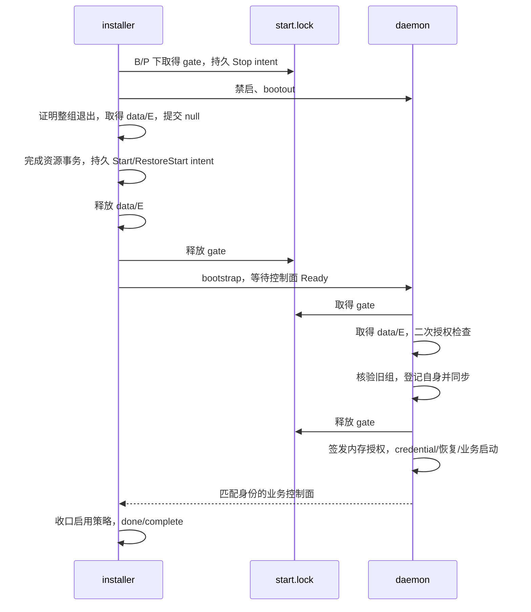

# macOS 共享进程组的精简补充设计

> **已由后续用户决策取代：** 三个平台改为“检测到中断后提示，由用户选择修复安装或全新安装”，见 [R5 三平台策略](2026-09-08-interrupted-install-user-choice-design.md)。下文 R4 保留为历史审计对象，其中自动恢复、重放及 pending source 启动授权不得按旧计划实施；登记与安全停机需求仍需在新策略下完成设计。R4 审计确认过卸载 source hash 条件误拒绝，另有未确认实质后果的耐久性疑点；这些不构成新策略的实施验收结论。

版本：R4，2026-09-08。状态：设计修订稿，待用户审核；未开始补充机制实现。R3 的历史复审未覆盖完整生产启动链，不能作为本版可进入实现的依据。本版补齐授权读取、恢复检查点、两次检查连续性、业务授权消费和实际 Ready 验收。保留已批准的共享 launchd PGID 停机方法，替换 R1 的 installer 代登记方案。

本文件的 R4 是此补充设计的修订号，不修改已冻结的 Unix 基础架构 R4/R3 原文。历史背景见 [PR #211 交接](../plans/2026-09-08-pr211-handoff.md)；共享组基础见 [停止设计](2026-09-08-darwin-shared-process-group-design.md)。

## 审核摘要

- 保持一份 `B/launchd-runtime/state.json` 和一把永久 `start.lock`；不新增 journal 字段、action kind、控制协议或公开 CLI 参数。
- 仅 macOS 新合同服务允许经过核验的 source 恢复启动；普通前台、其他平台、validation 和任意未完成恢复不获得例外。
- installer 在交还启动权前完成全部资源恢复；daemon 在持 gate/data/endpoint、二次核验且登记成功后，得到一个不可变的进程内授权对象。真实 phase 原样传递至装配、runtime、Manager 与 worker。
- `Start` / `RestoreStart` 是资源恢复结束后的启动检查点；更晚的 Stop intent 作废旧检查点。任何已经交还过业务运行权的事务，恢复时只能收尾或重新停机后重试启动，不再回放交还前的数据备份。
- 本稿新增的持久记录、锁、macOS 启动授权例外及恢复行为均属于待审核设计；本轮不改生产代码、测试、CI、系统服务，不提交或推送。

## 1. 目标与最小范围

在 daemon 自动重启、installer/daemon 崩溃以及正常停止后更新时，安装器能定位尚需核验的受管理进程组；未确认停机时不修改业务数据。仅 macOS 已安装的 root 服务适用，显式私有 P 的同名机器服务也参与。既有 Linux、Windows 和 macOS 前台语义不变。

新增机制限定为一份进程组身份记录和一把启动/停机交接锁：
- daemon 是非空身份记录的唯一发布者；
- installer 只能初始化空记录，或者在取得有效清空证明后把记录置空；
- 删除 installer 代登记、重复保存布局路径以及额外的初始化标记文件；
- 记录不是安装权限来源。B/D/E/C/I、binary hash、source/target 恢复方向继续由既有受保护的 journal 与哈希绑定备份决定；
- 不增加 journal 字段、控制 API、公开 CLI 参数、依赖或常驻辅助进程。

“已确认清空”只针对遵守登记合同的进程。旧版未登记进程必须另行通过原有停机检查，不能用空记录给它放行。

## 2. 固定位置、格式和两个状态

使用全局 B/launchd-runtime（root 0700），其中：
- start.lock：root 0600，永久保留，文件身份不变，不 unlink；锁由内核持有者生命周期释放。
- state.json：root 0600，严格且有界读取，最大 4096 字节。

格式仅包含 schema 和 generation。schema 固定为 mihari.launchd-runtime/v1。
- generation=null：已确认没有未清空的登记组；
- generation={boot_id,pid,start}：该组仍需核验，不能据此断言它仍在运行。
- pid 必须大于 1。共享组合同要求 daemon PID==PGID，因此不再重复保存 pgid；组号就是 pid。
- boot_id 与 start 沿用现有平台身份的规范表示。校验字段类型、长度、完整 EOF 和未知字段，拒绝重复键。

读写通过现有 TrustedRoot 的 no-follow、owner/mode/ACL、mount 与文件身份校验。更新用预期文件身份约束原子替换，文件及父目录同步全部成功才允许继续。任何读写、同步、身份校验错误都不得被解释为空记录。记录中不保存路径、token、配置、revision 或事务状态。

每次启动持锁读取旧记录，只有旧组确认不存在或确定属于更早的 boot，才可发布自身身份。daemon 退出时不删除、不清空自身记录，也不等待交接锁。

## 3. 新服务的完整合同

--launchd-process-group 首次引入本轮未提交变更，尚未发布；首次发布时它统一表示以下完整合同，不能把只支持“同组”而不登记的试验 binary 当作兼容服务。

新合同的服务启动必须同时验证：
1. 实际 argv 含该标记，且 PID==PGID；
2. 安装启动依据允许这一个 binary/layout 运行；从受保护备份选出的实际启动定义也必须含该标记，不能只看当前磁盘 plist；
3. 在取得交接锁、data/endpoint lease，二次验证启动依据并持久登记之前，不恢复业务、不创建 credential、不启动任何 managed child；
4. 普通 daemon 派生的 mihomo -t 也受该要求约束。installer 专用 RunInheritedValidation 保留已有独立身份、lease 和等待路径，不进入登记或交接锁。

启动顺序：初次启动依据检查 → 交接锁 → data/endpoint lease → 二次启动依据检查 → 核验旧组 → 发布自身记录并同步 → 释放交接锁 → credential/业务恢复/运行。
data/endpoint lease 持续到运行结束及清理完成；交接锁只覆盖启动交接，不持有整个运行期。取得锁采用有界、可取消的既有 lease 语义，不无限等待。

## 4. 首次初始化与缺失记录

先在 B install 锁内读取可信 journal、备份及实际服务定义，区分“新合同已经获得启动权”与“尚未获得启动权”。不能单独用目录、锁文件存在与否或一个未提交的候选 plist 判断。

允许首次初始化的情况：
- 可信未安装状态，无允许新合同服务运行的 activation；
- 当前恢复权限仍属于未采用新合同的 source，target 尚未获得 activation。

新合同的 source 已经获得过运行权，或新合同 target 的 activation 已持久化时，缺失目录/记录属于异常，拒绝自动补 null。Completed uninstall 的已有登记目录也保留；不把卸载当作删除该目录的动作。状态损坏不走初始化。

初始化必须在任何新合同 target 的 activation 持久化之前完成。创建 B 下的独占随机临时目录，在其中写入 start.lock 和完整初始 state.json=null，同步文件和临时目录；持有临时锁文件的锁，再以不覆盖目标的原子重命名发布为 launchd-runtime，最后同步 B。锁 fd 随目录发布保持同一文件身份，服务只能看到“目录缺失”或“完整目录且锁被持有”。

崩溃/重试规则：
| 崩溃位置 | 重试行为 |
| --- | --- |
| 原子发布前 | 正式目录仍缺失；重新验证初始化资格，创建新的临时目录。旧临时目录不作为证据，不盲删。 |
| 重命名成功、B 同步前 | 正式目录若存在，验证完整内容并重新同步，再按既有记录使用；若不存在，只有资格仍成立时才重试初始化。此时不得已有新合同 activation。 |
| 初始化完成、target activation 前 | 使用已有完整记录；source 恢复不得删除目录/永久锁。 |
| target activation 之后 | 不允许从缺失/损坏状态重新初始化；保留事务并返回明确错误。 |

合法冷安装遇到半初始化崩溃可以重试；已运行的新合同实例丢失记录不会被洗成冷状态。

## 5. 旧版与 source 回滚的边界

初始 null 只表示“未发布过登记组”，不表示旧版进程不存在。实际定义或可信 source 是旧版时，installer 在任何数据修改、binary 替换和 target activation 前仍需原有的旧进程停机证据；只有新合同身份才能采用第 6 节的“未登记 daemon”分支。

首次升级在 activation 前失败：允许按现有 source 权限恢复旧定义/旧 binary；空登记目录保留。旧 source 重新运行不属于登记组，新合同启动因启动定义不匹配而被拒绝；下一次升级仍必须重新检查旧进程，不能凭 null 跳过。Activation 后失败只恢复 target，不回退为未登记旧版。

对于旧独立组 daemon 的同 boot 停机，现有证据若不足，本设计不增加猜测 PID、路径扫描杀进程或强制放行。自动原地升级必须拒绝。可接受的后续入口是：已有可信备份记录旧 boot、服务已持久禁启，机器重启后再次核对 boot 已变化且旧服务未再次运行；或者在旧版本完成服务卸载、机器重启后，以可信未安装状态重新进行显式迁移。重启不由 installer 自动执行；仅重启但让旧服务再次自动启动，不能作为清空依据。

旧版兼容不要求修改新记录格式，也不承诺无证据的 legacy 实例可以无人值守原地升级。对已有恢复 journal，必须保留其恢复方向；不能用重新初始化绕过它。

## 6. 停机与未登记 daemon 的碰撞

所有安装、更换 binary、迁移、stop/restart/uninstall 以及会再写数据的恢复路径，统一使用下列交接流程，不再依赖某个 adapter 上次 Inspect 缓存的 PID：

1. installer 已持 B/P install 锁；取得全局交接锁。按第 7.3 节先持久记录本轮 Stop intent，使旧启动检查点失效，再建立并核验持久禁启屏障。不得通过已 done 的 Stop 跳过本轮停机。
2. 在锁内读取记录、检查实际 live job 的 argv、boot/PID/start 和当前服务定义依据。
3. 对已登记 daemon，用实际 job 身份执行 native bootout；对尚未登记、但已验证遵守完整新合同的 daemon，也可 native bootout，只在内存保存它的身份。交接锁保证后者此时尚未恢复业务或派生 managed child。installer 从不发布它的非空记录。
4. 有界等待记录中的组及任何本次捕获的未登记组全部退出。历史 PGID 仅用于被动查询，只有明确不存在才判空；不向历史组补发 TERM/KILL。跨 boot 不访问旧 PGID。
5. daemon 退出后取得相关 data/endpoint lease；在持交接锁期间重读记录、复查禁启状态和组退出证明，再将记录原子提交为 null 并同步。
6. 之后才进行业务数据和安装资源的事务修改；需要启动时按第 7 节统一交还权限。

记录为 null 也必须观察实际 job 并处理可能正在等待交接锁的 daemon，不能直接完成停机。真实进程身份、权限或分组能力未知则拒绝。

installer 在未登记 daemon 停止中途崩溃：交接锁随进程退出释放。幸存 daemon 必须重新完成二次启动依据检查，且在登记成功之前仍不能恢复/派生；它要么退出，要么自行登记。下次恢复读取这份新记录。不能依赖“bootout 返回”或“job label 消失”证明其已退出。

## 7. 锁顺序和恢复交接表

锁顺序固定：
- installer：B install → P install（如适用）→ 交接锁 → data → endpoint；
- daemon：交接锁 → data → endpoint。
- 任一需要重新取得交接锁的恢复，先释放此前残留的 data/endpoint lease。daemon shutdown 不等待交接锁。
- 更换 P/E 时，旧记录不保存布局也不能被忽略：先清空唯一全局登记组，再按已有 journal/backup 获取源、目标的相应数据权限。

| 路径/节点 | 交接锁和 data/E | 允许动作 |
| --- | --- | --- |
| 新事务准备、候选下载/校验前置工作 | B/P 保持既有合同；无需为了下载提前持交接锁 | 只做既有允许的候选准备，不据此启动新合同服务。 |
| ApplyLocked 的停机段、lifecycle 的 stop/restart/uninstall | 按第 6 节取得交接锁，退出后取得 data/E | 清空记录后进入 stopped 和后续提交。 |
| start 已运行目标 | 只读核验启动依据、实际身份及对应记录 | 一致时保持幂等；不得为“检查”覆盖正在运行的记录。 |
| start 已停止目标 | 持交接锁确认旧组已空并准备对应启动依据 | 进入下方统一启动交接。 |
| activation 后 WriteDefinition、启用目标定义 | 保持交接锁，data/E 仍由 installer 持有 | 自动启动进程可能出现，但无法通过登记门槛。 |
| journaledHook 的 Start/RestoreStart，包括重放 | 先持久化对应 action intent；确保无需再修改数据；释放 data/E，再释放交接锁，然后 native bootstrap/等待 Ready | B/P install 锁保持，daemon 无须它；禁止在交接锁内等待服务 Ready。 |
| bootstrap 后至启动成功的末尾 | 不再持 data/E/交接锁 | 可完成由已验证定义指定的启用策略收口、记录 action done/complete 和检查结果；不能追加业务数据、binary 或定义内容变更。 |
| 启动失败或半途崩溃后的 source/target 恢复 | 先识别是否已有第 7.2 节检查点；需要再停时按第 6 节取证、再取 data/E、清空记录 | 禁止沿用旧 null/done Stop；交还过业务权限后只重试启动和收尾，不重复内容恢复。 |
| 停止/卸载完成且不再启动 | null 已同步，数据/定义事务已完成 | 先释放 data/E，再释放交接锁；永久文件保留。 |

启用策略收口仅指既有 Running=true、Enabled=false 的流程：bootstrap 后再次持久 disable 并核验，既保留本次运行，也保留禁用开机自启的策略。它必须匹配当前可信 source/target 定义，直接 Start 与 action 重放都执行；失败按启动失败重新停机和取证，不能视为启动成功，也不能借此在已释放锁后恢复数据。

启动依据统一由现有 journal 及其保留的哈希绑定 unit metadata 选出：

| 持久状态 | 新合同服务允许启动的条件 |
| --- | --- |
| target + activation_committed | 沿用目标 activation，并要求第 7.2 节的有效 Start 检查点；严格匹配 target definition、CandidateHash 与 layout。单有 activation 不授权未完成定义交接的服务。 |
| target + complete | 完成的目标安装/lifecycle 是持续启动依据；严格匹配 target definition、CandidateHash 与 layout。目标必须仍为已安装服务。 |
| source 恢复未 complete | 已持久化 RestoreStart intent 或 done；此前应恢复的数据、binary、definition 等资源均已恢复并持久记录完成，或有原状态未改变的可信证明；不存在剩余资源恢复工作。严格匹配 OldDefinition 与旧 binary/layout。不能只因出现 RestoreStart 就放行。 |
| source + complete | 已完成的 source 恢复本身是持续启动依据，严格匹配 OldDefinition 与旧 binary/layout；无需存在 RestoreStart，也不要求旧 Running=true。涵盖回滚完成后的自动重启，以及原先 stopped、Enabled=true 的服务在机器重启后启动。 |

source 两个分支只适用于可信 OldDefinition 表示已安装且包含新合同标记的服务；not-installed、对象不匹配、普通 pending 或未完成资源恢复均不授权。daemon 两次启动检查使用相同规则。RestoreStart 从 intent 到 done，再到 source+complete，授权连续；完成 journal 与 unit metadata 保留，候选清理不得删除它们。

旧 binary hash 必须对应 OldDefinition.Binary：有 binary 替换的安装从哈希绑定备份中选取相应 OldHash；不替换 binary 的 lifecycle 仅在可信事务明确绑定同一 source binary/layout 时使用该事务 CandidateHash。不能把升级目标 CandidateHash 当作旧 binary hash，也不能按当前文件重新计算后反过来授予权限。layout 同样由已绑定的旧定义及对象证据选择，不能套用升级目标 P/E；缺少对应证据时拒绝。

这是仅对 macOS 新合同服务的启动检查适配，不新增另一份授权文件或 journal 字段。未 complete 的 source 启动是受恢复检查点约束的例外；complete+source 则保留已恢复服务的后续启动权。普通前台和其他平台的启动检查不获得这些例外。实现须保留以上分支条件，不能直接放宽通用 CheckDaemonInstallJournal。

实现位置必须统一接入：install_transaction.go 的 Start 交接、install_recovery.go 的 rollback/rollforward/finishAction、install_lifecycle.go 和 native session 的 prepareRollback。Start 的动作重放也必须执行交接，不能只修改直接调用 Start 的一处。

### 7.1 可信授权读取与 source 对象选择

新增 app 内部的只读读取/选择路径，与 installer 共享 metadata 的解码和绑定校验；不调用 `openNativeInstallSession`、`loadState` 的锁绑定副作用、`RecoverLocked` 或 `BindInstallLayout`。daemon 不取得 B/P install 锁、不创建 journal、备份或登记目录。

读取顺序为可信全局 B → 严格 journal → `ServiceBackup.Ref` 对应的 metadata → 按恢复方向选定义和对象 → 校验当前运行实例。规则如下：

1. journal 严格、有界、完整 EOF 解码；metadata 同样拒绝未知/重复键和超限，验证读取前后的文件 identity、实际字节 SHA256、transaction ID、BootID 与 journal 各布局字段。只允许 `transactions/<同一 id>/unit`；`unit-bootstrap` 不授予新合同服务启动权。提取共用纯校验函数，不能复制一套较宽松的 daemon reader。
2. target 从 `TargetDefinition` 与既有目标布局/对象选择；source 从 `OldDefinition` 的可信 argv/env 解析旧布局，再与 metadata 中相应 source/target 对象绑定。`SourcePath` 可能表示导入目录，不能直接认作旧服务 data root。若旧服务使用原 target D，则选择恢复前的 `TargetObject`；旧服务使用独立 source 时，必须匹配 `SourceObject`。没有对应可信对象则拒绝，不能补采当前目录生成授权。
3. 选中的定义必须为已安装的 system launchd 服务，具有固定 label、合法精确 argv、新合同标记及同组配置；实际启动参数、当前执行文件路径、解析出的 B/D/E/C/I 或私有 P 都必须对应它。磁盘 plist 与选中定义的内容、可信来源和可恢复版本身份也须一致；旧/新定义不能交叉借用。Enabled/Running 策略由可信选中定义决定，不从瞬时 live 状态重新授权。
4. source 旧 binary 若为本事务替换对象，只接受 `Files` 中 Path 精确匹配 `OldDefinition.Binary` 的非 absent `OldHash`；相关 action/backup ref 必须指向这一个受绑定对象。target 使用已校验的 `CandidateHash`。无 binary 替换的 lifecycle 才可按下面的限定使用 CandidateHash。
5. lifecycle 的 CandidateHash 必须由上一份合法已完成 source/target 授权选出，绑定同一 binary/layout，再验证当前文件与该值相符，随后在新 journal 发布前持久绑定新旧定义。禁止沿用当前 `lifecycleCandidateHash` 的“读取任意当前 binary 并把新 hash 作为依据”来授权新合同服务。`Files` 无 binary 变更、`DataAction=retain`、旧/目标 binary 与布局相同、定义变化仅为本次已知 lifecycle 策略时，daemon 才可把本事务 CandidateHash 用于 source；缺少这些证据时拒绝。stop/uninstall 可以沿用已完成授权，不能因不读取 binary 而授予未知文件的启动权。
6. data 的校验是受保护目录 identity/跨 boot marker 和布局的连续性。首次交还前由 installer 核验需要恢复的业务内容；交还后允许 daemon 正常改变 settings、订阅和日志，不再将当前业务内容与安装前快照逐字比较。binary、定义和数据根的身份仍须重新验证。跨 boot 沿用既有 marker/可信恢复身份规则，不把旧 inode 当作新 boot 的唯一证据。

metadata 在同一事务的启动收尾期间保持不可变，journal 可进行允许的 intent→done→complete 推进。读取 journal J1、metadata、再读取 journal J2；若不是第 7.4 节允许的推进，在尚无资源副作用时有界重读，达到现有启动截止时间则拒绝。不能拼接两个事务的证据。

### 7.2 启动检查点是资源恢复的终点

检查点使用既有 action：source 为 `restore_start`，target 为 `start`，内容仍是 `TargetRole=definition`、`OldState=unloaded`、`NewState=loaded`、既有 intent/done 与 Seq。它不是新格式或“phase 等于某值”的别名。

在持 gate 和所需 data/E lease 时，installer 才可发布检查点。发布前必须：

- 停止并 join installer validation，登记组已清空；该运行边界不依赖 validation ready.json。
- 以同一 journal/metadata 选择 source 或 target，检查数据、binary、channel、plist/定义、链接及相关 reload 的最终状态。需要执行的内容恢复已 done；未执行的 forward intent 只有经既有 Observe/classify 证明未发生、且按下段将其后置条件持久化时才可判为无需恢复。未知状态拒绝。
- source 恢复包括最后的 `RestoreDefinition` 内容写入与 reload；不能像现有分散路径那样仅认为反向 action 循环结束便可启动。target 的 activation 不替代定义写入完成。
- 将检查点以前所有影响恢复结果的 action/备份引用纳入同一有界证明，完成文件与目录同步；随后持久记录 Start/RestoreStart intent。两次 daemon reader 都必须核对该证明，不能只查 Actions 中是否出现过该字符串。

资源终点证明由既有 action 与 metadata 确定，不是一份未定义的内存布尔值：受影响且需恢复的对象必须有匹配 refs/状态的反向 action done；forward intent 实际未执行时，仍可写其对应反向 intent 并在 Observe 已等于反向 NewState 时记录 done，表达“恢复后置条件已满足”，不伪造 forward done。旧资源没有对应 forward action 时，完整、有界的 metadata 资源清单和当前旧对象身份证明它未被本事务修改；DataAction=retain 的数据根不恢复旧业务快照。所有可能写入的资源必须可由清单及已知 effect 枚举，不能因未知 action 无反向映射就当作不需恢复。首次检查点之后 reader 使用这份持久终点证明并复核不可变对象/数据根，不重新对合法可变业务内容做备份 hash 比较。

有效检查点是当前恢复方向最新的一次合法 Start/RestoreStart，且它后面没有 Stop/RestoreStop intent、内容变更或不允许的 action。检查点之前的未发生 forward intent 可保留原 status，由匹配的反向 done 或明确不变资源证明解释。检查点之后只允许本次启动的 intent→done、已选定义约束的 enable/disable 策略收口以及最终 complete。

Start/RestoreStart intent 的提交若 `Published=true`、`Durable=false`，本次不报告启动成功，也不主动执行 bootstrap；恢复必须将其视为“可能已交还过启动权”，不能重新覆盖业务数据。因为 gate 随错误退出释放后，已出现的自动启动进程可能读到这份可见 intent。重新入场在核验同一可信检查点和实际组状态后收尾或重试；不能把目录 sync 错误解释为未发布。发布前资源本身已同步是这一规则的前提。

对旧 `Running=false` 的 source 不伪造 RestoreStart：恢复全部资源、收口其 Enabled 策略，在锁内写 source+complete，再交还锁。其后由正常 service start 或 Enabled=true 的跨 boot 自动启动读取 complete 权限。旧 Running=true、Enabled=false 则实际 RestoreStart 后恢复禁启策略。

**检查点之后禁止再次恢复安装前的业务内容。** daemon 可能已经登记并发生业务写入，installer 崩溃不等于未启动。重进 Recover 时先判断是否已交还过启动权：已有合法检查点的事务进入启动收尾分支，不再从头执行 rollback/rollforward 的内容恢复循环。后续启动失败可重新停机、作废启动检查点并重试启动；不可覆盖 daemon 已产生的新业务状态。若仍需改业务内容或 binary/定义内容，必须先安全结束当前事务，再由新事务处理；身份不符时保留当前 journal 并报错。

### 7.3 再次停机、重放及检查点失效

每一轮需要重新停机的恢复在 B/P→gate 下持久追加当前方向的 Stop/RestoreStop intent，Seq 必须晚于此前全部启动检查点，随后才执行 disable、bootout、整组等待、data/E 获取和 null 提交。失效依据使用这个 action 的存在，intent 即生效，不等它 done。

即使观察到 job 已 unloaded，也必须留下本轮失效依据。沿用已有 WAL 的 `loaded→unloaded` 条件效果：Observe 为 loaded 时执行，已经 unloaded 时只验证后置条件；OldState 是允许的重放前态，不伪称本次观察到了 loaded。不得让 `journaledHook` 的 `OldState==NewState` 早退省掉这条 barrier，也不写 schema 禁止的相等状态 action。它只在“存在更早的已交还启动权”或需要停机的本轮追加一次；复用同一轮 intent，不无限追加。

Stop intent 落盘之后，旧 Start/RestoreStart 不再授权新的 daemon。尚在运行并持有 data/E 的 daemon 使用自身已签发的内存授权完成运行/退出；installer 必须实际停止它并取得 lease，不能把 journal 失效当作进程已停。崩溃释放 gate 后，等待中的新 daemon 二次检查看到失效依据应退出。

一轮停止及验证完成后，如果仍要启动，则重新验证所选不可变对象和既有资源恢复完成证明，追加更大 Seq 的 Start/RestoreStart；不能把旧 action 改回 intent 来重新授权。最初交还后的重试沿用第 7.2 节的内容恢复终点，不回滚已运行期间的数据。

已有 complete journal 不追加新的操作：正常 lifecycle 先按既有流程构造新的受绑定 journal。该新 journal 的 pending 状态在任何内容变更之前撤销上一事务的后续启动依据。新事务不得在没有旧 source hash/layout 证据时创建。无修改的 start-running 幂等分支也必须验证当前定义、live generation、登记记录和控制面，不能继续使用 `runLifecycle` 的 `old.Running` 早退。

`finishAction`、service effects 的 Observe/Replay 以及 `ensureTarget` 都进入同一个 app 交接编排：

- Start/RestoreStart 为 intent、效果尚未执行：先检查本轮 gate 和资源终点、释放 data/E 再释放 gate，执行 bootstrap 和 Ready 等待。
- 效果已执行但尚未 done，或已经 done、journal 未 complete：验证当前登记/live 身份并等待真实 Ready，再执行策略收口和 complete；不能因为 loaded 或 done 就跳过。
- 尚未成功且需要再启：按本节重新停止、作废旧检查点、重建新检查点。
- Stop 为 done：只能解释历史效果；当前轮停机必须有当前组证据及 null 同步，不能据此直接修改数据。

### 7.4 两次启动检查验证授权连续性

第一次检查只返回 app 内部的候选 `launchdStartupSelection`，没有业务权限。第二次检查在 gate→data→endpoint 下重读全部可信依据，核对同一个授权对象。对比键包含 transaction ID、ServiceBackup ref/hash、恢复方向、选中定义内容、对应 binary path/hash、所选布局及数据对象证明；同一 boot 的文件身份依既有规则复核。

允许的 journal 推进只有：

| 第一次 | 第二次 | 处理 |
| --- | --- | --- |
| 同一 source RestoreStart intent | 同 Seq done，或同一 source complete | 重新验证全部条件后允许。 |
| 同一 target Start intent | 同 Seq done，或同一 target complete | 重新验证全部条件后允许。 |
| 同一 source/target complete | 同一完成授权 | 允许，不要求历史 Running=true 或存在 Start。 |
| 合法检查点 | 仅合法 enable/disable 收口 action 或当前启动 action 完成 | 依据仍对应同一对象且未出现失效 barrier，允许。 |
| 任一 | 事务/方向/metadata/hash/layout 改变、phase 回退、旧 Seq 被新一轮替代、出现 Stop 或内容变更 | 拒绝本次启动；由新进程重新完整入场。 |

不能保留 `current != phase` 的字符串等值判断，也不能为通过检查而把 pending 改成 complete、空字符串或 validation mode。保留第二次实际 phase 作为本次启动的 ActivationPhase；业务授权快照记录所验证的检查点。daemon 入场后不持续读取可变 journal，也不需要等待 installer 将 intent 改为 done 才能运行，否则 installer 等待 Ready 将形成死锁。

### 7.5 业务授权类型、生成点和依赖方向

采用 runtime 使用方定义的小接口，app 提供非导出不可变实现；不新增通用授权包，不让 runtime 反向依赖 app。

```go
// 拟新增于 internal/runtime/startup_authorization.go；不属于 /v1 DTO。
type StartupAuthorization interface {
    CheckBusinessStartup(dataRoot, activationPhase string) error
}
```

app 的 `launchdBusinessAuthorization` 使用非导出字段保存：第二次选择结果、所选 data root、真实 phase、当前 boot/PID/start、登记成功的回执以及本进程所持 daemon lease 的生命周期状态。唯一生产构造点位于 Darwin 专用入场编排中，须在自身 generation 原子发布并同步成功后执行；构造函数不导出，不提供从 bool、JSON、phase、测试环境变量或任意 DTO 构造的入口。首次 selection 不能实现这个接口。接口可在测试中替换，不把防御同进程恶意 Go 代码作为额外安全边界。

回执只在内存中表达已经成功登记的本进程及 held lease，不是新的持久记录，也不使 phase 变成权限。`CheckBusinessStartup` 只验证冻结的 dataRoot/phase 绑定、回执有效和 lease 未释放；无 IO、不取得 gate、不保存 context，可供 mutation 和 worker 并发读取。关闭状态有单一所有者/同步保护；在所有 worker/core/清理 join 完成后失效，随后释放 data/E。复制 options 不得延长授权生命周期。

runtime 提供共用业务准入判定，顺序固定：validation 总是拒绝业务；若提供授权则验证授权，失败不回落至 phase 放行；未提供授权沿用既有空/activation_committed/complete 规则。专用 launchd 装配额外要求非空有效授权，共享组标记不能替代它。普通前台和其他平台不装配 source 授权。

| 消费位置 | 拟调整及验证责任 |
| --- | --- |
| `cmd/mihari/unix_layout.go`、`launchd_service_darwin.go` | 新合同走 app 专用入场；持 gate/data/E 二次核验和登记后才调用业务回调。普通 RunUnixSystemService/RunUnixStartup 保留原规则。 |
| `cmd/mihari/main.go` 的 daemonRunDeps 与 runDaemonWith | 传真实 ActivationPhase 和 StartupAuthorization；在目录、settings 或恢复副作用前按共用判定检查。marked/shared 模式缺授权直接拒绝。 |
| `internal/daemon/activation.go` | BusinessMutationAllowed 委托共用准入判定；普通 CheckDaemonInstallJournal 及前台 bootstrap 分类不放宽。 |
| `internal/app/runtime.go` 的 RuntimeBuildOptions / BuildRuntimeWithOptions | 复用共用判定，向 ManagerOptions 传同一授权；ValidationRuntime 永远不获得业务授权。 |
| `internal/runtime/manager.go` 的 ManagerOptions / NewManager / Run | 保存同一授权；启动 scheduler、gateway、订阅刷新、core 等 worker 之前校验。 |
| `internal/runtime/settings.go` 的 businessMutationAllowed / mutation 入口 | 通过同一判定检查；pending source 只在合法授权存活时可写。关闭或错实例必须拒绝。 |

cmd 中 credential、provider/resource recovery 发生在 `runDaemonWith` 之前，故它们必须位于“登记成功之后”的 app 业务回调内；仅修改上述函数里的判定不够。普通 daemon 派生的 `mihomo -t` 同样在授权以后。`RunInheritedValidation` 保留现有独立认证、lease 和验证生命周期，既不进入 gate，也不能产生或携带这个业务授权。

### 7.6 Ready 与启用策略收口

`LaunchdAdapter.Start` 当前以 `requireLaunchdRunning` 判定 job 状态；新增的 app 启动收尾必须在其外核验真实控制面。service 包继续只负责 launchd 动作和身份，不导入 app 或自行管理登记文件。

app 在释放 gate、data/E 后，用选中布局的 endpoint/credential 通过 `internal/control/client` 有界等待 `/v1/status`；核验 PID 等于当前已登记且实际 live job 的 PID、前后 boot/start 身份不变、binary/argv 与选中对象匹配，并确认 `health=ok` 的业务控制面。未知 health、未知/缺失 PID、认证错误、仅 job loaded/running、旧实例响应或降级控制面均不能完成启动。允许合法的 SetupRequired，不要求未配置实例已运行真实 mihomo。此 status 检查是业务启动收尾，不替代 installer validation 的认证 ready.json 或目标 activation 证据。Ready 等待新增内部上限为 30 秒，与现有整组停机等待同量级，取调用者更早截止时间；重读与 generation 变化不得重置总期限，使用可注入 waiter 测试，无公开超时选项。

等待不持 gate；读取登记记录与 live 身份使用前后相等的有界快照。若 generation 在等待期间改变，丢弃上一轮结果，重新验证新 generation 的相同启动依据，不覆盖记录。B/P 仍由 installer 持有，阻止另一安装事务变更资源。数据根 lease 的持续持有和 native 身份核对防止将旧控制面结果误认为本次启动。

启用策略按所选可信定义收口：Running=true、Enabled=false 的本次运行允许先 enable/bootstrap，随后 disable 并验证，原来的暂时 enable 与最后 disable 都必须属于同一选择对象。策略失败或 Ready 超时按第 7.3 节重新停机，并保留可恢复 journal；不得直接写 complete。Start/RestoreStart 的直接调用、action replay、effect 已发生但 done 未持久的情况，全部执行相同收尾。

source 原先 Running=false、Enabled=true 的恢复在写 complete 并交还锁后可以由 launchd 自动启动；installer 不把“旧 Running=false”解释为永久禁止此服务运行。Enabled=false 时仍保留持久禁启策略，不自动 enable；这个策略限制 launchd 自动启动，不能替代 binary/layout 授权验证，也不是新增防御 root 手工绕过服务管理器的安全边界。

### 7.7 锁和资源所有权图



授权签发所需的登记回执在 gate 内形成；图中签发/业务回调发生在 gate 释放后，释放失败则不进入业务。daemon 已取得 data/E 时，installer 后续即使抢到 gate 也必须等待其退出，才能获得数据权限。daemon 退出只 join 自己的工作并关闭授权/data/E，不取 gate、不清登记。installer 再取 gate 前先释放其旧 data/E；Close、错误补偿和取消都按持锁阶段清理，不能隐式执行内容恢复或删永久锁。

## 8. 减少误拒绝与失败语义

正常停机取得组空证明后，立即在同一锁内持久化 null，避免把不再需要的旧 PID 带入后续更新。重复 clear 在验证 null 和实际 job 后幂等；同步失败不报告停机事务成功，不开放后续数据修改。

daemon 意外退出、无人及时清空且 PID/PGID 后来被复用，仍可能拒绝操作。清空提交减少这类窗口，不承诺完全消除。组仍存活时先进行有界等待，超时返回现有 invalid_state 并保留记录；锁竞争映射既有 busy/lease 冲突语义。权限、身份、损坏与取消错误保留原分类，不混成“没有进程”。

不得用只剩主进程、缺失文件、固定 sleep 或未知查询结果提高通过率。只有完整新合同实例适用记录中的空状态和未登记碰撞流程。

## 9. 分工、验证和验收

拟实现分工：
- internal/platform：固定 root capability、交接 lease、两状态记录、原子发布/替换及 native 身份/组查询；
- cmd/mihari：新合同启动装配，登记位于 credential 和业务恢复之前；
- internal/app：初始化资格、已有启动依据适配、统一停机和 Start 交接；
- internal/service：实际 job 身份检查及 native stop/probe，不自行维护第二份持久身份。

优先验证以下可观察场景，先 RED 再 GREEN：
1. 冷安装初始化各崩溃窗口可重试；已获新合同启动权后 missing/corrupt 拒绝。
2. 登记发布/文件同步/目录同步失败时，credential、业务恢复、core 与 daemon 校验均未开始。
3. 正常停止写 null；之后旧 PID 复用不影响由 null 支持的正常更新。
4. 自动重启遇到旧组残留，等待或拒绝，绝不覆盖它；跨 boot 不查询旧 PGID。
5. 停机与未登记 daemon 相撞：installer 不写非空记录，崩溃重试无未登记 managed child。
6. 私有 P/E 切换共用全局交接锁；旧组不能因布局变化被漏掉。
7. 直接 Start、重放 Start、RestoreStart、source/target 恢复均不在持交接锁或 data/E 时等待 Ready；释放后再次修改必须重新停机。
8. source RestoreStart intent/done/complete 的权限连续性及完整对象/hash/恢复完成条件；回滚成功后自动重启、旧 source 原先 stopped 且 Enabled=true 时跨 boot 启动均成功；错误对象、误用 target hash、普通 pending 或提前启动拒绝。直接启动和重放都保留 Running=true、Enabled=false，并覆盖禁启策略收口失败后的重新停机。
9. Legacy source 回滚保留原方向；null 不授权 legacy 数据修改；跨 boot 入场不能接受重启后再次运行的旧实例。
10. 真实 hosted Darwin helper 覆盖共享组、TERM-resistant 后代、bootstrap/bootout 与组退出；测试及 always cleanup 都验证真实退出。

普通测试不得操作真实系统服务、账户、挂载或用户数据。发布前需要相关测试/race/vet、六目标 CGO0 构建、实际 hosted native CI 和最终 head 的实质 bot review；设计审核不能替代这些证据。

### 9.1 必须贯穿生产调用链的验收矩阵

fake 只替换时钟、进程、IPC/文件系统边界；保留生产 journal reader、metadata selector、装配、runtime builder、Manager 及准入判定。不能以 fake manager.running 或自行构造一个始终返回 nil 的授权替代正向验收。

| 场景 | 必须观察到的结果 | 主要覆盖位置 |
| --- | --- | --- |
| 合法 source pending RestoreStart | 保留真实 pending phase；登记后才创建 credential/恢复业务，实际 Manager mutation 和 worker 可用 | app startup reader、cmd 装配、runtime/integration |
| intent→done→complete 发生在两次检查之间 | 同一对象通过；不同事务/方向/metadata/hash/layout 拒绝 | app selector、cmd 二次检查 |
| source+complete 重启，无 RestoreStart | 已安装新合同旧定义能启动；无需旧 Running=true | app reader、集成 |
| source 原 stopped/Enabled=true，跨 boot | 旧组不查询；按保留 complete 依据启动实际服务并 Ready | hosted Darwin |
| Running=true/Enabled=false，直接启动与重放 | 实际业务可用且 launchd 禁启策略仍保留 | app/service、hosted Darwin |
| 更晚的 Stop intent、done Stop 或新一轮 Start Seq | 旧检查点拒绝；新检查点须重新验证，不用旧 done 证明当前停机 | app recovery |
| job 已 unloaded 时再次恢复 | 仍持久作废旧检查点，native stop 可以无效果，daemon 不得凭旧 intent 再入场 | app hook/replay |
| 检查点后启动产生业务写入，然后 installer 崩溃 | 恢复保留新业务内容，只收尾或再停后重试启动；不重放旧内容备份 | app recovery、生产 Manager 集成 |
| Start intent 可见但父目录 sync 失败 | 本次失败；恢复按可能已交还处理，已产生的数据不覆盖 | journal/启动集成 |
| 源恢复尚有资源未完成，或任意普通 pending | 不登记、不创建 credential、不启动 core/worker | app/cmd 回归 |
| 旧 binary 对错 CandidateHash、伪造 lifecycle hash、错误旧布局 | 拒绝；完成 source 后新 lifecycle 沿用对应旧 hash，不能重新给当前未知 binary 授权 | app metadata/lifecycle |
| 数据根被替换、可恢复定义版本不匹配 | 拒绝；合法 daemon 仅修改根内业务内容不引发误拒绝 | native 文件边界、app |
| validation 或无新标记实例携带 phase | 沿用原拒绝规则；validation 永不获得业务授权 | cli/cmd/app/runtime |
| 授权未签发、错 data root/phase、lease 已关闭 | 所有装配、Manager mutation 和 worker 入口都拒绝；不能回落为 complete 放行 | runtime/daemon/app |
| 登记写、文件 sync、父目录 sync 或 gate 释放失败 | 业务回调完全未执行；保留可见记录，后续被动核验 | platform、cmd |
| 首次初始化的每个崩溃窗口 | 合法首次入场可重试；已获新合同启动权后 missing/corrupt 拒绝 | platform/app |
| daemon 等 gate 与 installer stop 碰撞，installer 崩溃 | 非空记录仍只由 daemon 写；旧检查点已失效则 daemon 不进入业务 | 并发集成 |
| private P/E 改变、旧组残留或 PID 复用 | 同一全局 gate 阻止遗漏旧组；未知身份/组仍在不修改数据 | platform/app、hosted Darwin |
| Start 直接调用、Replay、already done、旧 running 幂等 | 全部执行登记/live/控制面/策略核验；等待 Ready 时无 gate/data/E | app/service/integration |
| job running 但 daemon 被 pending gate 拒绝、degraded 或旧实例应答 | 不写 complete；按边界重新停机或保留恢复状态 | app/hosted Darwin |
| Ready 成功但禁启收口失败 | 不成功；持久 Stop intent 作废检查点并重新取得整组退出证明 | app/service |
| 新合同首次升级与 legacy source | null 不放行 legacy；证据不足拒绝；合格跨 boot 路径重新核对禁启与旧实例 | app/hosted Darwin |
| Windows/Linux/macOS 前台 | 分组与普通启动行为保持原契约；不读写 launchd-runtime | 各平台回归及六目标 CGO0 构建 |

hosted Darwin 必须运行真正的 Mihari daemon，验证同 PID 的健康控制面、一个使用临时配置的真实 Manager mutation、以及受控 fake core 的 worker 行为；不接真实订阅或 mihomo。另以真实 launchd child/grandchild fixture 验证 TERM-resistant 后代和 always cleanup 的整组退出。仅 status 成功不能替代 mutation/worker 回归；已有 6f1c070 的 CI 与本地 Darwin 编译不能替代这些 native 证据。

## 10. 本轮交付范围与实现切分

本轮仅完成补充设计修订、自检及旧计划的状态纠正，等待用户审核。已存在的共享组代码未因此获得“完整恢复实现”或“可合并”的结论。后续详细 TDD 计划以获批版本为准；以下是实现边界，不是本轮执行许可：

| 顺序 | 可独立核验的交付 | 预期文件范围 |
| --- | --- | --- |
| 1 | 只读 metadata/source-target 选择及 checkpoint 连续性，保留普通 gate | `internal/app/startup_gate*.go`、新增 `startup_launchd_*`，提取 `install_native_session_unix.go` 的纯校验 |
| 2 | 固定全局 root、永久 gate、两状态记录及崩溃语义 | `internal/platform/launchd_runtime*_darwin.go` 及对应测试；复用 TrustedRoot/lease |
| 3 | 停机 barrier、资源终点、恢复尾部重放及 lifecycle hash 继承 | `internal/app/install_transaction.go`、`install_recovery.go`、`install_lifecycle.go`、`install_native_*`、`install_service_effects.go` |
| 4 | 登记后内存授权，贯穿 credential/恢复/装配/Manager | 新增 `internal/runtime/startup_authorization.go`、app Darwin 入场文件、`cmd/mihari`、`internal/daemon/activation.go`、runtime options/Manager |
| 5 | 统一 Ready/Enabled 收尾和真实生产恢复验收 | app/service 边界、`internal/integration/unix_security_launchd_*_darwin_test.go`、`scripts/test` helper/evidence |

第 1 项先通过现有真实入口展示 source pending 被拒绝的 RED；第 4 项在第 1–3 项基础上验证完整 GREEN，不能将只通过纯 selector 的测试当作业务已可用。平台能力由 Darwin 文件及其他平台的窄实现隔离，不在通用文件散布 GOOS 分支。最终按风险完成相关测试/race/vet、Python evidence、六目标 CGO0 构建、hosted native CI 和最终 head 评审。

本稿比较过三个实现方向：直接放宽 phase 检查会失去对象绑定；另建持久授权文件/IPC 会扩大格式与安全边界；采用既有 journal 证据加登记后的只读内存授权能保留一份记录/一把锁，并解决 app→runtime 的依赖方向，故选择第三种。现有共享组方案、kqueue 和被动组查询不重新设计。

## 11. R2/R3 历史独立审核记录

审核者：独立 subagent `/root/review_darwin_simplified_r2`；2026-09-08。以精简补充设计为审查对象，只读对照现有 startup、recovery 和 launchd 实现。

| R2 发现 | R3 处理与复审结论 |
| --- | --- |
| Important：只有 RestoreStart intent 的当次启动权，回滚完成后自动重启及原先 stopped/Enabled=true 的启动无依据 | 第 7 节明确 pending source 与 complete+source 的权限连续性，绑定旧对象/hash/layout；第 9 节补验收。复审关闭。 |
| Minor：启动末尾只允许 done/complete，与 Running=true/Enabled=false 的禁启策略收口冲突 | 第 7 节允许受既有定义约束的持久 disable，并覆盖直接启动、重放及失败重新停机。复审关闭。 |

当时复审结论：两项 finding 均关闭，未发现其他阻塞设计进入实现的问题。后续交接核查发现该结论未覆盖生产授权消费链，因此不能沿用为本版审核结论。本节仅保留历史，不表示 R4 已通过独立审核或用户审核。

## 12. R4 自检记录与待用户审核的决策

2026-09-08，本轮按实际代码对照完成设计自检，没有运行补充实现测试或发起独立 agent 审核。

| R3/代码缺口 | 本版设计落点 |
| --- | --- |
| 普通 reader 先拒绝 pending、只接受 target，并只校验目标 hash | §7.1 与 §7 启动表：Darwin 专用 selector、旧定义/旧 hash/旧布局绑定 |
| 第二次检查强制 phase 相等 | §7.4：同一授权对象连续性，保留真实 phase |
| main/daemon/app/runtime/Manager/worker 分别拒绝 pending | §7.5：登记后签发唯一生产授权实现和全部消费点 |
| 恢复检查点没有覆盖最终定义恢复、再次 Stop、重放与业务写入后的重试 | §7.2–7.3：内容恢复终点、较晚 Stop intent 作废、启动尾部恢复 |
| lifecycle 可能根据当前文件重新授予 hash；运行中 start 提前返回 | §7.1、§7.3：继承已完成授权并验证文件，幂等核验全部运行依据 |
| Start 只证明 job running，fake manager 测试不经过真实 startup | §7.6、§9.1：同代控制面及生产 mutation/worker 验收 |

请审核以下具体影响：新增 `launchd-runtime` 的固定持久 schema/永久锁；仅对 macOS 新合同服务增加受核验的 source pending/complete 启动权；Start 检查点之后不再重放旧业务内容；新合同 lifecycle 禁止凭当前未知 binary 重新授予 hash；Start 收尾需验证真实业务控制面。

保留的操作边界：legacy 无可靠停机证明时仍拒绝自动原地升级；未知/复用进程组仍可能要求人工处理或符合条件的跨 boot 恢复。检查点以后发现不可变对象损坏时保留 journal 并拒绝，不通过自动恢复旧数据提高成功率。没有新增绕过参数或额外持久授权对象。
